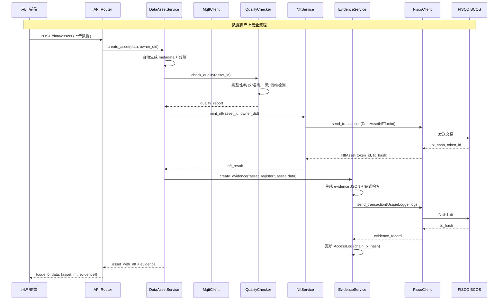
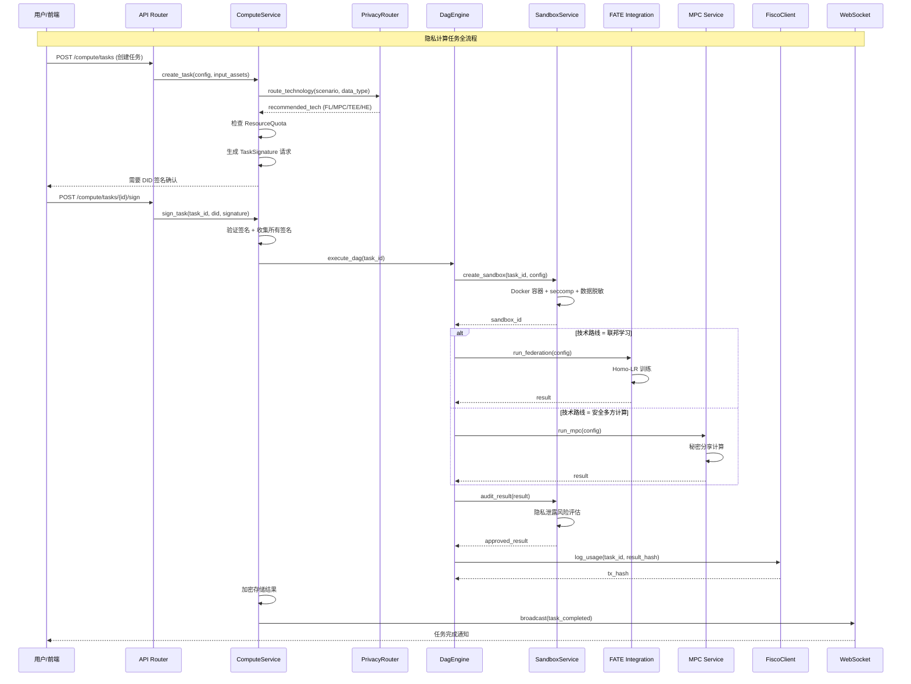
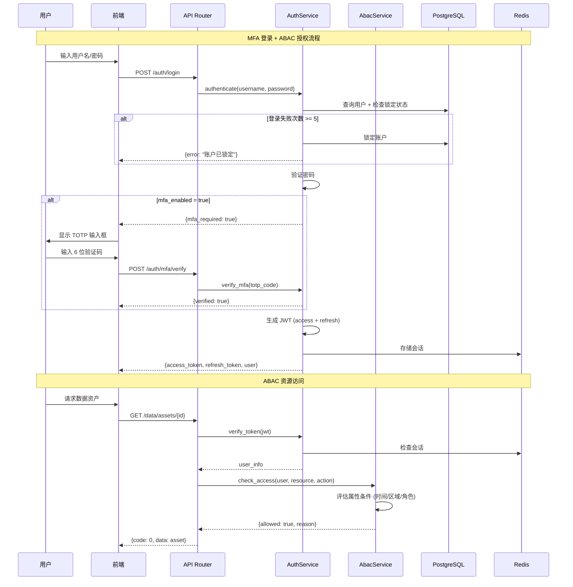
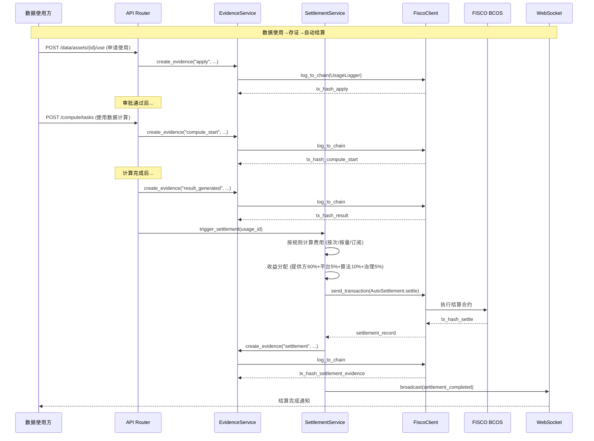
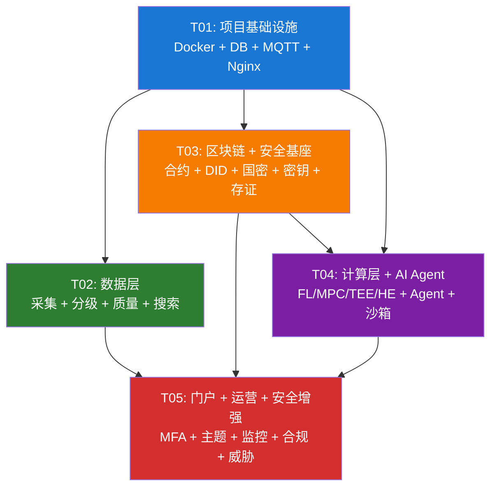

# 能源可信数据空间 — 系统设计与任务分解文档

> 基于需求文档（完善版）和 TASK-LIST.md，覆盖 139 个功能项（47 已实现 + 待完成）  
> 编制人：架构师（Bob）  
> 编制时间：2026-05-20  
> 版本：v1.0

---

## Part A: 系统设计

### 1. 实现方案

#### 1.1 核心技术挑战

本系统的核心难点在于**区块链-隐私计算-DID 三技术融合闭环**的工程落地：

| 难点 | 具体描述 | 解决策略 |
|------|----------|----------|
| **FISCO BCOS 真实连接** | 需要 4 节点联盟链 + PBFT 共识 + 合约编译部署 | Docker 化部署 + Python SDK 对接 |
| **隐私计算多技术路线** | FL/MPC/TEE/HE 四种技术路线，需统一路由 | 抽象 `PrivacyRouter` 服务层 + 场景-技术矩阵 |
| **全链路存证** | 8 个生命周期节点均需上链，链式哈希结构 | `EvidenceService` 统一入口 + 异步上链队列 |
| **MQTT 实时采集** | 5 个模拟发电企业 + 断线续传 + 边缘预处理 | EMQX + 离线缓存 + 预处理 Pipeline |
| **国密算法集成** | SM2/SM3/SM4 真实实现 + 国密 SSL | GmSSL Python 绑定 + gmssl_adapter 统一接口 |
| **AI Agent 多智能体** | 4 种 Agent（Query/Trade/Security/Dispatch） | LangChain ReAct Agent + DeepSeek V3 API |
| **前后端数据一致性** | PostgreSQL → Redis → 前端状态同步 | Zustand 状态管理 + WebSocket 实时推送 |

#### 1.2 框架选型与技术栈

**后端技术栈：**
- **Web 框架**: FastAPI 0.115+（异步高性能，自带 OpenAPI 文档）
- **ORM**: SQLAlchemy 2.0 + Alembic（已有模型定义，需完成迁移）
- **数据库**: PostgreSQL 16（主存储）+ Redis 7（缓存/会话）+ MongoDB 7（元数据/日志）
- **消息队列**: EMQX 5（MQTT Broker）+ RabbitMQ（内部任务队列）
- **区块链**: FISCO BCOS v3.x（Python SDK: `fisco-bcos-py`）
- **隐私计算**: FATE v2.x + MP-SPDZ + Gramine（TEE 模拟）+ SEAL（HE）
- **AI**: DeepSeek V3 API + LangChain + AutoGen
- **国密**: GmSSL v3.x Python bindings

**前端技术栈：**
- **UI 框架**: React 18.3 + MUI 6.4 + TailwindCSS 3.4
- **状态管理**: Zustand 4.5（已有 6 个 store）
- **图表**: ECharts 5.5 + echarts-for-react
- **流程图**: ReactFlow 11.11（DAG 编排）
- **路由**: React Router DOM 6.28
- **构建**: Vite 5.4 + TypeScript 5.6

**架构模式：**
- **后端**: 分层架构 `API Router → Service → Model/Repository`
- **前端**: `Page → Store → API → Component` 单向数据流
- **区块链**: `Service → Contract ABI → FISCO SDK → 链节点`
- **通信**: RESTful API + WebSocket 实时推送 + MQTT 采集上报

#### 1.3 实现分批策略

根据依赖关系，将 139 个功能项分为 **5 个实现批次**：

```
Batch 1: 基础设施层（T01-T04）  ← 其他所有模块依赖此层
    ├── Docker 容器化部署
    ├── PostgreSQL + Redis 真实接入
    ├── MQTT Broker 对接
    └── Nginx 反向代理配置

Batch 2: 数据层 + 安全基座（T05-T26）
    ├── 数据采集全流程（MQTT 采集 → 预处理 → 分级 → 存储）
    ├── 数据模型完善（DataAsset/Metadata/AccessLog）
    ├── 国密算法真实实现（SM2/SM3/SM4）
    ├── DID/VC 数字身份体系
    └── 密钥管理增强

Batch 3: 区块链存证层（T27-T50）
    ├── FISCO BCOS 4 节点部署
    ├── 6 个核心智能合约部署
    ├── 数据资产确权 NFT 铸造
    ├── 全链路存证
    └── 智能合约结算

Batch 4: 计算层 + AI Agent（T51-T80）
    ├── FATE/MPC/TEE/HE 真实集成
    ├── DAG 编排增强
    ├── 数据沙箱
    ├── AI Agent 四种场景
    └── 隐私计算路由

Batch 5: 门户增强 + 运营管理 + 安全管控增强（T81-T139）
    ├── MFA/SSO/ABAC
    ├── 主题切换 + 响应式
    ├── 监控告警 + 合规
    ├── 用户全生命周期
    ├── ZKP + 威胁检测
    └── WebSocket 实时推送
```

---

### 2. 文件列表

以下是按模块组织的**新增/修改文件清单**（共约 180 个文件）：

#### 2.1 基础设施层

```
backend/
├── Dockerfile                                    [新增]
├── requirements.txt                              [修改]
├── alembic/
│   ├── alembic.ini                               [修改]
│   └── versions/
│       ├── 0002_add_mfa_fields.py                [新增]
│       ├── 0003_add_data_quality.py              [新增]
│       ├── 0004_add_blockchain_settlement.py     [新增]
│       ├── 0005_add_security_enhanced.py         [新增]
│       └── 0006_add_ops_enhanced.py              [新增]
frontend/
├── Dockerfile                                    [新增]
deploy/
├── nginx/
│   ├── nginx.conf                                [新增]
│   └── default.conf                              [新增]
├── prometheus/
│   └── prometheus.yml                            [新增]
├── grafana/
│   └── dashboards/
│       └── energy-tds.json                       [新增]
docker-compose.yml                                [修改]
.env.example                                      [新增]
```

#### 2.2 数据资源中心

```
backend/app/
├── models/
│   ├── data_asset.py                             [修改] 增加 DataFeedback, DataRating
│   └── mqtt_record.py                            [新增] MqttCollectRecord, OfflineBuffer
├── services/
│   ├── mqtt_client.py                            [修改] 真实 EMQX 连接
│   ├── mqtt_simulator.py                         [修改] 5 企业模拟器增强
│   ├── data_classifier.py                        [修改] 自动分级引擎增强
│   ├── classify_service.py                       [修改] 六大分类 + 四级等级 + 三维度标签
│   ├── data_quality.py                           [修改] 四维质量检测（完整性/时效/准确/一致）
│   ├── quality_service.py                        [修改] 质量报告 + 量化评分
│   ├── edge_preprocessor.py                      [修改] 边缘预处理增强
│   ├── offline_relay.py                          [修改] 断线续传增强
│   └── search_service.py                         [新增] 全文检索 + 分类筛选 + 标签过滤
├── api/v1/
│   ├── mqtt_collect.py                           [修改] MQTT 采集 API 增强
│   ├── data_enhanced.py                          [修改] 数据预览/评价/搜索 API
│   └── quality.py                                [修改] 质量检测 API 增强
frontend/src/
├── pages/data/
│   ├── DataCatalogPage.tsx                       [修改] 增加预览/评价/搜索
│   └── DataQualityPage.tsx                       [修改] 四维质量仪表盘
├── api/data.ts                                   [修改] 新增 API 调用
└── stores/dataStore.ts                           [修改] 新增状态字段
```

#### 2.3 区块链存证中心

```
contracts/
├── IdentityRegistry.sol                          [已有] 需验证 + 部署
├── DataAssetNFT.sol                              [已有] 需验证 + 部署
├── AccessControl.sol                             [已有] 需验证 + 部署
├── UsageLogger.sol                               [已有] 需验证 + 部署
├── AutoSettlement.sol                            [已有] 需验证 + 部署
├── ComplianceAudit.sol                           [已有] 需验证 + 部署
├── compile.py                                    [修改] 编译脚本增强
├── deploy.py                                     [修改] 部署脚本增强
└── deploy_config.json                            [修改] 配置更新

backend/app/
├── core/
│   ├── fisco_client.py                           [修改] 真实 FISCO SDK 连接
│   └── fisco_web3_client.py                      [修改] Web3 连接增强
├── services/
│   ├── blockchain_evidence_service.py            [修改] 全链路存证增强
│   ├── blockchain_nft_service.py                 [修改] NFT 铸造增强
│   ├── blockchain_settle_service.py              [修改] 自动结算增强
│   ├── blockchain_contract_service.py            [修改] 合约管理增强
│   ├── blockchain_chain_service.py               [修改] 链上查询优化
│   ├── did_service.py                            [修改] W3C DID v1.0 规范
│   ├── vc_service.py                             [修改] VC 签发/验证增强
│   ├── vc_real.py                                [修改] VC 真实实现
│   └── evidence_schema.py                        [新增] 存证 JSON Schema
├── api/v1/
│   ├── blockchain_evidence.py                    [修改] 存证 API 增强
│   ├── blockchain_nft.py                         [修改] NFT API 增强
│   ├── blockchain_settle.py                      [修改] 结算 API 增强
│   └── blockchain_contract.py                    [修改] 合约 API 增强
frontend/src/
├── pages/blockchain/
│   ├── BcAssetsPage.tsx                          [修改] 确权 + NFT + 证书
│   ├── BcEvidencePage.tsx                        [修改] 全链路存证展示
│   ├── BcSettlementPage.tsx                      [修改] 自动结算 + 收益分配
│   └── BcQueryPage.tsx                           [修改] 链上查询优化
├── api/blockchain.ts                             [修改] 新增 API 调用
└── stores/blockchainStore.ts                     [修改] 新增状态字段
```

#### 2.4 可信计算中心

```
backend/app/
├── services/
│   ├── fate_integration.py                       [修改] FATE 真实集成（Homo-LR）
│   ├── mpc_service.py                            [修改] MPC 真实集成（秘密分享）
│   ├── tee_service.py                            [修改] TEE Gramine 模拟
│   ├── he_service.py                             [修改] SEAL CKKS/BFV 集成
│   ├── dp_service.py                             [修改] 差分隐私增强
│   ├── fl_service.py                             [修改] 联邦学习增强
│   ├── privacy_router.py                         [修改] 技术路线选择矩阵
│   ├── compute_sandbox.py                        [修改] Docker 沙箱隔离
│   ├── sandbox_service.py                        [修改] seccomp + 脱敏 + 出口审核
│   ├── dag_engine.py                             [修改] DAG 编排增强
│   ├── compute_service.py                        [修改] 任务状态实时追踪
│   ├── agent_service.py                          [修改] LangChain Agent 增强
│   ├── agent_manage_service.py                   [修改] Agent 管理增强
│   ├── cluster_service.py                        [修改] 资源配额管理
│   └── algorithm_scanner.py                      [新增] 算法准入静态扫描
├── api/v1/
│   ├── compute_task.py                           [修改] 任务 API 增强
│   ├── compute_fl.py                             [修改] FL API 增强
│   ├── compute_mpc.py                            [修改] MPC API 增强
│   ├── compute_tee.py                            [修改] TEE API 增强
│   ├── compute_he.py                             [修改] HE API 增强
│   ├── compute_sandbox.py                        [修改] 沙箱 API 增强
│   ├── compute_agent.py                          [修改] Agent API 增强
│   └── compute_enhanced.py                       [修改] 计算增强 API
frontend/src/
├── pages/compute/
│   ├── ComputeTasksPage.tsx                      [修改] 任务状态实时追踪
│   ├── ComputeDagPage.tsx                        [修改] DAG 拖拽增强（ReactFlow）
│   ├── ComputeSandboxPage.tsx                    [修改] 沙箱管理增强
│   ├── ComputeAgentsPage.tsx                     [修改] 4 种 Agent 管理
│   └── ComputeBenchmarkPage.tsx                  [修改] 性能基准增强
├── api/compute.ts                                [修改] 新增 API 调用
└── stores/computeStore.ts                        [修改] 新增状态字段
```

#### 2.5 统一门户增强

```
backend/app/
├── services/
│   ├── auth_service.py                           [修改] MFA/SSO/登录锁定
│   └── abac_service.py                           [新增] ABAC 策略引擎
├── middleware.py                                  [修改] CSRF/XSS/SQL注入防护
├── core/
│   └── ws_manager.py                             [修改] WebSocket 任务/告警推送
├── api/v1/
│   └── auth.py                                   [修改] MFA/SSO API
frontend/src/
├── pages/auth/
│   └── LoginPage.tsx                             [修改] MFA 登录 + DID 登录
├── pages/monitor-screen/
│   └── MonitorScreenPage.tsx                     [修改] 监管大屏增强
├── pages/portal/
│   └── PortalProfilePage.tsx                     [修改] 主题切换
├── theme/
│   ├── index.ts                                  [已有] 深色/浅色主题
│   └── ThemeProvider.tsx                         [新增] 主题 Provider 包装
├── components/
│   ├── ThemeToggle.tsx                           [新增] 主题切换按钮
│   ├── MfaVerifyDialog.tsx                       [新增] MFA 验证对话框
│   └── ResponsiveContainer.tsx                   [新增] 响应式容器
├── stores/
│   ├── appStore.ts                               [修改] 主题/布局状态
│   └── websocketStore.ts                         [修改] WebSocket 增强
└── hooks/
    └── useResponsive.ts                          [新增] 响应式 hook
```

#### 2.6 运营管理中心

```
backend/app/
├── services/
│   ├── monitor_service.py                        [修改] Prometheus 指标
│   ├── billing_service.py                        [修改] 月度账单 + 明细下载
│   ├── compliance_service.py                     [修改] 合规报告自动生成
│   ├── org_service.py                            [修改] 四级组织架构
│   ├── user_service.py                           [修改] 用户全生命周期
│   ├── alert_service.py                          [新增] 多渠道告警推送
│   ├── revenue_service.py                        [新增] 收益计算模型
│   └── excel_import_service.py                   [新增] Excel 批量导入
├── api/v1/
│   ├── ops_monitor.py                            [修改] 监控 API 增强
│   ├── ops_billing.py                            [修改] 计费 API 增强
│   ├── ops_compliance.py                         [修改] 合规 API 增强
│   ├── ops_user.py                               [修改] 用户 API 增强
│   ├── ops_org.py                                [修改] 组织 API 增强
│   └── ops_kpi.py                                [修改] KPI API 增强
frontend/src/
├── pages/ops/
│   ├── OpsMonitorPage.tsx                        [修改] Prometheus 集成
│   ├── OpsBillingPage.tsx                        [修改] 账单 + 下载
│   ├── OpsCompliancePage.tsx                     [修改] 合规报告
│   ├── OpsUsersPage.tsx                          [修改] 用户全生命周期
│   ├── OpsOrgPage.tsx                            [修改] 四级组织
│   └── OpsKpiPage.tsx                            [修改] KPI 仪表盘
├── api/ops.ts                                    [修改] 新增 API 调用
└── stores/opsStore.ts                            [修改] 新增状态字段
```

#### 2.7 安全管控中心

```
backend/app/
├── services/
│   ├── gmssl_service.py                          [修改] SM2/SM3/SM4 增强
│   ├── gmssl_real.py                             [修改] 国密真实实现
│   ├── key_service.py                            [修改] 三层密钥 + HSM
│   ├── key_manager.py                            [修改] Shamir 秘密共享
│   ├── zkp_service.py                            [修改] ZKP 增强
│   ├── zkp_real.py                               [修改] Groth16/BBS+/Bulletproofs
│   ├── security_policy_service.py                [修改] ABAC 策略增强
│   ├── threat_service.py                         [修改] 规则引擎 + ML 检测
│   └── did_service.py                            [修改] 设备 DID
├── api/v1/
│   ├── security_gmssl.py                         [修改] 国密 API 增强
│   ├── security_key.py                           [修改] 密钥 API 增强
│   ├── security_zkp.py                           [修改] ZKP API 增强
│   ├── security_did.py                           [修改] DID API 增强
│   ├── security_vc.py                            [修改] VC API 增强
│   ├── security_policy.py                        [修改] 策略 API 增强
│   ├── security_threat.py                        [修改] 威胁 API 增强
│   └── security_enhanced.py                      [修改] 安全增强 API
frontend/src/
├── pages/security/
│   ├── SecurityCryptoPage.tsx                    [修改] 国密算法展示
│   ├── SecurityDidPage.tsx                       [修改] DID + 设备身份
│   ├── SecurityVcPage.tsx                        [修改] VC 签发/验证
│   ├── SecurityKeysPage.tsx                      [修改] 三层密钥 + HSM
│   ├── SecurityZkpPage.tsx                       [修改] ZKP 三种证明
│   ├── SecurityThreatsPage.tsx                   [修改] 威胁检测增强
│   ├── SecurityPoliciesPage.tsx                  [修改] ABAC 策略
│   └── SecurityLevelsPage.tsx                    [修改] 安全等级矩阵
├── api/security.ts                               [修改] 新增 API 调用
└── components/common/
    └── SecurityDashboard.tsx                     [新增] 安全态势大屏组件
```

---

### 3. 数据结构与接口

```mermaid
classDiagram
    %% ==================== 数据层 ====================
    class DataSource {
        +UUID id
        +str name
        +str protocol_type
        +dict connection_config
        +str device_did
        +str mqtt_topic
        +int collection_interval_ms
        +bool is_critical
        +dict edge_preprocess
        +str status
        +UUID organization_id
        +UUID created_by
    }

    class DataAsset {
        +UUID id
        +str name
        +UUID source_id
        +str category
        +int classification_level
        +str description
        +dict schema_def
        +str storage_path
        +str storage_format
        +int size_bytes
        +int record_count
        +str nft_token_id
        +str status
        +UUID owner_id
        +UUID organization_id
        +datetime published_at
    }

    class Metadata {
        +UUID id
        +UUID asset_id
        +str standard
        +dict content
        +dict lineage_graph
        +int version
        +UUID previous_version_id
        +UUID created_by
    }

    class DataFeedback {
        +UUID id
        +UUID asset_id
        +UUID user_id
        +int rating
        +str comment
        +datetime created_at
    }

    class MqttCollectRecord {
        +UUID id
        +str device_did
        +str topic
        +dict payload
        +str data_type
        +datetime collected_at
        +str status
        +str preprocess_result
    }

    class DataQualityReport {
        +UUID id
        +UUID asset_id
        +float completeness_score
        +float timeliness_score
        +float accuracy_score
        +float consistency_score
        +float overall_score
        +dict details
        +datetime checked_at
    }

    class AccessLog {
        +UUID id
        +str visitor_did
        +UUID asset_id
        +str access_type
        +str result_hash
        +str chain_tx_hash
        +datetime timestamp
    }

    %% ==================== 计算层 ====================
    class DagDefinition {
        +UUID id
        +str name
        +dict nodes
        +dict edges
        +int version
        +str status
        +UUID created_by
    }

    class ComputeTask {
        +UUID id
        +str name
        +str task_type
        +str scenario
        +UUID dag_id
        +dict config
        +list input_asset_ids
        +str status
        +int progress
        +str result_ref
        +str result_hash
        +str error_message
        +datetime started_at
        +datetime completed_at
        +UUID created_by
    }

    class TaskSignature {
        +UUID id
        +UUID task_id
        +str signer_did
        +str signature
        +datetime signed_at
    }

    class ResourceQuota {
        +UUID id
        +UUID organization_id
        +int max_cpu_cores
        +int max_memory_gb
        +int max_gpu_count
        +int max_concurrent_tasks
        +int used_cpu_cores
        +int used_memory_gb
    }

    %% ==================== 区块链层 ====================
    class NftAsset {
        +UUID id
        +str token_id
        +UUID asset_id
        +str owner_did
        +str creator_did
        +str token_uri
        +str evidence_hash
        +str certificate_url
        +str tx_hash
        +int block_number
    }

    class EvidenceRecord {
        +UUID id
        +str node_type
        +UUID resource_id
        +str resource_type
        +str data_hash
        +str prev_hash
        +str schema_version
        +dict evidence_data
        +str tx_hash
        +int block_number
        +int timestamp
    }

    class BlockchainTransaction {
        +UUID id
        +str tx_hash
        +str contract_address
        +str method
        +dict params
        +str from_address
        +int block_number
        +int gas_used
        +str status
    }

    class SettlementRecord {
        +UUID id
        +str usage_id
        +str provider_did
        +str consumer_did
        +float amount
        +str billing_rule
        +str tx_hash
        +str status
        +datetime settled_at
    }

    %% ==================== 安全层 ====================
    class DidDocument {
        +UUID id
        +str did
        +str public_key
        +str key_type
        +str controller
        +dict authentication
        +dict service_endpoints
        +str status
        +datetime created_at
        +datetime rotated_at
    }

    class VcRecord {
        +UUID id
        +str issuer_did
        +str subject_did
        +str credential_type
        +dict claims
        +str proof
        +str status
        +datetime issued_at
        +datetime expires_at
    }

    class KeyStore {
        +UUID id
        +str key_id
        +str key_type
        +str algorithm
        +str encrypted_key
        +str public_key
        +int hierarchy_level
        +UUID owner_id
        +str status
        +datetime created_at
        +datetime rotated_at
    }

    class SecurityPolicy {
        +UUID id
        +str name
        +str policy_type
        +dict conditions
        +dict effect
        +int priority
        +bool enabled
    }

    class ThreatEvent {
        +UUID id
        +str threat_type
        +str severity
        +str source_ip
        +str target_resource
        +dict details
        +str status
        +datetime detected_at
        +datetime resolved_at
    }

    %% ==================== 运营层 ====================
    class Organization {
        +UUID id
        +str name
        +str code
        +UUID parent_id
        +int level
        +str status
        +str did
        +dict metadata_
    }

    class Department {
        +UUID id
        +str name
        +UUID organization_id
        +UUID parent_id
        +str status
    }

    class User {
        +UUID id
        +str username
        +str password_hash
        +str email
        +str phone
        +str did
        +str sm2_public_key
        +str mfa_secret
        +bool mfa_enabled
        +str role
        +UUID department_id
        +UUID organization_id
        +str status
        +datetime last_login_at
        +int login_fail_count
        +datetime locked_until
    }

    class BillingRecord {
        +UUID id
        +UUID user_id
        +UUID asset_id
        +str billing_type
        +float amount
        +str currency
        +str status
        +str period
        +datetime billing_date
    }

    class AuditLog {
        +UUID id
        +str actor_did
        +str action
        +str resource_type
        +str resource_id
        +str ip_address
        +dict details
        +datetime created_at
    }

    class ComplianceReport {
        +UUID id
        +str report_type
        +str period
        +dict content
        +float score
        +datetime generated_at
    }

    class AlertRule {
        +UUID id
        +str name
        +str metric
        +str condition
        +float threshold
        +str severity
        +list channels
        +bool enabled
    }

    %% ==================== 关系 ====================
    DataSource "1" --> "*" DataAsset : produces
    DataAsset "1" --> "1" Metadata : has
    DataAsset "1" --> "*" DataFeedback : receives
    DataAsset "1" --> "*" AccessLog : logged_by
    DataAsset "1" --> "*" DataQualityReport : quality_checks
    DataAsset "1" --> "0..1" NftAsset : nft_minted

    DagDefinition "1" --> "*" ComputeTask : defines
    ComputeTask "1" --> "*" TaskSignature : signed_by
    ComputeTask "1" --> "0..1" ResourceQuota : consumes

    NftAsset --> EvidenceRecord : evidence
    EvidenceRecord --> BlockchainTransaction : tx

    Organization "1" --> "*" Department : contains
    Organization "1" --> "*" User : belongs_to
    Department "1" --> "*" User : belongs_to
    User "1" --> "*" AuditLog : actions
    User "1" --> "*" BillingRecord : bills

    User "1" --> "0..1" DidDocument : owns
    User "1" --> "*" KeyStore : keys
    DidDocument "1" --> "*" VcRecord : credentials

    SecurityPolicy --> ThreatEvent : detects
```



---

### 4. 程序调用流程

#### 4.1 数据资产上链存证流程



#### 4.2 隐私计算任务执行流程



#### 4.3 用户认证与 ABAC 授权流程



#### 4.4 全链路存证与结算流程



---

### 5. 不明确事项

| 项目 | 问题 | 假设/建议 |
|------|------|-----------|
| **FISCO BCOS 部署** | 比赛环境是否允许 Docker 多容器部署 4 节点？ | 假设允许，使用 docker-compose 编排；备选方案：单节点模拟 |
| **FATE 部署** | FATE v2.x 协调器 + Party 节点需要 32GB+ 内存 | 开发环境使用 FATE Standalone 模式；演示时使用 FATE Serving |
| **SGX 硬件** | 服务器是否支持 Intel SGX？ | 使用 Gramine LibOS 模拟 SGX 环境，不依赖物理 SGX |
| **SEAL 库** | SEAL 的 Python 绑定是否有现成包？ | 使用 `seal-python` 或 `concrete-python` 包 |
| **DeepSeek API** | 使用云端 API 还是本地部署？ | 优先使用 DeepSeek 云端 API（sk-your-api-key）；如需离线，部署 DeepSeek 7B |
| **MQTT 数据格式** | 发电企业上报数据的具体 JSON 结构？ | 参照 IEC 61850 标准，定义通用 Schema |
| **ZKP 性能** | Groth16 证明生成时间在无 GPU 环境下可能较慢 | 使用 snarkjs 的 Node.js 版本通过子进程调用 |
| **密钥存储** | 生产环境 HSM 硬件不可用 | 使用软件 HSM 模拟（SQLite + 加密存储） |
| **Prometheus/Grafana** | 监控配置的具体 Dashboard 设计？ | 使用预配置 JSON 导入，覆盖业务+系统双维度 |
| **数据量级** | 演示需要多大的数据量？ | 模拟 5 企业 × 1000 条/天 × 30 天 = 15 万条 |

---

## Part B: 任务分解

### 6. 依赖包列表

#### 6.1 后端 Python 依赖（requirements.txt 补充）

```
# 数据库
sqlalchemy[asyncio]>=2.0.0
asyncpg>=0.29.0
alembic>=1.13.0
redis[hiredis]>=5.0.0
motor>=3.3.0
beanie>=1.25.0

# MQTT
paho-mqtt>=1.6.0
gmqtt>=0.6.0

# 区块链
fisco-bcos-py>=3.0.0
web3>=6.0.0
eth-account>=0.10.0

# 国密算法
gmssl>=3.2.0
pysmx>=0.1.0

# 隐私计算
pyfhel>=3.0.0
concrete-python>=0.11.0

# AI / LLM
langchain>=0.3.0
langchain-community>=0.3.0
langchain-openai>=0.2.0
openai>=1.50.0
deepseek-sdk>=0.1.0

# ZKP
snarkjs>=0.7.0
py-ecc>=6.0.0

# 监控
prometheus-client>=0.20.0

# 消息队列
aio-pika>=9.0.0
celery>=5.3.0

# 工具
python-multipart>=0.0.6
python-jose[cryptography]>=3.3.0
pyotp>=2.9.0
openpyxl>=3.1.0
jinja2>=3.1.0
httpx>=0.27.0
```

#### 6.2 前端 npm 依赖（package.json 补充）

```json
{
  "dependencies": {
    "reactflow": "^11.11.4",        // 已有
    "echarts": "^5.5.1",            // 已有
    "echarts-for-react": "^3.0.2",  // 已有
    "@reactflow/core": "^11.11.4",  // DAG 编排
    "xlsx": "^0.18.5",              // Excel 导入
    "file-saver": "^2.0.5",         // 文件下载
    "@types/file-saver": "^2.0.7",
    "qrcode.react": "^3.1.0",       // MFA 二维码
    "date-fns": "^3.6.0"            // 日期处理
  }
}
```

---

### 7. 任务列表（按依赖顺序排列）

> ⚠️ 任务数量限制：≤5 个，每个任务至少 3 个文件

---

#### **T01: 项目基础设施 — Docker + DB 真实接入 + 部署配置**

**依赖**: 无（基础设施，所有任务的基础）

**优先级**: P0

**源文件**:
- `docker-compose.yml` [修改] — 补充 nginx、RabbitMQ 服务配置
- `backend/Dockerfile` [新增] — Python 3.11 + 依赖安装 + Alembic 迁移
- `frontend/Dockerfile` [新增] — Node 20 构建 + Nginx 静态服务
- `deploy/nginx/default.conf` [新增] — 前端静态文件 + API 反向代理
- `deploy/nginx/nginx.conf` [新增] — Nginx 主配置
- `deploy/prometheus/prometheus.yml` [新增] — Prometheus 采集配置
- `deploy/grafana/dashboards/energy-tds.json` [新增] — Grafana 仪表盘
- `.env.example` [新增] — 环境变量模板
- `backend/requirements.txt` [修改] — 补充缺失依赖包
- `backend/alembic/alembic.ini` [修改] — 数据库迁移配置
- `backend/alembic/versions/0002_add_mfa_fields.py` [新增] — MFA 字段迁移
- `backend/alembic/versions/0003_add_data_quality.py` [新增] — 数据质量表迁移
- `backend/alembic/versions/0004_add_blockchain_settlement.py` [新增] — 结算表迁移
- `backend/alembic/versions/0005_add_security_enhanced.py` [新增] — 安全增强表迁移
- `backend/alembic/versions/0006_add_ops_enhanced.py` [新增] — 运营增强表迁移
- `backend/app/services/mqtt_client.py` [修改] — 真实 EMQX 连接配置
- `backend/app/database.py` [修改] — Redis 真实接入 + 连接池优化
- `backend/app/config.py` [修改] — 补充 RabbitMQ 配置项

**具体任务**:
1. 编写 `backend/Dockerfile`（Python 3.11-slim + pip install + alembic upgrade）
2. 编写 `frontend/Dockerfile`（node:20-alpine build + nginx:alpine 静态服务）
3. 完善 `docker-compose.yml`（添加 nginx、rabbitmq 服务，完善 healthcheck）
4. 编写 `deploy/nginx/default.conf`（前端 / + API /api 反向代理到 backend:8000）
5. 编写 Alembic 迁移脚本（0002-0006，覆盖所有新增表和字段）
6. 修改 `mqtt_client.py`，连接真实 EMQX Broker
7. 修改 `database.py`，Redis 连接池 + 会话管理
8. 编写 `.env.example`（所有环境变量的模板和说明）
9. 补充 `requirements.txt`（所有新增 Python 依赖）
10. 编写 Prometheus + Grafana 配置文件

**验收标准**:
- `docker-compose up -d` 一键启动所有服务
- PostgreSQL 数据库迁移成功
- Redis 连接成功
- MQTT 连接 EMQX 成功
- Nginx 反向代理工作正常
- 前端可通过 http://localhost:80 访问
- 后端可通过 http://localhost:8000/docs 访问 API 文档

---

#### **T02: 数据层 — 采集 + 分级 + 质量 + 存储 + 搜索**

**依赖**: T01（需要 PostgreSQL + MQTT + Redis）

**优先级**: P0

**源文件**:
- `backend/app/models/data_asset.py` [修改] — 增加 DataFeedback, DataRating 模型
- `backend/app/models/mqtt_record.py` [新增] — MqttCollectRecord, OfflineBuffer 模型
- `backend/app/models/__init__.py` [修改] — 导出新模型
- `backend/app/services/mqtt_simulator.py` [修改] — 5 企业模拟器增强
- `backend/app/services/data_classifier.py` [修改] — 自动分级引擎
- `backend/app/services/classify_service.py` [修改] — 六大分类 + 四级等级 + 三维度标签
- `backend/app/services/data_quality.py` [修改] — 四维质量检测
- `backend/app/services/quality_service.py` [修改] — 质量报告生成
- `backend/app/services/edge_preprocessor.py` [修改] — 边缘预处理增强
- `backend/app/services/offline_relay.py` [修改] — 断线续传增强
- `backend/app/services/search_service.py` [新增] — 全文检索 + 分类筛选 + 标签过滤
- `backend/app/api/v1/mqtt_collect.py` [修改] — MQTT 采集 API 增强
- `backend/app/api/v1/data_enhanced.py` [修改] — 数据预览/评价/搜索 API
- `backend/app/api/v1/quality.py` [修改] — 质量检测 API 增强
- `frontend/src/pages/data/DataCatalogPage.tsx` [修改] — 增加预览/评价/搜索
- `frontend/src/pages/data/DataQualityPage.tsx` [修改] — 四维质量仪表盘
- `frontend/src/api/data.ts` [修改] — 新增 API 调用
- `frontend/src/stores/dataStore.ts` [修改] — 新增状态字段
- `backend/app/schemas/asset.py` [修改] — 补充新 Schema

**具体任务**:
1. 新增 `MqttCollectRecord` + `DataFeedback` 数据模型 + Alembic 迁移
2. 增强 `mqtt_simulator.py`：模拟 5 个发电企业（风/光/水/火/核），MQTT 主题 `energy/collect/{did}/{type}`
3. 实现 `data_classifier.py` 自动分级引擎：基于关键词/字段类型自动标记六大分类 + 四级安全等级
4. 增强 `data_quality.py`：四维检测（完整性<0.1%缺失、时效性<1秒、准确性>95%、一致性>99.9%）
5. 新增 `search_service.py`：PostgreSQL 全文检索 + 分类筛选 + 标签过滤
6. 增强 `DataCatalogPage.tsx`：脱敏预览（10条记录）+ 评价反馈 + 搜索增强
7. 增强 `DataQualityPage.tsx`：四维质量雷达图 + 趋势图表

**验收标准**:
- MQTT 采集模拟器运行正常，5 个企业数据持续上报
- 数据自动分级准确率 > 90%
- 四维质量检测结果可查询，评分正确
- 数据预览功能正常（脱敏显示 10 条记录）
- 数据评价/反馈功能完整
- 全文检索响应 < 500ms

---

#### **T03: 区块链 + 安全基座 — 合约部署 + DID/VC + 国密 + 密钥管理**

**依赖**: T01（需要 PostgreSQL + FISCO BCOS 节点）

**优先级**: P0

**源文件**:
- `contracts/compile.py` [修改] — 合约编译脚本增强
- `contracts/deploy.py` [修改] — 合约部署脚本增强
- `contracts/deploy_config.json` [修改] — 部署配置更新
- `backend/app/core/fisco_client.py` [修改] — FISCO SDK 真实连接
- `backend/app/core/fisco_web3_client.py` [修改] — Web3 连接增强
- `backend/app/services/blockchain_evidence_service.py` [修改] — 全链路存证
- `backend/app/services/blockchain_nft_service.py` [修改] — NFT 铸造增强
- `backend/app/services/blockchain_settle_service.py` [修改] — 自动结算增强
- `backend/app/services/blockchain_contract_service.py` [修改] — 合约管理
- `backend/app/services/blockchain_chain_service.py` [修改] — 链上查询优化
- `backend/app/services/did_service.py` [修改] — W3C DID v1.0 (did:fisco)
- `backend/app/services/vc_service.py` [修改] — VC 签发/验证
- `backend/app/services/vc_real.py` [修改] — VC 真实实现
- `backend/app/services/gmssl_service.py` [修改] — SM2/SM3/SM4 增强
- `backend/app/services/gmssl_real.py` [修改] — 国密真实实现
- `backend/app/services/key_service.py` [修改] — 三层密钥 + HSM 模拟
- `backend/app/services/key_manager.py` [修改] — Shamir 秘密共享
- `backend/app/services/zkp_service.py` [修改] — ZKP 增强
- `backend/app/services/zkp_real.py` [修改] — Groth16/BBS+/Bulletproofs
- `backend/app/services/security_policy_service.py` [修改] — ABAC 策略
- `backend/app/services/evidence_schema.py` [新增] — 存证 JSON Schema
- `backend/app/services/abac_service.py` [新增] — ABAC 策略引擎
- `backend/app/api/v1/blockchain_evidence.py` [修改] — 存证 API
- `backend/app/api/v1/blockchain_nft.py` [修改] — NFT API
- `backend/app/api/v1/blockchain_settle.py` [修改] — 结算 API
- `backend/app/api/v1/blockchain_contract.py` [修改] — 合约 API
- `backend/app/api/v1/security_gmssl.py` [修改] — 国密 API
- `backend/app/api/v1/security_did.py` [修改] — DID API
- `backend/app/api/v1/security_vc.py` [修改] — VC API
- `backend/app/api/v1/security_key.py` [修改] — 密钥 API
- `backend/app/api/v1/security_zkp.py` [修改] — ZKP API
- `backend/app/api/v1/security_policy.py` [修改] — 策略 API
- `backend/app/api/v1/security_enhanced.py` [修改] — 安全增强 API
- `frontend/src/pages/blockchain/BcAssetsPage.tsx` [修改] — 确权 + NFT
- `frontend/src/pages/blockchain/BcEvidencePage.tsx` [修改] — 全链路存证
- `frontend/src/pages/blockchain/BcSettlementPage.tsx` [修改] — 结算
- `frontend/src/pages/blockchain/BcQueryPage.tsx` [修改] — 链上查询
- `frontend/src/pages/security/SecurityCryptoPage.tsx` [修改] — 国密
- `frontend/src/pages/security/SecurityDidPage.tsx` [修改] — DID
- `frontend/src/pages/security/SecurityVcPage.tsx` [修改] — VC
- `frontend/src/pages/security/SecurityKeysPage.tsx` [修改] — 密钥
- `frontend/src/pages/security/SecurityZkpPage.tsx` [修改] — ZKP
- `frontend/src/pages/security/SecurityPoliciesPage.tsx` [修改] — 策略
- `frontend/src/pages/security/SecurityThreatsPage.tsx` [修改] — 威胁
- `frontend/src/pages/security/SecurityLevelsPage.tsx` [修改] — 安全等级
- `frontend/src/api/blockchain.ts` [修改] — 新增 API
- `frontend/src/api/security.ts` [修改] — 新增 API
- `frontend/src/stores/blockchainStore.ts` [修改] — 新增状态

**具体任务**:
1. **合约编译部署**：完善 `compile.py` + `deploy.py`，部署 6 个核心合约到 FISCO BCOS 4 节点
2. **FISCO 真实连接**：`fisco_client.py` 使用 Python SDK 连接真实链节点，支持合约调用
3. **DID 体系**：实现 `did:fisco` 方法，SM2 签名，DID 文档存储上链
4. **VC 签发验证**：可验证凭证签发（SM2 签名）+ 验证 + 过期检查
5. **国密实现**：SM2 签名/验签、SM3 哈希、SM4 加密/解密真实实现
6. **密钥管理**：三层密钥体系（根→机构→用户）+ HSM 模拟 + Shamir 3-of-5
7. **全链路存证**：8 个生命周期节点存证 + 链式哈希结构
8. **NFT 铸造**：数据资产 → ERC-721 NFT → 确权证书
9. **智能结算**：计费规则上链 + 自动触发 + 收益分配（提供方60%/平台5%/算法10%/治理5%）
10. **ABAC 策略引擎**：基于时间/区域/属性条件的动态访问控制
11. **前端页面增强**：区块链 4 个页面 + 安全 8 个页面功能完善

**验收标准**:
- 6 个核心合约成功部署到 FISCO BCOS
- DID 注册 + VC 签发流程完整
- SM2/SM3/SM4 算法测试通过
- 数据资产 NFT 铸造成功
- 全链路存证覆盖 8 个节点
- 自动结算流程跑通
- 链上查询响应 < 200ms（单条）

---

#### **T04: 计算层 + AI Agent — 隐私计算集成 + Agent + 沙箱 + DAG**

**依赖**: T01（需要 PostgreSQL + Docker），T03（需要 DID 签名）

**优先级**: P0-P1

**源文件**:
- `backend/app/services/fate_integration.py` [修改] — FATE 真实集成（Homo-LR）
- `backend/app/services/mpc_service.py` [修改] — MPC 秘密分享协议
- `backend/app/services/tee_service.py` [修改] — TEE Gramine 模拟
- `backend/app/services/he_service.py` [修改] — SEAL CKKS/BFV 集成
- `backend/app/services/dp_service.py` [修改] — 差分隐私增强
- `backend/app/services/fl_service.py` [修改] — 联邦学习增强
- `backend/app/services/privacy_router.py` [修改] — 技术路线选择矩阵
- `backend/app/services/compute_sandbox.py` [修改] — Docker 沙箱隔离
- `backend/app/services/sandbox_service.py` [修改] — seccomp + 脱敏 + 出口审核
- `backend/app/services/dag_engine.py` [修改] — DAG 编排增强
- `backend/app/services/compute_service.py` [修改] — 任务状态实时追踪
- `backend/app/services/agent_service.py` [修改] — LangChain Agent 增强
- `backend/app/services/agent_manage_service.py` [修改] — Agent 管理
- `backend/app/services/cluster_service.py` [修改] — 资源配额管理
- `backend/app/services/algorithm_scanner.py` [新增] — 算法准入静态扫描
- `backend/app/api/v1/compute_task.py` [修改] — 任务 API 增强
- `backend/app/api/v1/compute_fl.py` [修改] — FL API
- `backend/app/api/v1/compute_mpc.py` [修改] — MPC API
- `backend/app/api/v1/compute_tee.py` [修改] — TEE API
- `backend/app/api/v1/compute_he.py` [修改] — HE API
- `backend/app/api/v1/compute_sandbox.py` [修改] — 沙箱 API
- `backend/app/api/v1/compute_agent.py` [修改] — Agent API
- `backend/app/api/v1/compute_enhanced.py` [修改] — 计算增强 API
- `frontend/src/pages/compute/ComputeTasksPage.tsx` [修改] — 任务状态追踪
- `frontend/src/pages/compute/ComputeDagPage.tsx` [修改] — DAG 拖拽
- `frontend/src/pages/compute/ComputeSandboxPage.tsx` [修改] — 沙箱管理
- `frontend/src/pages/compute/ComputeAgentsPage.tsx` [修改] — Agent 管理
- `frontend/src/pages/compute/ComputeBenchmarkPage.tsx` [修改] — 性能基准
- `frontend/src/pages/compute/ComputeClusterPage.tsx` [修改] — 资源配额
- `frontend/src/api/compute.ts` [修改] — 新增 API
- `frontend/src/stores/computeStore.ts` [修改] — 新增状态

**具体任务**:
1. **FATE 联邦学习**：集成 FATE Standalone，实现 Homo-LR 发电预测场景
2. **MPC 安全多方计算**：集成 MP-SPDZ，实现秘密分享协议（3 方求和）
3. **TEE 可信执行环境**：Gramine LibOS 模拟 SGX 飞地
4. **同态加密**：集成 SEAL 库，支持 CKKS 浮点 + BFV 整数运算
5. **差分隐私**：ε 可配置 + 噪声注入 + 本地/全局差分隐私
6. **隐私计算路由**：场景→技术路线自动选择矩阵（FL/MPC/TEE/HE）
7. **DAG 编排**：ReactFlow 拖拽 + YAML/JSON 配置导入 + 执行监控
8. **数据沙箱**：Docker 容器隔离 + seccomp + 算法准入扫描 + 数据脱敏 + 出口审核
9. **AI Agent**：LangChain ReAct Agent 集成，4 种 Agent（Query/Trade/Security/Dispatch）
10. **资源配额**：CPU/GPU 配额管理 + 并发任务限制
11. **任务状态追踪**：排队/运行中/完成/失败状态实时推送（WebSocket）

**验收标准**:
- FATE Homo-LR 5 方联邦学习完成（< 5 分钟）
- MPC 3 方求和计算完成（< 10 秒）
- TEE 飞地启动时间 < 3 秒
- HE 加密/解密 + 同态运算正确
- DAG 拖拽编排可执行
- 沙箱隔离 + 出口审核正常
- 4 种 AI Agent 响应正常
- 任务状态 WebSocket 推送延迟 < 100ms

---

#### **T05: 门户增强 + 运营管理 + 安全增强 — 全功能收尾**

**依赖**: T01, T02, T03（需要所有基础设施和数据层）

**优先级**: P1-P2

**源文件**:
- `backend/app/services/auth_service.py` [修改] — MFA/SSO/登录锁定
- `backend/app/services/monitor_service.py` [修改] — Prometheus 指标采集
- `backend/app/services/billing_service.py` [修改] — 月度账单 + 明细下载
- `backend/app/services/compliance_service.py` [修改] — 合规报告自动生成
- `backend/app/services/org_service.py` [修改] — 四级组织架构
- `backend/app/services/user_service.py` [修改] — 用户全生命周期
- `backend/app/services/alert_service.py` [新增] — 多渠道告警推送
- `backend/app/services/revenue_service.py` [新增] — 收益计算模型
- `backend/app/services/excel_import_service.py` [新增] — Excel 批量导入
- `backend/app/services/threat_service.py` [修改] — 规则引擎 + ML 检测
- `backend/app/middleware.py` [修改] — CSRF/XSS 防护增强
- `backend/app/core/ws_manager.py` [修改] — WebSocket 任务/告警推送
- `backend/app/api/v1/auth.py` [修改] — MFA/SSO API
- `backend/app/api/v1/ops_monitor.py` [修改] — 监控 API
- `backend/app/api/v1/ops_billing.py` [修改] — 计费 API
- `backend/app/api/v1/ops_compliance.py` [修改] — 合规 API
- `backend/app/api/v1/ops_user.py` [修改] — 用户 API
- `backend/app/api/v1/ops_org.py` [修改] — 组织 API
- `backend/app/api/v1/ops_kpi.py` [修改] — KPI API
- `backend/app/api/v1/security_threat.py` [修改] — 威胁 API
- `frontend/src/pages/auth/LoginPage.tsx` [修改] — MFA 登录
- `frontend/src/pages/monitor-screen/MonitorScreenPage.tsx` [修改] — 监管大屏
- `frontend/src/pages/portal/PortalProfilePage.tsx` [修改] — 主题切换
- `frontend/src/pages/ops/OpsMonitorPage.tsx` [修改] — Prometheus 集成
- `frontend/src/pages/ops/OpsBillingPage.tsx` [修改] — 账单增强
- `frontend/src/pages/ops/OpsCompliancePage.tsx` [修改] — 合规报告
- `frontend/src/pages/ops/OpsUsersPage.tsx` [修改] — 用户全生命周期
- `frontend/src/pages/ops/OpsOrgPage.tsx` [修改] — 四级组织
- `frontend/src/pages/ops/OpsKpiPage.tsx` [修改] — KPI 仪表盘
- `frontend/src/theme/ThemeProvider.tsx` [新增] — 主题 Provider 包装
- `frontend/src/components/ThemeToggle.tsx` [新增] — 主题切换按钮
- `frontend/src/components/MfaVerifyDialog.tsx` [新增] — MFA 验证对话框
- `frontend/src/components/ResponsiveContainer.tsx` [新增] — 响应式容器
- `frontend/src/components/common/SecurityDashboard.tsx` [新增] — 安全态势大屏
- `frontend/src/hooks/useResponsive.ts` [新增] — 响应式 hook
- `frontend/src/stores/appStore.ts` [修改] — 主题/布局状态
- `frontend/src/stores/websocketStore.ts` [修改] — WebSocket 增强
- `frontend/src/stores/opsStore.ts` [修改] — 运营状态增强
- `frontend/src/api/ops.ts` [修改] — 运营 API
- `frontend/src/layouts/MainLayout.tsx` [修改] — 响应式 + 主题集成

**具体任务**:
1. **MFA + SSO**：TOTP 双因素认证 + 登录失败锁定（5次）+ JWT 跨服务 SSO
2. **深色/浅色主题**：ThemeProvider 包装 + ThemeToggle 组件 + 持久化
3. **响应式适配**：1920×1080 + 1366×768 双分辨率 + useResponsive hook
4. **CSRF/XSS 防护**：中间件增强 + 前端 Token 验证
5. **WebSocket 增强**：任务状态推送 + 告警推送 + 大屏数据实时刷新（≤5秒）
6. **监管大屏增强**：数据流通 + 安全态势 + 合规统计三大板块
7. **Prometheus 集成**：业务指标（API 调用量/任务成功率/区块链 TPS/用户活跃度）
8. **多渠道告警**：邮件/钉钉/企业微信 + 三级告警（提示/警告/严重）+ 规则配置界面
9. **计费增强**：月度账单自动生成 + 明细下载 + 配额管理
10. **合规增强**：操作日志保留 6 个月 + 月度/季度合规报告 + 数据主体请求流程
11. **用户管理增强**：四级组织架构 + 用户全生命周期 + DID 绑定 + Excel 批量导入
12. **收益分配**：收益计算模型（质量40%×使用60%）+ 平台费5% + 算法10% + 治理5%
13. **威胁检测增强**：规则引擎 + ML 异常检测 + APT 慢速渗透检测 + 安全态势大屏

**验收标准**:
- MFA 登录流程完整（TOTP + QR Code）
- 深色/浅色主题切换正常
- 1366×768 分辨率下布局正常
- WebSocket 告警推送延迟 < 100ms
- Prometheus 指标采集正常
- 月度账单自动生成 + PDF 下载
- 四级组织架构创建/管理正常
- 安全态势大屏实时刷新

---

### 8. 共享知识

#### 8.1 API 响应格式

所有 API 端点统一使用以下响应格式：

```json
{
  "code": 0,           // 0=成功, 非0=错误码
  "message": "success",
  "data": { ... },     // 业务数据
  "timestamp": "2026-05-20T12:00:00Z"
}
```

分页响应：
```json
{
  "code": 0,
  "data": {
    "items": [...],
    "total": 100,
    "page": 1,
    "page_size": 20
  }
}
```

#### 8.2 数据库约定

- 所有表使用 UUID 主键（`UUIDMixin`）
- 所有时间字段使用 `DateTime(timezone=True)` + UTC
- 所有金额字段使用 `Numeric(20, 8)` 精度
- JSONB 字段用于扩展属性（避免频繁 ALTER TABLE）
- 软删除使用 `status` 字段（`active/deleted/suspended`）

#### 8.3 区块链约定

- DID 格式：`did:fisco:energy:{org_code}:{user_id}`
- 存证数据格式：`{event_id, event_type, actor_did, resource_id, resource_type, timestamp, data_hash, prev_hash, signature}`
- 链式哈希：每条存证记录包含 `prev_hash` 字段，形成链式结构
- 智能合约地址存储在 `deploy_config.json` 中，部署后更新

#### 8.4 前端约定

- 所有页面使用 `LazyLoad` + `Suspense` 懒加载
- 状态管理统一使用 Zustand，每个领域一个 store
- API 调用统一通过 `frontend/src/api/request.ts`（Axios 封装）
- 图表使用 ECharts，通过 `useECharts` hook 封装
- 权限控制通过 `rolePermissions.ts` + `ProtectedRoute`

#### 8.5 安全约定

- JWT Token 有效期：Access 60 分钟，Refresh 7 天
- 密码哈希：bcrypt（cost=12）
- MFA：TOTP（Google Authenticator 兼容）
- 国密：SM2 签名 + SM3 哈希 + SM4 加密
- Session 超时：默认 30 分钟，可通过配置修改

#### 8.6 部署约定

- Docker 网络：energy-net（业务）、fisco-net（区块链，内部）、privacy-net（隐私计算，内部）
- 端口映射：前端 80、后端 8000、PostgreSQL 5432、Redis 6379、MQTT 1883
- 日志：JSON 格式，写入 stdout/stderr，由 Docker 收集
- 环境变量：通过 `.env` 文件注入，敏感信息不入库

---

### 9. 任务依赖图



**依赖说明**：
- **T01** 是所有任务的基础，必须最先完成
- **T02** 和 **T03** 可以并行开发（均只依赖 T01）
- **T04** 依赖 T01（基础设施）和 T03（DID 签名确认参与意愿）
- **T05** 依赖 T01、T02、T03，可以在 T04 完成前开始部分工作

---

## 附录：任务覆盖统计

| 批次 | 任务 ID | 覆盖的 TASK-LIST 项 | 数量 | 优先级 |
|------|---------|---------------------|------|--------|
| T01 | T-DB-01~04, T-MQ-01~03, T-DK-01~04, T-NX-01 | 12 | P0 |
| T02 | T-D-01~21 | 21 | P0-P1 |
| T03 | T-B-01~24, T-S-01~19, T-P-04~05 | 47 | P0-P1 |
| T04 | T-C-01~21 | 21 | P0-P1 |
| T05 | T-P-01~16, T-O-01~22, T-S-20~25 | 38 | P1-P2 |
| **合计** | — | **139** | — |
