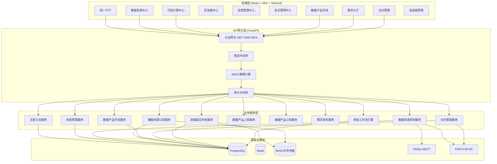
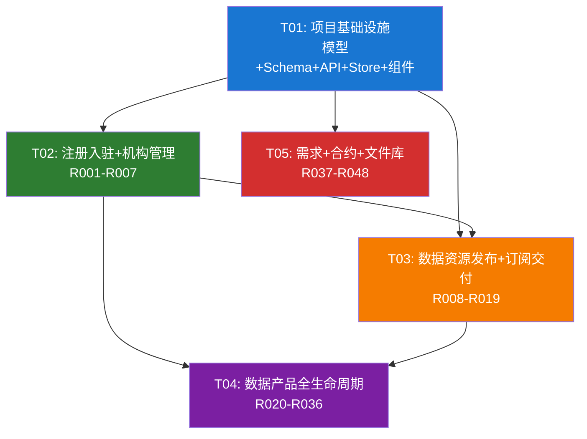

# 南方能源行业可信数据空间 — 系统架构设计与任务分解

> **文档版本**: v2.0  
> **编制人**: Bob (架构师)  
> **编制时间**: 2026-05-21  
> **基于**: PRD v1.0 + 操作指引对比差距分析报告 + 现有系统分析

---

## 目录

1. [系统架构总览](#1-系统架构总览)
2. [数据库设计](#2-数据库设计)
3. [API设计](#3-api设计)
4. [前端设计](#4-前端设计)
5. [安全设计](#5-安全设计)
6. [任务列表](#6-任务列表)
7. [文件清单](#7-文件清单)
8. [依赖包列表](#8-依赖包列表)

---

## 1. 系统架构总览

### 1.1 整体架构图



### 1.2 技术栈确认

| 层次 | 技术选型 | 说明 |
|------|----------|------|
| **前端** | React 18 + MUI 6 + Tailwind CSS 3.4 | 已有基础，增量开发 |
| **状态管理** | Zustand 4.5 + @tanstack/react-query | 已有6个store |
| **路由** | React Router DOM 6.28 | 已有47个页面路由 |
| **后端** | FastAPI 0.115+ + SQLAlchemy 2.0 | 已有66个Router |
| **数据库** | PostgreSQL 16 + asyncpg | 已有87个模型 |
| **缓存** | Redis 7 | 会话+热点数据 |
| **文件存储** | MinIO | 新增，用于文件库 |
| **消息队列** | EMQX 5 (MQTT) | 已有基础连接 |
| **区块链** | FISCO BCOS v3.x | 已有12个合约 |
| **认证** | JWT + SM3 + MFA(TOTP) + SSO + DID | 已实现 |

### 1.3 核心技术挑战与解决方案

| 挑战 | 解决方案 |
|------|----------|
| **68个需求的增量实现** | 基于现有87个模型扩展，不推翻现有架构 |
| **二级审批工作流** | 设计通用审批引擎，支持可配置的多级审批 |
| **连接器架构** | 轻量级连接器代理，通过REST API与平台通信 |
| **差异化交付** | 统一交付接口，按资源类型路由到不同交付通道 |
| **合约管理** | 纸质+电子双轨制，电子合约集成SM2数字签名 |
| **安全等级分类** | 四级分类（核心/重要/一般/公开），支持表级+字段级 |

---

## 2. 数据库设计

### 2.1 现有模型分析

当前系统已有87个SQLAlchemy模型，主要分布在：
- **用户/组织**: Organization, Department, User
- **数据资产**: DataSource, DataAsset, Metadata, DataAssetRating
- **计算**: ComputeTask, DagDefinition, SandboxModel, AgentModel
- **区块链**: NftAsset, EvidenceRecord, BlockchainTransaction, SettlementRecord
- **安全**: DidDocument, VcRecord, KeyStore, SecurityPolicy, ThreatEvent
- **运营**: BillingRecord, AuditLog, ComplianceReport, AlertRule

### 2.2 需要新增的数据表

#### 2.2.1 注册入驻模块

```sql
-- 邀请码表
CREATE TABLE invite_codes (
    id UUID PRIMARY KEY DEFAULT gen_random_uuid(),
    code VARCHAR(20) NOT NULL UNIQUE,
    created_by UUID REFERENCES users(id),
    organization_id UUID REFERENCES organizations(id),
    max_uses INTEGER DEFAULT 1,
    used_count INTEGER DEFAULT 0,
    error_count INTEGER DEFAULT 0,
    status VARCHAR(20) DEFAULT 'active',  -- active/expired/invalidated
    expires_at TIMESTAMP WITH TIME ZONE NOT NULL,
    created_at TIMESTAMP WITH TIME ZONE DEFAULT NOW(),
    
    INDEX idx_invite_code (code),
    INDEX idx_invite_status (status),
    INDEX idx_invite_expires (expires_at)
);

-- 机构认证申请表
CREATE TABLE organization_certifications (
    id UUID PRIMARY KEY DEFAULT gen_random_uuid(),
    organization_id UUID REFERENCES organizations(id) NOT NULL,
    cert_type VARCHAR(30) NOT NULL,  -- enterprise/government/institution
    business_license_url VARCHAR(500),
    legal_person_id_url VARCHAR(500),
    credit_report_url VARCHAR(500),
    authorization_letter_url VARCHAR(500),
    dcmm_cert_url VARCHAR(500),
    iso_cert_url VARCHAR(500),
    social_credit_code VARCHAR(50),
    status VARCHAR(20) DEFAULT 'pending',  -- pending/approved/rejected
    reviewer_id UUID REFERENCES users(id),
    review_comment TEXT,
    reviewed_at TIMESTAMP WITH TIME ZONE,
    created_at TIMESTAMP WITH TIME ZONE DEFAULT NOW(),
    updated_at TIMESTAMP WITH TIME ZONE DEFAULT NOW(),
    
    INDEX idx_cert_org_id (organization_id),
    INDEX idx_cert_status (status),
    INDEX idx_cert_type (cert_type)
);

-- 机构加入申请表
CREATE TABLE organization_join_requests (
    id UUID PRIMARY KEY DEFAULT gen_random_uuid(),
    user_id UUID REFERENCES users(id) NOT NULL,
    organization_id UUID REFERENCES organizations(id) NOT NULL,
    reason TEXT,
    status VARCHAR(20) DEFAULT 'pending',  -- pending/approved/rejected/withdrawn
    reviewer_id UUID REFERENCES users(id),
    review_comment TEXT,
    reviewed_at TIMESTAMP WITH TIME ZONE,
    created_at TIMESTAMP WITH TIME ZONE DEFAULT NOW(),
    updated_at TIMESTAMP WITH TIME ZONE DEFAULT NOW(),
    
    INDEX idx_join_user_id (user_id),
    INDEX idx_join_org_id (organization_id),
    INDEX idx_join_status (status),
    UNIQUE(user_id, organization_id, status)  -- 防止重复申请
);
```

#### 2.2.2 机构管理模块

```sql
-- 自定义角色表
CREATE TABLE custom_roles (
    id UUID PRIMARY KEY DEFAULT gen_random_uuid(),
    name VARCHAR(100) NOT NULL,
    description TEXT,
    organization_id UUID REFERENCES organizations(id) NOT NULL,
    permissions JSONB NOT NULL DEFAULT '{}',  -- {menu: [...], function: [...]}
    is_system BOOLEAN DEFAULT FALSE,
    status VARCHAR(20) DEFAULT 'active',
    created_by UUID REFERENCES users(id),
    created_at TIMESTAMP WITH TIME ZONE DEFAULT NOW(),
    updated_at TIMESTAMP WITH TIME ZONE DEFAULT NOW(),
    
    INDEX idx_role_org_id (organization_id),
    UNIQUE(name, organization_id)
);

-- 用户角色关联表
CREATE TABLE user_roles (
    id UUID PRIMARY KEY DEFAULT gen_random_uuid(),
    user_id UUID REFERENCES users(id) NOT NULL,
    role_id UUID REFERENCES custom_roles(id) NOT NULL,
    assigned_by UUID REFERENCES users(id),
    assigned_at TIMESTAMP WITH TIME ZONE DEFAULT NOW(),
    
    INDEX idx_user_role_user (user_id),
    INDEX idx_user_role_role (role_id),
    UNIQUE(user_id, role_id)
);

-- 审批工单表
CREATE TABLE approval_workflows (
    id UUID PRIMARY KEY DEFAULT gen_random_uuid(),
    workflow_type VARCHAR(50) NOT NULL,  -- member_join/org_change/catalog_publish/subscribe/product_publish
    resource_type VARCHAR(50) NOT NULL,
    resource_id UUID NOT NULL,
    applicant_id UUID REFERENCES users(id) NOT NULL,
    organization_id UUID REFERENCES organizations(id),
    current_step INTEGER DEFAULT 1,
    total_steps INTEGER DEFAULT 2,
    status VARCHAR(20) DEFAULT 'pending',  -- pending/approved/rejected/cancelled
    metadata_ JSONB DEFAULT '{}',
    created_at TIMESTAMP WITH TIME ZONE DEFAULT NOW(),
    updated_at TIMESTAMP WITH TIME ZONE DEFAULT NOW(),
    
    INDEX idx_workflow_type (workflow_type),
    INDEX idx_workflow_status (status),
    INDEX idx_workflow_applicant (applicant_id),
    INDEX idx_workflow_resource (resource_type, resource_id)
);

-- 审批记录表
CREATE TABLE approval_records (
    id UUID PRIMARY KEY DEFAULT gen_random_uuid(),
    workflow_id UUID REFERENCES approval_workflows(id) NOT NULL,
    step_number INTEGER NOT NULL,
    reviewer_id UUID REFERENCES users(id) NOT NULL,
    action VARCHAR(20) NOT NULL,  -- approve/reject/return
    comment TEXT,
    created_at TIMESTAMP WITH TIME ZONE DEFAULT NOW(),
    
    INDEX idx_approval_workflow (workflow_id),
    INDEX idx_approval_reviewer (reviewer_id)
);
```

#### 2.2.3 数据资源发布模块

```sql
-- 连接器表
CREATE TABLE connectors (
    id UUID PRIMARY KEY DEFAULT gen_random_uuid(),
    name VARCHAR(200) NOT NULL,
    connector_type VARCHAR(20) NOT NULL,  -- lite/standard/custom
    version VARCHAR(20),
    organization_id UUID REFERENCES organizations(id) NOT NULL,
    deployment_config JSONB DEFAULT '{}',  -- 部署配置
    status VARCHAR(20) DEFAULT 'offline',  -- online/offline/error/maintenance
    last_heartbeat TIMESTAMP WITH TIME ZONE,
    registered_at TIMESTAMP WITH TIME ZONE DEFAULT NOW(),
    created_by UUID REFERENCES users(id),
    
    INDEX idx_connector_org (organization_id),
    INDEX idx_connector_status (status),
    INDEX idx_connector_type (connector_type)
);

-- 数据源配置表（连接器侧）
CREATE TABLE connector_data_sources (
    id UUID PRIMARY KEY DEFAULT gen_random_uuid(),
    connector_id UUID REFERENCES connectors(id) NOT NULL,
    name VARCHAR(200) NOT NULL,
    db_type VARCHAR(30) NOT NULL,  -- mysql/postgresql/oracle/sqlserver/mongodb
    host VARCHAR(255) NOT NULL,
    port INTEGER NOT NULL,
    username VARCHAR(100),
    password_encrypted TEXT,  -- SM4加密存储
    database_name VARCHAR(100),
    schema_name VARCHAR(100),
    status VARCHAR(20) DEFAULT 'active',
    last_sync_at TIMESTAMP WITH TIME ZONE,
    created_at TIMESTAMP WITH TIME ZONE DEFAULT NOW(),
    
    INDEX idx_cds_connector (connector_id),
    INDEX idx_cds_status (status)
);

-- 元数据发现记录表
CREATE TABLE metadata_discoveries (
    id UUID PRIMARY KEY DEFAULT gen_random_uuid(),
    data_source_id UUID REFERENCES connector_data_sources(id) NOT NULL,
    table_name VARCHAR(200) NOT NULL,
    table_comment VARCHAR(500),
    column_count INTEGER,
    row_count BIGINT,
    columns JSONB NOT NULL,  -- [{name, type, nullable, comment, pk, fk}]
    security_level VARCHAR(20) DEFAULT 'public',  -- core/important/general/public
    sensitive_fields JSONB DEFAULT '[]',
    discovered_at TIMESTAMP WITH TIME ZONE DEFAULT NOW(),
    updated_at TIMESTAMP WITH TIME ZONE DEFAULT NOW(),
    
    INDEX idx_discovery_source (data_source_id),
    INDEX idx_discovery_table (table_name),
    INDEX idx_discovery_security (security_level)
);

-- 数据目录登记表
CREATE TABLE catalog_registrations (
    id UUID PRIMARY KEY DEFAULT gen_random_uuid(),
    catalog_type VARCHAR(20) NOT NULL,  -- dataset/service
    name VARCHAR(200) NOT NULL,
    description TEXT,
    connector_id UUID REFERENCES connectors(id),
    data_source_id UUID REFERENCES connector_data_sources(id),
    metadata_discovery_id UUID REFERENCES metadata_discoveries(id),
    organization_id UUID REFERENCES organizations(id) NOT NULL,
    security_level VARCHAR(20) NOT NULL,  -- core/important/general/public
    visibility VARCHAR(20) DEFAULT 'public',  -- public/private
    supply_channels JSONB DEFAULT '[]',  -- 文件配置/网格查询/隐私计算/密文查询
    control_protocol JSONB DEFAULT '{}',  -- 管控协议配置
    compliance_docs JSONB DEFAULT '[]',  -- 合规材料
    api_config JSONB DEFAULT '{}',  -- 数据服务API配置
    status VARCHAR(20) DEFAULT 'draft',  -- draft/pending/approved/rejected/published
    created_by UUID REFERENCES users(id),
    created_at TIMESTAMP WITH TIME ZONE DEFAULT NOW(),
    updated_at TIMESTAMP WITH TIME ZONE DEFAULT NOW(),
    
    INDEX idx_catalog_type (catalog_type),
    INDEX idx_catalog_org (organization_id),
    INDEX idx_catalog_security (security_level),
    INDEX idx_catalog_status (status),
    INDEX idx_catalog_visibility (visibility)
);

-- 管控协议模板表
CREATE TABLE control_templates (
    id UUID PRIMARY KEY DEFAULT gen_random_uuid(),
    name VARCHAR(200) NOT NULL,
    description TEXT,
    template_content JSONB NOT NULL,
    organization_id UUID REFERENCES organizations(id),
    is_system BOOLEAN DEFAULT FALSE,
    status VARCHAR(20) DEFAULT 'active',
    created_by UUID REFERENCES users(id),
    created_at TIMESTAMP WITH TIME ZONE DEFAULT NOW(),
    
    INDEX idx_template_org (organization_id)
);

-- 开放范围管控表
CREATE TABLE access_scope_rules (
    id UUID PRIMARY KEY DEFAULT gen_random_uuid(),
    catalog_id UUID REFERENCES catalog_registrations(id) NOT NULL,
    scope_type VARCHAR(20) NOT NULL,  -- whitelist/blacklist
    target_type VARCHAR(20) NOT NULL,  -- organization/user
    target_id UUID NOT NULL,
    reason TEXT,
    created_by UUID REFERENCES users(id),
    created_at TIMESTAMP WITH TIME ZONE DEFAULT NOW(),
    
    INDEX idx_scope_catalog (catalog_id),
    INDEX idx_scope_target (target_type, target_id)
);
```

#### 2.2.4 数据资源订阅模块

```sql
-- 数据资源订阅申请表
CREATE TABLE data_subscriptions (
    id UUID PRIMARY KEY DEFAULT gen_random_uuid(),
    catalog_id UUID REFERENCES catalog_registrations(id) NOT NULL,
    subscriber_id UUID REFERENCES users(id) NOT NULL,
    subscriber_org_id UUID REFERENCES organizations(id) NOT NULL,
    reason TEXT,
    contract_id UUID,  -- 关联合约
    subscription_config JSONB DEFAULT '{}',  -- 订阅配置
    status VARCHAR(20) DEFAULT 'pending',  -- pending/approved/rejected/active/expired/cancelled
    approved_by UUID REFERENCES users(id),
    approved_at TIMESTAMP WITH TIME ZONE,
    expires_at TIMESTAMP WITH TIME ZONE,
    created_at TIMESTAMP WITH TIME ZONE DEFAULT NOW(),
    updated_at TIMESTAMP WITH TIME ZONE DEFAULT NOW(),
    
    INDEX idx_sub_catalog (catalog_id),
    INDEX idx_subscriber (subscriber_id),
    INDEX idx_sub_org (subscriber_org_id),
    INDEX idx_sub_status (status)
);

-- 数据交付记录表
CREATE TABLE data_deliveries (
    id UUID PRIMARY KEY DEFAULT gen_random_uuid(),
    subscription_id UUID REFERENCES data_subscriptions(id) NOT NULL,
    delivery_type VARCHAR(20) NOT NULL,  -- file_download/api_access/file_transfer
    delivery_config JSONB DEFAULT '{}',  -- 交付配置（API Token/文件路径等）
    access_token VARCHAR(500),  -- API访问凭证
    file_path VARCHAR(500),  -- 文件路径
    download_count INTEGER DEFAULT 0,
    last_accessed_at TIMESTAMP WITH TIME ZONE,
    status VARCHAR(20) DEFAULT 'active',  -- active/expired/revoked
    created_at TIMESTAMP WITH TIME ZONE DEFAULT NOW(),
    
    INDEX idx_delivery_sub (subscription_id),
    INDEX idx_delivery_type (delivery_type),
    INDEX idx_delivery_status (status)
);
```

#### 2.2.5 数据产品开发模块

```sql
-- 数据产品项目表
CREATE TABLE product_projects (
    id UUID PRIMARY KEY DEFAULT gen_random_uuid(),
    name VARCHAR(200) NOT NULL,
    description TEXT,
    project_type VARCHAR(30) NOT NULL,  -- api/report/application/model/dataset
    organization_id UUID REFERENCES organizations(id) NOT NULL,
    owner_id UUID REFERENCES users(id) NOT NULL,
    data_sources JSONB DEFAULT '[]',  -- 配置的数据源列表
    status VARCHAR(20) DEFAULT 'active',  -- active/archived/completed
    created_at TIMESTAMP WITH TIME ZONE DEFAULT NOW(),
    updated_at TIMESTAMP WITH TIME ZONE DEFAULT NOW(),
    
    INDEX idx_project_org (organization_id),
    INDEX idx_project_owner (owner_id),
    INDEX idx_project_type (project_type),
    INDEX idx_project_status (status)
);

-- 项目成员表
CREATE TABLE project_members (
    id UUID PRIMARY KEY DEFAULT gen_random_uuid(),
    project_id UUID REFERENCES product_projects(id) NOT NULL,
    user_id UUID REFERENCES users(id) NOT NULL,
    role VARCHAR(30) DEFAULT 'member',  -- owner/admin/member/external
    joined_at TIMESTAMP WITH TIME ZONE DEFAULT NOW(),
    
    INDEX idx_pm_project (project_id),
    INDEX idx_pm_user (user_id),
    UNIQUE(project_id, user_id)
);

-- 数据产品表
CREATE TABLE data_products (
    id UUID PRIMARY KEY DEFAULT gen_random_uuid(),
    project_id UUID REFERENCES product_projects(id),
    name VARCHAR(200) NOT NULL,
    description TEXT,
    product_type VARCHAR(30) NOT NULL,  -- api/report/application/model/dataset
    compute_engine VARCHAR(30),  -- service_orchestration/sandbox/fl/mpc_intersect/mpc_shadow/app_development
    version VARCHAR(20) DEFAULT '1.0.0',
    organization_id UUID REFERENCES organizations(id) NOT NULL,
    owner_id UUID REFERENCES users(id) NOT NULL,
    technical_spec JSONB DEFAULT '{}',  -- 技术规格
    pricing JSONB DEFAULT '{}',  -- 定价配置
    delivery_config JSONB DEFAULT '{}',  -- 交付配置
    compliance_docs JSONB DEFAULT '[]',  -- 合规材料
    control_protocol JSONB DEFAULT '{}',  -- 管控协议
    status VARCHAR(20) DEFAULT 'development',  -- development/testing/verification/published/archived
    published_at TIMESTAMP WITH TIME ZONE,
    created_at TIMESTAMP WITH TIME ZONE DEFAULT NOW(),
    updated_at TIMESTAMP WITH TIME ZONE DEFAULT NOW(),
    
    INDEX idx_product_project (project_id),
    INDEX idx_product_org (organization_id),
    INDEX idx_product_type (product_type),
    INDEX idx_product_status (status)
);

-- 产品验收记录表
CREATE TABLE product_acceptances (
    id UUID PRIMARY KEY DEFAULT gen_random_uuid(),
    product_id UUID REFERENCES data_products(id) NOT NULL,
    acceptor_id UUID REFERENCES users(id) NOT NULL,
    test_result JSONB DEFAULT '{}',
    status VARCHAR(20) DEFAULT 'pending',  -- pending/approved/rejected
    comment TEXT,
    accepted_at TIMESTAMP WITH TIME ZONE,
    created_at TIMESTAMP WITH TIME ZONE DEFAULT NOW(),
    
    INDEX idx_acceptance_product (product_id)
);
```

#### 2.2.6 数据产品上架模块

```sql
-- 产品上架申请表
CREATE TABLE product_publish_requests (
    id UUID PRIMARY KEY DEFAULT gen_random_uuid(),
    product_id UUID REFERENCES data_products(id) NOT NULL,
    applicant_id UUID REFERENCES users(id) NOT NULL,
    organization_id UUID REFERENCES organizations(id) NOT NULL,
    review_deadline TIMESTAMP WITH TIME ZONE,  -- 差异化审核周期
    control_protocol JSONB DEFAULT '{}',
    compliance_docs JSONB DEFAULT '[]',
    pricing_config JSONB DEFAULT '{}',
    status VARCHAR(20) DEFAULT 'pending',  -- pending/approved/rejected/published
    reviewer_id UUID REFERENCES users(id),
    review_comment TEXT,
    reviewed_at TIMESTAMP WITH TIME ZONE,
    published_at TIMESTAMP WITH TIME ZONE,
    created_at TIMESTAMP WITH TIME ZONE DEFAULT NOW(),
    updated_at TIMESTAMP WITH TIME ZONE DEFAULT NOW(),
    
    INDEX idx_publish_product (product_id),
    INDEX idx_publish_status (status),
    INDEX idx_publish_deadline (review_deadline)
);

-- 产品下架申请表
CREATE TABLE product_unpublish_requests (
    id UUID PRIMARY KEY DEFAULT gen_random_uuid(),
    product_id UUID REFERENCES data_products(id) NOT NULL,
    applicant_id UUID REFERENCES users(id) NOT NULL,
    reason TEXT,
    status VARCHAR(20) DEFAULT 'pending',  -- pending/approved/rejected
    reviewer_id UUID REFERENCES users(id),
    review_comment TEXT,
    reviewed_at TIMESTAMP WITH TIME ZONE,
    created_at TIMESTAMP WITH TIME ZONE DEFAULT NOW(),
    
    INDEX idx_unpublish_product (product_id)
);
```

#### 2.2.7 数据产品订阅模块

```sql
-- 产品订阅申请表
CREATE TABLE product_subscriptions (
    id UUID PRIMARY KEY DEFAULT gen_random_uuid(),
    product_id UUID REFERENCES data_products(id) NOT NULL,
    subscriber_id UUID REFERENCES users(id) NOT NULL,
    subscriber_org_id UUID REFERENCES organizations(id) NOT NULL,
    reason TEXT,
    contract_id UUID,  -- 关联合约
    subscription_config JSONB DEFAULT '{}',
    delivery_config JSONB DEFAULT '{}',  -- 交付配置
    status VARCHAR(20) DEFAULT 'pending',  -- pending/approved/rejected/active/expired/cancelled
    approved_by UUID REFERENCES users(id),
    approved_at TIMESTAMP WITH TIME ZONE,
    expires_at TIMESTAMP WITH TIME ZONE,
    created_at TIMESTAMP WITH TIME ZONE DEFAULT NOW(),
    updated_at TIMESTAMP WITH TIME ZONE DEFAULT NOW(),
    
    INDEX idx_psub_product (product_id),
    INDEX idx_psub_subscriber (subscriber_id),
    INDEX idx_psub_status (status)
);

-- 产品交付记录表
CREATE TABLE product_deliveries (
    id UUID PRIMARY KEY DEFAULT gen_random_uuid(),
    subscription_id UUID REFERENCES product_subscriptions(id) NOT NULL,
    delivery_type VARCHAR(30) NOT NULL,  -- token/download/url_token
    delivery_config JSONB DEFAULT '{}',
    access_token VARCHAR(500),
    access_url VARCHAR(500),
    download_count INTEGER DEFAULT 0,
    last_accessed_at TIMESTAMP WITH TIME ZONE,
    status VARCHAR(20) DEFAULT 'active',
    created_at TIMESTAMP WITH TIME ZONE DEFAULT NOW(),
    
    INDEX idx_pdelivery_sub (subscription_id)
);
```

#### 2.2.8 需求发布模块

```sql
-- 需求表
CREATE TABLE demands (
    id UUID PRIMARY KEY DEFAULT gen_random_uuid(),
    demand_type VARCHAR(30) NOT NULL,  -- data_resource/data_product
    title VARCHAR(200) NOT NULL,
    description TEXT NOT NULL,
    technical_requirements JSONB DEFAULT '{}',
    budget_range VARCHAR(50),
    deadline DATE,
    organization_id UUID REFERENCES organizations(id) NOT NULL,
    publisher_id UUID REFERENCES users(id) NOT NULL,
    security_risk_assessment JSONB DEFAULT '{}',  -- 5类风险评估
    status VARCHAR(20) DEFAULT 'pending',  -- pending/published/closed/expired/intervened
    claimed_by_org UUID REFERENCES organizations(id),
    claimed_by_user UUID REFERENCES users(id),
    claimed_at TIMESTAMP WITH TIME ZONE,
    published_at TIMESTAMP WITH TIME ZONE,
    closed_at TIMESTAMP WITH TIME ZONE,
    created_at TIMESTAMP WITH TIME ZONE DEFAULT NOW(),
    updated_at TIMESTAMP WITH TIME ZONE DEFAULT NOW(),
    
    INDEX idx_demand_type (demand_type),
    INDEX idx_demand_org (organization_id),
    INDEX idx_demand_status (status),
    INDEX idx_demand_publisher (publisher_id),
    INDEX idx_demand_deadline (deadline)
);

-- 需求认领记录表
CREATE TABLE demand_claims (
    id UUID PRIMARY KEY DEFAULT gen_random_uuid(),
    demand_id UUID REFERENCES demands(id) NOT NULL,
    claimer_id UUID REFERENCES users(id) NOT NULL,
    claimer_org_id UUID REFERENCES organizations(id) NOT NULL,
    proposal TEXT,
    status VARCHAR(20) DEFAULT 'pending',  -- pending/approved/rejected
    reviewed_by UUID REFERENCES users(id),
    reviewed_at TIMESTAMP WITH TIME ZONE,
    created_at TIMESTAMP WITH TIME ZONE DEFAULT NOW(),
    
    INDEX idx_claim_demand (demand_id),
    INDEX idx_claim_claimer (claimer_id)
);
```

#### 2.2.9 合约管理模块

```sql
-- 合约表
CREATE TABLE contracts (
    id UUID PRIMARY KEY DEFAULT gen_random_uuid(),
    contract_no VARCHAR(50) NOT NULL UNIQUE,
    contract_type VARCHAR(20) NOT NULL,  -- paper/electronic
    name VARCHAR(200) NOT NULL,
    description TEXT,
    party_a_org_id UUID REFERENCES organizations(id) NOT NULL,
    party_b_org_id UUID REFERENCES organizations(id) NOT NULL,
    pricing_type VARCHAR(20) NOT NULL,  -- periodic/per_use/one_time
    pricing_config JSONB DEFAULT '{}',
    terms JSONB DEFAULT '{}',
    effective_date DATE,
    expiry_date DATE,
    digital_signature JSONB DEFAULT '{}',  -- 电子签名信息
    status VARCHAR(20) DEFAULT 'draft',  -- draft/pending_approval/active/expired/terminated/amended
    created_by UUID REFERENCES users(id),
    approved_by UUID REFERENCES users(id),
    approved_at TIMESTAMP WITH TIME ZONE,
    created_at TIMESTAMP WITH TIME ZONE DEFAULT NOW(),
    updated_at TIMESTAMP WITH TIME ZONE DEFAULT NOW(),
    
    INDEX idx_contract_no (contract_no),
    INDEX idx_contract_type (contract_type),
    INDEX idx_contract_party_a (party_a_org_id),
    INDEX idx_contract_party_b (party_b_org_id),
    INDEX idx_contract_status (status)
);

-- 合约变更记录表
CREATE TABLE contract_amendments (
    id UUID PRIMARY KEY DEFAULT gen_random_uuid(),
    contract_id UUID REFERENCES contracts(id) NOT NULL,
    amendment_type VARCHAR(20) NOT NULL,  -- modify/terminate
    changes JSONB NOT NULL,
    reason TEXT,
    status VARCHAR(20) DEFAULT 'pending',  -- pending/approved/rejected
    applicant_id UUID REFERENCES users(id) NOT NULL,
    reviewer_id UUID REFERENCES users(id),
    reviewed_at TIMESTAMP WITH TIME ZONE,
    created_at TIMESTAMP WITH TIME ZONE DEFAULT NOW(),
    
    INDEX idx_amendment_contract (contract_id)
);
```

#### 2.2.10 连接器文件库模块

```sql
-- 文件库文件表
CREATE TABLE connector_files (
    id UUID PRIMARY KEY DEFAULT gen_random_uuid(),
    name VARCHAR(200) NOT NULL,
    file_type VARCHAR(30) NOT NULL,  -- structured/unstructured/mixed
    file_size BIGINT,
    storage_path VARCHAR(500) NOT NULL,
    mime_type VARCHAR(100),
    connector_id UUID REFERENCES connectors(id),
    organization_id UUID REFERENCES organizations(id) NOT NULL,
    uploaded_by UUID REFERENCES users(id) NOT NULL,
    file_set_id UUID,
    metadata_ JSONB DEFAULT '{}',
    status VARCHAR(20) DEFAULT 'active',
    created_at TIMESTAMP WITH TIME ZONE DEFAULT NOW(),
    
    INDEX idx_cfile_connector (connector_id),
    INDEX idx_cfile_org (organization_id),
    INDEX idx_cfile_set (file_set_id)
);

-- 文件集表
CREATE TABLE file_sets (
    id UUID PRIMARY KEY DEFAULT gen_random_uuid(),
    name VARCHAR(200) NOT NULL,
    description TEXT,
    connector_id UUID REFERENCES connectors(id),
    organization_id UUID REFERENCES organizations(id) NOT NULL,
    file_count INTEGER DEFAULT 0,
    total_size BIGINT DEFAULT 0,
    status VARCHAR(20) DEFAULT 'active',
    created_by UUID REFERENCES users(id),
    created_at TIMESTAMP WITH TIME ZONE DEFAULT NOW(),
    updated_at TIMESTAMP WITH TIME ZONE DEFAULT NOW(),
    
    INDEX idx_fset_connector (connector_id),
    INDEX idx_fset_org (organization_id)
);

-- API代理配置表
CREATE TABLE api_proxies (
    id UUID PRIMARY KEY DEFAULT gen_random_uuid(),
    name VARCHAR(200) NOT NULL,
    description TEXT,
    source_api_url VARCHAR(500) NOT NULL,
    source_method VARCHAR(10) NOT NULL,
    source_headers JSONB DEFAULT '{}',
    proxy_path VARCHAR(200) NOT NULL,
    error_codes JSONB DEFAULT '{}',
    connector_id UUID REFERENCES connectors(id),
    organization_id UUID REFERENCES organizations(id) NOT NULL,
    status VARCHAR(20) DEFAULT 'draft',  -- draft/testing/published
    test_result JSONB DEFAULT '{}',
    created_by UUID REFERENCES users(id),
    created_at TIMESTAMP WITH TIME ZONE DEFAULT NOW(),
    updated_at TIMESTAMP WITH TIME ZONE DEFAULT NOW(),
    
    INDEX idx_apiproxy_connector (connector_id),
    INDEX idx_apiproxy_org (organization_id),
    INDEX idx_apiproxy_status (status),
    UNIQUE(proxy_path)
);
```

### 2.3 新增表关系图

```mermaid
erDiagram
    invite_codes ||--o{ users : "created_by"
    organization_certifications ||--|| organizations : "belongs_to"
    organization_join_requests }o--|| users : "applicant"
    organization_join_requests }o--|| organizations : "target"
    
    custom_roles ||--|| organizations : "belongs_to"
    user_roles }o--|| users : "assigned_to"
    user_roles }o--|| custom_roles : "has_role"
    
    approval_workflows ||--o{ approval_records : "contains"
    approval_workflows }o--|| users : "applicant"
    
    connectors ||--|| organizations : "belongs_to"
    connectors ||--o{ connector_data_sources : "contains"
    connector_data_sources ||--o{ metadata_discoveries : "discovers"
    
    catalog_registrations }o--|| organizations : "belongs_to"
    catalog_registrations ||--o{ data_subscriptions : "subscribed_by"
    catalog_registrations ||--o{ access_scope_rules : "controlled_by"
    
    data_subscriptions ||--o{ data_deliveries : "delivers"
    
    product_projects ||--o{ project_members : "has"
    product_projects ||--o{ data_products : "produces"
    data_products ||--o{ product_publish_requests : "publish_requests"
    data_products ||--o{ product_subscriptions : "subscribed_by"
    
    demands ||--o{ demand_claims : "claimed_by"
    
    contracts ||--o{ contract_amendments : "amended_by"
    contracts }o--|| organizations : "party_a"
    contracts }o--|| organizations : "party_b"
    
    connector_files }o--|| file_sets : "belongs_to"
    connectors ||--o{ connector_files : "contains"
    connectors ||--o{ api_proxies : "proxies"
```



---

## 3. API设计

### 3.1 新增API端点列表

#### 3.1.1 注册入驻模块 (R001-R003)

| 方法 | 路径 | 说明 | 需求 |
|------|------|------|------|
| POST | `/api/v1/auth/register/invite-code` | 使用邀请码注册 | R001 |
| POST | `/api/v1/auth/invite-codes` | 生成邀请码（管理员） | R001 |
| GET | `/api/v1/auth/invite-codes` | 获取邀请码列表 | R001 |
| POST | `/api/v1/organizations/certifications` | 提交机构认证申请 | R002 |
| GET | `/api/v1/organizations/certifications` | 获取认证申请列表 | R002 |
| PUT | `/api/v1/organizations/certifications/{id}/review` | 审核认证申请 | R002 |
| GET | `/api/v1/organizations` | 获取机构列表 | R003 |
| POST | `/api/v1/organizations/{id}/join` | 申请加入机构 | R003 |
| GET | `/api/v1/organizations/join-requests` | 获取加入申请列表 | R003 |
| PUT | `/api/v1/organizations/join-requests/{id}/review` | 审批加入申请 | R003 |
| PUT | `/api/v1/organizations/join-requests/{id}/withdraw` | 撤回加入申请 | R003 |

#### 3.1.2 机构管理模块 (R004-R007)

| 方法 | 路径 | 说明 | 需求 |
|------|------|------|------|
| GET | `/api/v1/ops/roles` | 获取角色列表 | R005 |
| POST | `/api/v1/ops/roles` | 创建自定义角色 | R005 |
| PUT | `/api/v1/ops/roles/{id}` | 更新角色 | R005 |
| DELETE | `/api/v1/ops/roles/{id}` | 删除角色 | R005 |
| POST | `/api/v1/ops/roles/{id}/permissions` | 配置角色权限 | R005 |
| POST | `/api/v1/ops/users/{id}/assign-role` | 分配角色 | R005 |
| POST | `/api/v1/ops/users` | 创建用户（管理员代建） | R006 |
| POST | `/api/v1/ops/users/{id}/reset-password` | 重置密码 | R006 |
| POST | `/api/v1/ops/users/{id}/freeze` | 冻结账户 | R006 |
| POST | `/api/v1/ops/users/{id}/unfreeze` | 解冻账户 | R006 |
| GET | `/api/v1/ops/organizations/{id}` | 获取机构信息 | R007 |
| PUT | `/api/v1/ops/organizations/{id}` | 编辑机构信息 | R007 |
| POST | `/api/v1/ops/organizations/{id}/change-request` | 提交变更申请 | R007 |
| GET | `/api/v1/ops/departments` | 获取部门树 | R007 |
| POST | `/api/v1/ops/departments` | 创建部门 | R007 |
| PUT | `/api/v1/ops/departments/{id}` | 更新部门 | R007 |
| DELETE | `/api/v1/ops/departments/{id}` | 删除部门 | R007 |

#### 3.1.3 数据资源发布模块 (R008-R015)

| 方法 | 路径 | 说明 | 需求 |
|------|------|------|------|
| POST | `/api/v1/connectors` | 注册连接器 | R008 |
| GET | `/api/v1/connectors` | 获取连接器列表 | R008 |
| GET | `/api/v1/connectors/{id}` | 获取连接器详情 | R008 |
| PUT | `/api/v1/connectors/{id}` | 更新连接器 | R008 |
| POST | `/api/v1/connectors/{id}/heartbeat` | 连接器心跳 | R008 |
| POST | `/api/v1/connectors/{id}/data-sources` | 创建数据源 | R009 |
| GET | `/api/v1/connectors/{id}/data-sources` | 获取数据源列表 | R009 |
| PUT | `/api/v1/connectors/{id}/data-sources/{ds_id}` | 更新数据源 | R009 |
| POST | `/api/v1/connectors/{id}/data-sources/{ds_id}/test` | 测试连接 | R009 |
| POST | `/api/v1/connectors/{id}/data-sources/{ds_id}/discover` | 触发元数据发现 | R010 |
| GET | `/api/v1/connectors/{id}/data-sources/{ds_id}/metadata` | 获取发现的元数据 | R010 |
| PUT | `/api/v1/metadata-discoveries/{id}/security-level` | 设置安全等级 | R011 |
| PUT | `/api/v1/metadata-discoveries/{id}/sensitive-fields` | 标记敏感字段 | R011 |
| POST | `/api/v1/catalogs` | 创建目录登记 | R012 |
| GET | `/api/v1/catalogs` | 获取目录列表 | R012 |
| GET | `/api/v1/catalogs/{id}` | 获取目录详情 | R012 |
| PUT | `/api/v1/catalogs/{id}` | 更新目录 | R012 |
| POST | `/api/v1/catalogs/{id}/supply-channels` | 配置供给渠道 | R013 |
| POST | `/api/v1/catalogs/{id}/control-protocol` | 配置管控协议 | R014 |
| GET | `/api/v1/control-templates` | 获取管控模板列表 | R014 |
| POST | `/api/v1/catalogs/{id}/access-scope` | 配置开放范围 | R014 |
| POST | `/api/v1/catalogs/{id}/submit` | 提交审批 | R015 |
| PUT | `/api/v1/catalogs/{id}/review` | 审批目录（二级） | R015 |
| POST | `/api/v1/catalogs/{id}/compliance-docs` | 上传合规材料 | R015 |

#### 3.1.4 数据资源订阅模块 (R016-R019)

| 方法 | 路径 | 说明 | 需求 |
|------|------|------|------|
| GET | `/api/v1/data-resources/search` | 搜索数据资源 | R016 |
| GET | `/api/v1/data-resources/browse` | 浏览数据资源中心 | R016 |
| POST | `/api/v1/data-subscriptions` | 提交订阅申请 | R017 |
| GET | `/api/v1/data-subscriptions` | 获取订阅列表 | R017 |
| PUT | `/api/v1/data-subscriptions/{id}/review` | 审批订阅（含合约/协议配置） | R018 |
| GET | `/api/v1/data-subscriptions/{id}` | 获取订阅详情 | R018 |
| POST | `/api/v1/data-subscriptions/{id}/deliver` | 触发数据交付 | R019 |
| GET | `/api/v1/data-subscriptions/{id}/delivery` | 获取交付信息 | R019 |

#### 3.1.5 数据产品开发模块 (R020-R027)

| 方法 | 路径 | 说明 | 需求 |
|------|------|------|------|
| POST | `/api/v1/product-projects` | 创建项目 | R020 |
| GET | `/api/v1/product-projects` | 获取项目列表 | R020 |
| GET | `/api/v1/product-projects/{id}` | 获取项目详情 | R020 |
| POST | `/api/v1/product-projects/{id}/members` | 添加项目成员 | R020 |
| POST | `/api/v1/product-projects/{id}/data-sources` | 配置项目数据源 | R020 |
| POST | `/api/v1/data-products` | 创建数据产品 | R021 |
| GET | `/api/v1/data-products` | 获取产品列表 | R021 |
| GET | `/api/v1/data-products/{id}` | 获取产品详情 | R021 |
| PUT | `/api/v1/data-products/{id}` | 更新产品 | R021 |
| POST | `/api/v1/data-products/{id}/compute-engine` | 配置计算引擎 | R022 |
| POST | `/api/v1/data-products/{id}/accept` | 产品验收 | R027 |

#### 3.1.6 数据产品上架模块 (R028-R032)

| 方法 | 路径 | 说明 | 需求 |
|------|------|------|------|
| POST | `/api/v1/product-publish` | 提交上架申请 | R028 |
| GET | `/api/v1/product-publish` | 获取上架申请列表 | R028 |
| PUT | `/api/v1/product-publish/{id}/review` | 审核上架申请 | R028 |
| POST | `/api/v1/product-publish/{id}/control-protocol` | 配置管控协议 | R030 |
| POST | `/api/v1/product-publish/{id}/compliance-docs` | 上传合规材料 | R031 |
| POST | `/api/v1/product-unpublish` | 提交下架申请 | R032 |
| PUT | `/api/v1/product-unpublish/{id}/review` | 审核下架申请 | R032 |

#### 3.1.7 数据产品订阅模块 (R033-R036)

| 方法 | 路径 | 说明 | 需求 |
|------|------|------|------|
| GET | `/api/v1/product-market/search` | 搜索数据产品 | R033 |
| GET | `/api/v1/product-market/recommend` | 产品推荐 | R033 |
| POST | `/api/v1/product-subscriptions` | 提交产品订阅申请 | R034 |
| GET | `/api/v1/product-subscriptions` | 获取产品订阅列表 | R034 |
| PUT | `/api/v1/product-subscriptions/{id}/review` | 审批产品订阅 | R034 |
| POST | `/api/v1/product-subscriptions/{id}/contract` | 备案合约 | R035 |
| POST | `/api/v1/product-subscriptions/{id}/deliver` | 触发产品交付 | R036 |
| GET | `/api/v1/product-subscriptions/{id}/delivery` | 获取产品交付信息 | R036 |

#### 3.1.8 需求发布模块 (R037-R041)

| 方法 | 路径 | 说明 | 需求 |
|------|------|------|------|
| POST | `/api/v1/demands` | 发布需求 | R037 |
| GET | `/api/v1/demands` | 获取需求列表（需求大厅） | R037 |
| GET | `/api/v1/demands/{id}` | 获取需求详情 | R037 |
| PUT | `/api/v1/demands/{id}` | 更新需求 | R037 |
| POST | `/api/v1/demands/{id}/risk-assessment` | 安全风险评估 | R038 |
| PUT | `/api/v1/demands/{id}/status` | 更新需求状态 | R039 |
| POST | `/api/v1/demands/{id}/claim` | 认领需求 | R040 |
| GET | `/api/v1/demands/{id}/claims` | 获取认领列表 | R040 |
| PUT | `/api/v1/demands/{id}/claims/{claim_id}/review` | 审批认领 | R040 |
| POST | `/api/v1/demands/{id}/intervene` | 运营方干预（超7天） | R041 |

#### 3.1.9 合约管理模块 (R042-R045)

| 方法 | 路径 | 说明 | 需求 |
|------|------|------|------|
| POST | `/api/v1/contracts` | 创建合约 | R042/R043 |
| GET | `/api/v1/contracts` | 获取合约列表 | R042/R043 |
| GET | `/api/v1/contracts/{id}` | 获取合约详情 | R042/R043 |
| PUT | `/api/v1/contracts/{id}` | 更新合约 | R042/R043 |
| POST | `/api/v1/contracts/{id}/approve` | 审批合约 | R042/R043 |
| POST | `/api/v1/contracts/{id}/sign` | 电子签名（SM2） | R043 |
| POST | `/api/v1/contracts/{id}/pricing` | 配置定价 | R044 |
| POST | `/api/v1/contracts/{id}/amend` | 合约变更 | R045 |
| POST | `/api/v1/contracts/{id}/terminate` | 合约终止 | R045 |
| PUT | `/api/v1/contracts/amendments/{id}/review` | 审批变更/终止 | R045 |

#### 3.1.10 连接器文件库模块 (R046-R048)

| 方法 | 路径 | 说明 | 需求 |
|------|------|------|------|
| POST | `/api/v1/connector-files/upload` | 上传文件 | R046 |
| GET | `/api/v1/connector-files` | 获取文件列表 | R046 |
| GET | `/api/v1/connector-files/{id}/download` | 下载文件 | R046 |
| POST | `/api/v1/file-sets` | 创建文件集 | R047 |
| GET | `/api/v1/file-sets` | 获取文件集列表 | R047 |
| POST | `/api/v1/file-sets/{id}/files` | 添加文件到文件集 | R047 |
| POST | `/api/v1/api-proxies` | 创建API代理 | R048 |
| GET | `/api/v1/api-proxies` | 获取API代理列表 | R048 |
| POST | `/api/v1/api-proxies/{id}/test` | 测试API代理 | R048 |
| POST | `/api/v1/api-proxies/{id}/publish` | 发布API代理 | R048 |

#### 3.1.11 审批工作流引擎（通用）

| 方法 | 路径 | 说明 |
|------|------|------|
| GET | `/api/v1/workflows` | 获取审批工单列表 |
| GET | `/api/v1/workflows/{id}` | 获取审批详情 |
| POST | `/api/v1/workflows/{id}/approve` | 审批通过 |
| POST | `/api/v1/workflows/{id}/reject` | 审批拒绝 |
| GET | `/api/v1/workflows/pending` | 获取待审批列表 |

### 3.2 API响应格式规范

所有API统一使用以下响应格式：

```json
{
  "code": 0,
  "message": "success",
  "data": { ... },
  "timestamp": "2026-05-21T12:00:00Z"
}
```

分页响应：
```json
{
  "code": 0,
  "message": "success",
  "data": {
    "items": [...],
    "total": 100,
    "page": 1,
    "page_size": 20
  }
}
```

---

## 4. 前端设计

### 4.1 需要新增的页面

| 模块 | 页面路径 | 页面名称 | 优先级 |
|------|----------|----------|--------|
| **注册入驻** | `/register` | 注册页面（邀请码） | P0 |
| | `/dashboard/organizations` | 机构列表与搜索 | P0 |
| | `/dashboard/organizations/certify` | 机构认证申请 | P0 |
| | `/dashboard/organizations/join` | 申请加入机构 | P0 |
| **机构管理** | `/dashboard/ops/member-approval` | 成员审批工单 | P0 |
| | `/dashboard/ops/roles` | 角色管理 | P0 |
| | `/dashboard/ops/org-info` | 机构信息管理 | P0 |
| | `/dashboard/ops/departments` | 部门管理 | P0 |
| **数据资源发布** | `/dashboard/data/connectors` | 连接器管理 | P0 |
| | `/dashboard/data/connectors/{id}/sources` | 连接器数据源管理 | P0 |
| | `/dashboard/data/connectors/{id}/sources/{id}/metadata` | 元数据发现 | P0 |
| | `/dashboard/data/catalog/register` | 目录登记 | P0 |
| | `/dashboard/data/catalog/{id}/supply-channels` | 供给渠道配置 | P0 |
| | `/dashboard/data/catalog/{id}/control-protocol` | 管控协议配置 | P0 |
| | `/dashboard/data/catalog/{id}/approval` | 目录审批 | P0 |
| **数据资源订阅** | `/dashboard/data/resources` | 数据资源中心 | P0 |
| | `/dashboard/data/subscriptions` | 我的订阅 | P0 |
| | `/dashboard/data/subscriptions/{id}` | 订阅详情 | P0 |
| **数据产品开发** | `/dashboard/product/projects` | 项目管理 | P0 |
| | `/dashboard/product/projects/{id}` | 项目详情 | P0 |
| | `/dashboard/product/create` | 创建产品 | P0 |
| **数据产品上架** | `/dashboard/product/publish` | 产品上架申请 | P0 |
| | `/dashboard/product/publish/{id}` | 上架详情 | P0 |
| **数据产品订阅** | `/dashboard/product/market` | 产品市场 | P0 |
| | `/dashboard/product/subscriptions` | 产品订阅管理 | P0 |
| **需求发布** | `/dashboard/demands` | 需求大厅 | P0 |
| | `/dashboard/demands/create` | 发布需求 | P0 |
| | `/dashboard/demands/{id}` | 需求详情 | P0 |
| | `/dashboard/demands/my` | 我的需求 | P0 |
| **合约管理** | `/dashboard/contracts` | 合约列表 | P0 |
| | `/dashboard/contracts/create` | 创建合约 | P0 |
| | `/dashboard/contracts/{id}` | 合约详情 | P0 |
| **连接器文件库** | `/dashboard/connector-files` | 文件库 | P0 |
| | `/dashboard/connector-files/file-sets` | 文件集管理 | P0 |
| | `/dashboard/connector-files/api-proxies` | API代理管理 | P0 |
| **审批中心** | `/dashboard/workflows` | 审批中心（统一入口） | P0 |

### 4.2 需要修改的页面

| 页面 | 修改内容 |
|------|----------|
| `LoginPage.tsx` | 增加注册入口、邀请码输入 |
| `LandingPage.tsx` | 增加数据资源中心、产品市场、需求大厅入口 |
| `DashboardPage.tsx` | 增加待审批、订阅、合约等统计卡片 |
| `MainLayout.tsx` | 侧边栏增加新菜单项 |
| `DataCatalogPage.tsx` | 增加目录登记、审批流程 |
| `DataMarketPage.tsx` | 改造为产品市场 |
| `DataApplicationPage.tsx` | 改造为订阅管理 |
| `OpsUsersPage.tsx` | 增加角色分配、冻结/解冻 |
| `OpsOrgPage.tsx` | 增加机构信息编辑、变更申请 |

### 4.3 需要新增的前端文件

```
frontend/src/
├── api/
│   ├── registration.ts          [新增] 注册入驻API
│   ├── connector.ts             [新增] 连接器管理API
│   ├── catalog.ts               [新增] 数据目录API
│   ├── subscription.ts          [新增] 订阅管理API
│   ├── product.ts               [新增] 数据产品API
│   ├── demand.ts                [新增] 需求发布API
│   ├── contract.ts              [新增] 合约管理API
│   ├── connectorFile.ts         [新增] 连接器文件库API
│   └── workflow.ts              [新增] 审批工作流API
├── pages/
│   ├── auth/
│   │   └── RegisterPage.tsx     [新增] 注册页面
│   ├── organization/
│   │   ├── OrgListPage.tsx      [新增] 机构列表
│   │   ├── OrgCertifyPage.tsx   [新增] 机构认证
│   │   └── OrgJoinPage.tsx      [新增] 加入机构
│   ├── data/
│   │   ├── ConnectorPage.tsx    [新增] 连接器管理
│   │   ├── ConnectorSourcePage.tsx [新增] 连接器数据源
│   │   ├── MetadataDiscoveryPage.tsx [新增] 元数据发现
│   │   ├── CatalogRegisterPage.tsx [新增] 目录登记
│   │   ├── DataResourceCenterPage.tsx [新增] 数据资源中心
│   │   ├── DataSubscriptionPage.tsx [新增] 我的订阅
│   │   └── SubscriptionDetailPage.tsx [新增] 订阅详情
│   ├── product/
│   │   ├── ProjectListPage.tsx  [新增] 项目列表
│   │   ├── ProjectDetailPage.tsx [新增] 项目详情
│   │   ├── ProductCreatePage.tsx [新增] 创建产品
│   │   ├── ProductPublishPage.tsx [新增] 产品上架
│   │   ├── ProductMarketPage.tsx [新增] 产品市场
│   │   └── ProductSubscriptionPage.tsx [新增] 产品订阅
│   ├── demand/
│   │   ├── DemandHallPage.tsx   [新增] 需求大厅
│   │   ├── DemandCreatePage.tsx [新增] 发布需求
│   │   ├── DemandDetailPage.tsx [新增] 需求详情
│   │   └── MyDemandsPage.tsx    [新增] 我的需求
│   ├── contract/
│   │   ├── ContractListPage.tsx [新增] 合约列表
│   │   ├── ContractCreatePage.tsx [新增] 创建合约
│   │   └── ContractDetailPage.tsx [新增] 合约详情
│   ├── connector-files/
│   │   ├── FileLibraryPage.tsx  [新增] 文件库
│   │   ├── FileSetPage.tsx      [新增] 文件集管理
│   │   └── ApiProxyPage.tsx     [新增] API代理管理
│   └── workflow/
│       └── ApprovalCenterPage.tsx [新增] 审批中心
├── stores/
│   ├── registrationStore.ts     [新增] 注册入驻状态
│   ├── connectorStore.ts        [新增] 连接器状态
│   ├── catalogStore.ts          [新增] 目录状态
│   ├── subscriptionStore.ts     [新增] 订阅状态
│   ├── productStore.ts          [新增] 产品状态
│   ├── demandStore.ts           [新增] 需求状态
│   ├── contractStore.ts         [新增] 合约状态
│   └── workflowStore.ts         [新增] 审批工作流状态
└── components/
    ├── ApprovalDialog.tsx       [新增] 审批对话框
    ├── SecurityLevelBadge.tsx   [新增] 安全等级标签
    ├── ContractTemplate.tsx     [新增] 合约模板组件
    └── RiskAssessmentForm.tsx   [新增] 风险评估表单
```

---

## 5. 安全设计

### 5.1 权限模型（RBAC + ABAC）

#### 5.1.1 角色定义

| 角色 | 说明 | 主要权限 |
|------|------|----------|
| `platform_admin` | 平台管理员 | 全局管理、审核认证、系统配置 |
| `platform_operator` | 平台运营方 | 二级审批、需求干预、合规审核 |
| `org_admin` | 机构管理员 | 成员管理、角色管理、一级审批 |
| `data_provider` | 数据提供方 | 连接器管理、数据源配置、目录登记 |
| `data_consumer` | 数据使用方 | 资源搜索、订阅申请、数据使用 |
| `product_developer` | 产品加工员 | 项目管理、产品开发、产品上架 |
| `demand_publisher` | 需求发布员 | 需求发布、需求管理 |
| `demand_fulfiller` | 需求承接员 | 需求认领、需求交付 |

#### 5.1.2 ABAC策略示例

```json
{
  "policy_id": "catalog_publish_policy",
  "description": "数据目录发布权限控制",
  "effect": "allow",
  "conditions": {
    "user.role": ["data_provider", "org_admin"],
    "user.organization_id": "${resource.organization_id}",
    "resource.status": ["draft", "rejected"],
    "time.business_hours": true
  }
}
```

### 5.2 数据安全策略

| 等级 | 分类 | 标记 | 处理策略 |
|------|------|------|----------|
| 核心 | 关键业务数据 | `core` | SM4加密存储 + 字段级脱敏 + 仅白名单访问 |
| 重要 | 敏感业务数据 | `important` | SM4加密传输 + 访问审计 + 审批后访问 |
| 一般 | 普通业务数据 | `general` | HTTPS传输 + 访问日志 |
| 公开 | 公开数据 | `public` | 无限制 |

### 5.3 审计日志设计

所有关键操作均记录审计日志：

```json
{
  "audit_id": "uuid",
  "timestamp": "2026-05-21T12:00:00Z",
  "actor": {
    "user_id": "uuid",
    "username": "user1",
    "organization_id": "uuid",
    "ip_address": "192.168.1.1"
  },
  "action": "catalog.publish",
  "resource": {
    "type": "catalog_registration",
    "id": "uuid",
    "name": "电力负荷数据集"
  },
  "details": {
    "status_change": "draft -> pending",
    "security_level": "important"
  },
  "result": "success"
}
```

---

## 6. 任务列表

### 6.1 任务总览

基于依赖关系和优先级，将68个需求分解为5个主要任务：

| 任务ID | 任务名称 | 覆盖需求 | 依赖 | 优先级 |
|--------|----------|----------|------|--------|
| T01 | 项目基础设施 | 数据库迁移 + 路由注册 + 通用组件 | 无 | P0 |
| T02 | 注册入驻 + 机构管理 | R001-R007 | T01 | P0 |
| T03 | 数据资源发布 + 订阅交付 | R008-R019 | T01, T02 | P0 |
| T04 | 数据产品全生命周期 | R020-R036 | T01, T02, T03 | P0 |
| T05 | 需求发布 + 合约管理 + 文件库 | R037-R048 | T01, T02 | P0 |

### 6.2 详细任务描述

#### T01: 项目基础设施

**目标**: 建立新模块的数据模型、路由注册、通用组件

**依赖**: 无

**源文件**:
- `backend/app/models/invite_code.py` [新增]
- `backend/app/models/certification.py` [新增]
- `backend/app/models/connector.py` [新增]
- `backend/app/models/catalog.py` [新增]
- `backend/app/models/subscription.py` [新增]
- `backend/app/models/product.py` [新增]
- `backend/app/models/demand.py` [新增]
- `backend/app/models/contract.py` [新增]
- `backend/app/models/connector_file.py` [新增]
- `backend/app/models/workflow.py` [新增]
- `backend/app/models/__init__.py` [修改]
- `backend/alembic/versions/0010_add_business_tables.py` [新增]
- `backend/app/api/v1/router.py` [修改]
- `backend/app/schemas/registration.py` [新增]
- `backend/app/schemas/connector.py` [新增]
- `backend/app/schemas/catalog.py` [新增]
- `backend/app/schemas/subscription.py` [新增]
- `backend/app/schemas/product.py` [新增]
- `backend/app/schemas/demand.py` [新增]
- `backend/app/schemas/contract.py` [新增]
- `backend/app/schemas/workflow.py` [新增]
- `frontend/src/api/registration.ts` [新增]
- `frontend/src/api/connector.ts` [新增]
- `frontend/src/api/catalog.ts` [新增]
- `frontend/src/api/subscription.ts` [新增]
- `frontend/src/api/product.ts` [新增]
- `frontend/src/api/demand.ts` [新增]
- `frontend/src/api/contract.ts` [新增]
- `frontend/src/api/connectorFile.ts` [新增]
- `frontend/src/api/workflow.ts` [新增]
- `frontend/src/stores/registrationStore.ts` [新增]
- `frontend/src/stores/connectorStore.ts` [新增]
- `frontend/src/stores/catalogStore.ts` [新增]
- `frontend/src/stores/subscriptionStore.ts` [新增]
- `frontend/src/stores/productStore.ts` [新增]
- `frontend/src/stores/demandStore.ts` [新增]
- `frontend/src/stores/contractStore.ts` [新增]
- `frontend/src/stores/workflowStore.ts` [新增]
- `frontend/src/components/ApprovalDialog.tsx` [新增]
- `frontend/src/components/SecurityLevelBadge.tsx` [新增]
- `frontend/src/components/ContractTemplate.tsx` [新增]
- `frontend/src/components/RiskAssessmentForm.tsx` [新增]
- `frontend/src/routes/index.tsx` [修改]

**具体任务**:
1. 创建10个新数据模型文件
2. 编写Alembic迁移脚本（0010）
3. 创建8个Schema文件
4. 创建9个API Service文件
5. 创建8个Zustand Store文件
6. 创建4个通用组件
7. 更新路由注册（router.py + routes/index.tsx）

**验收标准**:
- 数据库迁移成功
- 所有新模型可正常导入
- 前端路由可访问

---

#### T02: 注册入驻 + 机构管理

**目标**: 实现邀请码注册、机构认证、成员审批、角色管理

**依赖**: T01

**源文件**:
- `backend/app/api/v1/registration.py` [新增]
- `backend/app/api/v1/org_management.py` [新增]
- `backend/app/services/registration_service.py` [新增]
- `backend/app/services/certification_service.py` [新增]
- `backend/app/services/role_service.py` [新增]
- `backend/app/services/workflow_service.py` [新增]
- `frontend/src/pages/auth/RegisterPage.tsx` [新增]
- `frontend/src/pages/organization/OrgListPage.tsx` [新增]
- `frontend/src/pages/organization/OrgCertifyPage.tsx` [新增]
- `frontend/src/pages/organization/OrgJoinPage.tsx` [新增]
- `frontend/src/pages/ops/MemberApprovalPage.tsx` [新增]
- `frontend/src/pages/ops/RoleManagePage.tsx` [新增]
- `frontend/src/pages/ops/OrgInfoPage.tsx` [新增]
- `frontend/src/pages/ops/DepartmentPage.tsx` [新增]
- `frontend/src/pages/workflow/ApprovalCenterPage.tsx` [新增]
- `frontend/src/pages/auth/LoginPage.tsx` [修改]
- `frontend/src/pages/ops/OpsUsersPage.tsx` [修改]
- `frontend/src/pages/ops/OpsOrgPage.tsx` [修改]
- `frontend/src/layouts/MainLayout.tsx` [修改]
- `frontend/src/routes/index.tsx` [修改]

**具体任务**:
1. 实现邀请码生成、验证、过期、失效逻辑
2. 实现三类机构认证申请与审核流程
3. 实现机构加入申请与审批流程
4. 实现审批工作流引擎
5. 实现自定义角色管理
6. 实现用户管理增强（代建、重置密码、冻结/解冻）
7. 实现机构信息管理与变更申请
8. 实现部门树形管理
9. 创建注册、机构管理、审批相关页面
10. 更新侧边栏菜单和路由

**验收标准**:
- 邀请码注册流程完整
- 机构认证审核通过
- 成员审批工作流正常
- 角色权限配置生效
- 用户管理功能完整

---

#### T03: 数据资源发布 + 订阅交付

**目标**: 实现连接器管理、元数据发现、目录登记、订阅审批、数据交付

**依赖**: T01, T02

**源文件**:
- `backend/app/api/v1/connector_manage.py` [新增]
- `backend/app/api/v1/catalog_manage.py` [新增]
- `backend/app/api/v1/data_subscription.py` [新增]
- `backend/app/services/connector_service.py` [新增]
- `backend/app/services/metadata_discovery_service.py` [新增]
- `backend/app/services/catalog_service_v2.py` [新增]
- `backend/app/services/data_subscription_service.py` [新增]
- `backend/app/services/delivery_service.py` [新增]
- `frontend/src/pages/data/ConnectorPage.tsx` [新增]
- `frontend/src/pages/data/ConnectorSourcePage.tsx` [新增]
- `frontend/src/pages/data/MetadataDiscoveryPage.tsx` [新增]
- `frontend/src/pages/data/CatalogRegisterPage.tsx` [新增]
- `frontend/src/pages/data/DataResourceCenterPage.tsx` [新增]
- `frontend/src/pages/data/DataSubscriptionPage.tsx` [新增]
- `frontend/src/pages/data/SubscriptionDetailPage.tsx` [新增]
- `frontend/src/pages/data/DataCatalogPage.tsx` [修改]
- `frontend/src/pages/data/DataMarketPage.tsx` [修改]
- `frontend/src/routes/index.tsx` [修改]

**具体任务**:
1. 实现连接器注册、心跳、状态管理
2. 实现连接器数据源配置与测试
3. 实现元数据自动发现
4. 实现安全等级分类（表级+字段级）
5. 实现目录登记流程（数据集/数据服务）
6. 实现供给渠道配置
7. 实现管控协议配置（模板+开放范围）
8. 实现二级审批流程
9. 实现数据资源搜索与浏览
10. 实现订阅申请与审批（含合约/协议配置）
11. 实现数据交付（文件下载/API访问/文件传输）

**验收标准**:
- 连接器注册和心跳正常
- 元数据自动发现成功
- 目录登记审批流程完整
- 订阅申请审批正常
- 数据交付功能可用

---

#### T04: 数据产品全生命周期

**目标**: 实现产品开发、上架、订阅、交付全流程

**依赖**: T01, T02, T03

**源文件**:
- `backend/app/api/v1/product_manage.py` [新增]
- `backend/app/api/v1/product_publish_v2.py` [新增]
- `backend/app/api/v1/product_market.py` [新增]
- `backend/app/services/product_service.py` [新增]
- `backend/app/services/product_publish_service.py` [新增]
- `backend/app/services/product_market_service.py` [新增]
- `backend/app/services/product_delivery_service.py` [新增]
- `frontend/src/pages/product/ProjectListPage.tsx` [新增]
- `frontend/src/pages/product/ProjectDetailPage.tsx` [新增]
- `frontend/src/pages/product/ProductCreatePage.tsx` [新增]
- `frontend/src/pages/product/ProductPublishPage.tsx` [新增]
- `frontend/src/pages/product/ProductMarketPage.tsx` [新增]
- `frontend/src/pages/product/ProductSubscriptionPage.tsx` [新增]
- `frontend/src/pages/product/ProductDetailPage.tsx` [新增]
- `frontend/src/routes/index.tsx` [修改]

**具体任务**:
1. 实现项目管理（创建/成员配置/数据源配置）
2. 实现5种产品类型支持
3. 实现产品验收流程
4. 实现产品上架申请与审核（差异化周期）
5. 实现管控协议与合规材料管理
6. 实现产品下架流程
7. 实现产品市场搜索与推荐
8. 实现产品订阅申请与审批
9. 实现合约备案
10. 实现差异化交付（Token/下载/URL）

**验收标准**:
- 项目创建和管理正常
- 产品开发流程完整
- 上架审核周期差异化生效
- 产品市场搜索正常
- 产品交付功能可用

---

#### T05: 需求发布 + 合约管理 + 文件库

**目标**: 实现需求大厅、合约管理、连接器文件库

**依赖**: T01, T02

**源文件**:
- `backend/app/api/v1/demand_manage.py` [新增]
- `backend/app/api/v1/contract_manage.py` [新增]
- `backend/app/api/v1/connector_file_manage.py` [新增]
- `backend/app/services/demand_service.py` [新增]
- `backend/app/services/contract_service.py` [新增]
- `backend/app/services/connector_file_service.py` [新增]
- `backend/app/services/risk_assessment_service.py` [新增]
- `frontend/src/pages/demand/DemandHallPage.tsx` [新增]
- `frontend/src/pages/demand/DemandCreatePage.tsx` [新增]
- `frontend/src/pages/demand/DemandDetailPage.tsx` [新增]
- `frontend/src/pages/demand/MyDemandsPage.tsx` [新增]
- `frontend/src/pages/contract/ContractListPage.tsx` [新增]
- `frontend/src/pages/contract/ContractCreatePage.tsx` [新增]
- `frontend/src/pages/contract/ContractDetailPage.tsx` [新增]
- `frontend/src/pages/connector-files/FileLibraryPage.tsx` [新增]
- `frontend/src/pages/connector-files/FileSetPage.tsx` [新增]
- `frontend/src/pages/connector-files/ApiProxyPage.tsx` [新增]
- `frontend/src/routes/index.tsx` [修改]

**具体任务**:
1. 实现需求发布（数据资源/数据产品）
2. 实现安全风险评估（5类风险）
3. 实现需求状态管理
4. 实现需求认领流程
5. 实现超7天运营方干预机制
6. 实现纸质/电子合约管理
7. 实现合约定价配置
8. 实现合约变更/终止流程
9. 实现文件上传与管理
10. 实现文件集管理
11. 实现API代理配置与测试

**验收标准**:
- 需求发布和搜索正常
- 风险评估功能可用
- 需求认领流程完整
- 合约创建和审批正常
- 文件上传下载正常
- API代理测试通过

---

## 7. 文件清单

### 7.1 新增文件列表（后端）

```
backend/app/models/
├── invite_code.py                    # 邀请码模型
├── certification.py                  # 机构认证模型
├── connector.py                      # 连接器模型
├── catalog.py                        # 数据目录模型
├── subscription.py                   # 订阅模型
├── product.py                        # 数据产品模型
├── demand.py                         # 需求模型
├── contract.py                       # 合约模型
├── connector_file.py                 # 连接器文件模型
└── workflow.py                       # 审批工作流模型

backend/app/schemas/
├── registration.py                   # 注册入驻Schema
├── connector.py                      # 连接器Schema
├── catalog.py                        # 数据目录Schema
├── subscription.py                   # 订阅Schema
├── product.py                        # 数据产品Schema
├── demand.py                         # 需求Schema
├── contract.py                       # 合约Schema
└── workflow.py                       # 审批工作流Schema

backend/app/api/v1/
├── registration.py                   # 注册入驻API
├── org_management.py                 # 机构管理API
├── connector_manage.py               # 连接器管理API
├── catalog_manage.py                 # 数据目录API
├── data_subscription.py              # 数据订阅API
├── product_manage.py                 # 数据产品API
├── product_publish_v2.py             # 产品上架API
├── product_market.py                 # 产品市场API
├── demand_manage.py                  # 需求管理API
├── contract_manage.py                # 合约管理API
└── connector_file_manage.py          # 连接器文件API

backend/app/services/
├── registration_service.py           # 注册入驻服务
├── certification_service.py          # 机构认证服务
├── role_service.py                   # 角色管理服务
├── workflow_service.py               # 审批工作流服务
├── connector_service.py              # 连接器服务
├── metadata_discovery_service.py     # 元数据发现服务
├── catalog_service_v2.py             # 数据目录服务
├── data_subscription_service.py      # 数据订阅服务
├── delivery_service.py               # 数据交付服务
├── product_service.py                # 数据产品服务
├── product_publish_service.py        # 产品上架服务
├── product_market_service.py         # 产品市场服务
├── product_delivery_service.py       # 产品交付服务
├── demand_service.py                 # 需求服务
├── risk_assessment_service.py        # 风险评估服务
├── contract_service.py               # 合约服务
└── connector_file_service.py         # 连接器文件服务

backend/alembic/versions/
└── 0010_add_business_tables.py       # 业务表迁移
```

### 7.2 新增文件列表（前端）

```
frontend/src/api/
├── registration.ts                   # 注册入驻API
├── connector.ts                      # 连接器API
├── catalog.ts                        # 数据目录API
├── subscription.ts                   # 订阅API
├── product.ts                        # 数据产品API
├── demand.ts                         # 需求API
├── contract.ts                       # 合约API
├── connectorFile.ts                  # 连接器文件API
└── workflow.ts                       # 审批工作流API

frontend/src/pages/auth/
└── RegisterPage.tsx                  # 注册页面

frontend/src/pages/organization/
├── OrgListPage.tsx                   # 机构列表
├── OrgCertifyPage.tsx                # 机构认证
└── OrgJoinPage.tsx                   # 加入机构

frontend/src/pages/data/
├── ConnectorPage.tsx                 # 连接器管理
├── ConnectorSourcePage.tsx           # 连接器数据源
├── MetadataDiscoveryPage.tsx         # 元数据发现
├── CatalogRegisterPage.tsx           # 目录登记
├── DataResourceCenterPage.tsx        # 数据资源中心
├── DataSubscriptionPage.tsx          # 我的订阅
└── SubscriptionDetailPage.tsx        # 订阅详情

frontend/src/pages/product/
├── ProjectListPage.tsx               # 项目列表
├── ProjectDetailPage.tsx             # 项目详情
├── ProductCreatePage.tsx             # 创建产品
├── ProductPublishPage.tsx            # 产品上架
├── ProductMarketPage.tsx             # 产品市场
├── ProductSubscriptionPage.tsx       # 产品订阅
└── ProductDetailPage.tsx             # 产品详情

frontend/src/pages/demand/
├── DemandHallPage.tsx                # 需求大厅
├── DemandCreatePage.tsx              # 发布需求
├── DemandDetailPage.tsx              # 需求详情
└── MyDemandsPage.tsx                 # 我的需求

frontend/src/pages/contract/
├── ContractListPage.tsx              # 合约列表
├── ContractCreatePage.tsx            # 创建合约
└── ContractDetailPage.tsx            # 合约详情

frontend/src/pages/connector-files/
├── FileLibraryPage.tsx               # 文件库
├── FileSetPage.tsx                   # 文件集管理
└── ApiProxyPage.tsx                  # API代理管理

frontend/src/pages/workflow/
└── ApprovalCenterPage.tsx            # 审批中心

frontend/src/pages/ops/
├── MemberApprovalPage.tsx            # 成员审批
├── RoleManagePage.tsx                # 角色管理
├── OrgInfoPage.tsx                   # 机构信息
└── DepartmentPage.tsx                # 部门管理

frontend/src/stores/
├── registrationStore.ts              # 注册入驻状态
├── connectorStore.ts                 # 连接器状态
├── catalogStore.ts                   # 目录状态
├── subscriptionStore.ts              # 订阅状态
├── productStore.ts                   # 产品状态
├── demandStore.ts                    # 需求状态
├── contractStore.ts                  # 合约状态
└── workflowStore.ts                  # 审批工作流状态

frontend/src/components/
├── ApprovalDialog.tsx                # 审批对话框
├── SecurityLevelBadge.tsx            # 安全等级标签
├── ContractTemplate.tsx              # 合约模板组件
└── RiskAssessmentForm.tsx            # 风险评估表单
```

### 7.3 修改文件列表

```
backend/app/models/__init__.py        # 导出新模型
backend/app/api/v1/router.py          # 注册新路由
backend/alembic/versions/0010_*.py    # 数据库迁移

frontend/src/routes/index.tsx         # 添加新路由
frontend/src/layouts/MainLayout.tsx   # 更新侧边栏菜单
frontend/src/pages/auth/LoginPage.tsx # 增加注册入口
frontend/src/pages/data/DataCatalogPage.tsx # 目录功能增强
frontend/src/pages/data/DataMarketPage.tsx # 产品市场改造
frontend/src/pages/ops/OpsUsersPage.tsx # 用户管理增强
frontend/src/pages/ops/OpsOrgPage.tsx # 机构管理增强
```

---

## 8. 依赖包列表

### 8.1 后端Python依赖（requirements.txt补充）

```
# 文件存储
minio>=7.2.0                    # MinIO客户端
python-multipart>=0.0.6         # 文件上传

# 数据库工具
sqlalchemy[asyncio]>=2.0.0      # 已有，确认版本
asyncpg>=0.29.0                 # 已有
alembic>=1.13.0                 # 已有

# 缓存
redis[hiredis]>=5.0.0           # 已有

# 安全
pyotp>=2.9.0                    # TOTP MFA
python-jose[cryptography]>=3.3.0 # JWT
passlib[bcrypt]>=1.7.4          # 密码哈希

# 文件处理
openpyxl>=3.1.0                 # Excel导入导出
aiofiles>=23.2.0                # 异步文件操作

# HTTP客户端
httpx>=0.27.0                   # 异步HTTP

# 任务调度
apscheduler>=3.10.0             # 定时任务（合约到期检查等）

# 工具
python-dateutil>=2.8.0          # 日期处理
```

### 8.2 前端npm依赖（package.json补充）

```json
{
  "dependencies": {
    "date-fns": "^3.6.0",           // 日期处理
    "file-saver": "^2.0.5",         // 文件下载
    "@types/file-saver": "^2.0.7",
    "xlsx": "^0.18.5",              // Excel导入导出
    "qrcode.react": "^3.1.0",       // MFA二维码
    "react-dropzone": "^14.2.3",    // 文件拖拽上传
    "react-quill": "^2.0.0"         // 富文本编辑器（合约内容）
  }
}
```

---

## 附录：任务依赖图



**并行开发建议**:
- T02和T05可以并行开发（均只依赖T01）
- T03需要等T02完成（依赖机构管理功能）
- T04需要等T03完成（依赖数据资源订阅功能）

---

**文档完成时间**: 2026-05-21  
**编制人**: Bob (架构师)  
**审核状态**: 待审核
