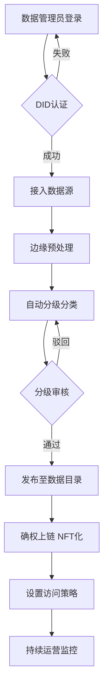
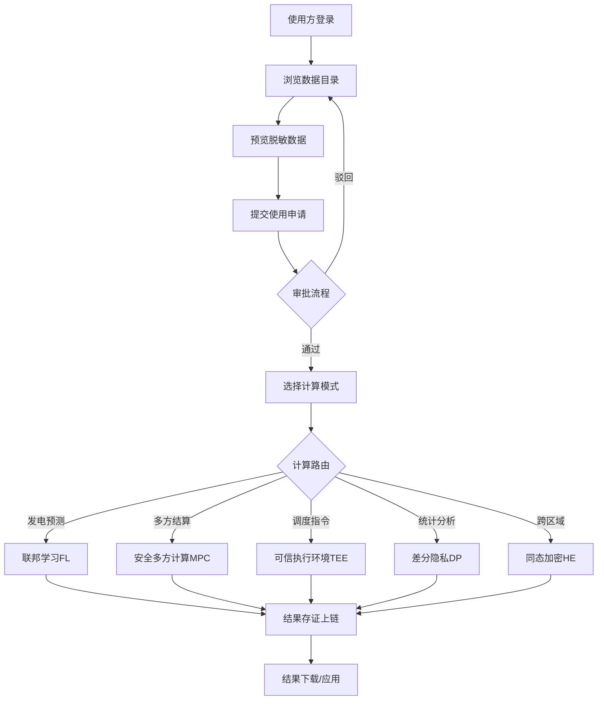
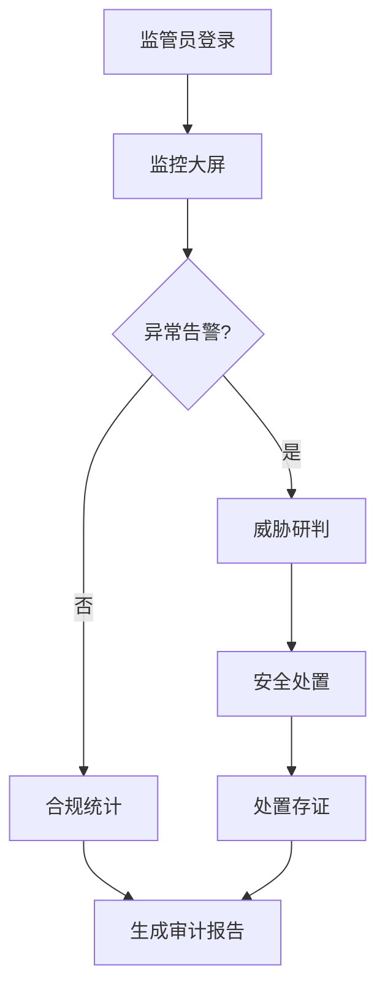

# 产品需求文档（PRD）

## 面向能源可信数据空间的"一门户五中心"系统

| 字段 | 值 |
|------|-----|
| **项目名称** | energy_trusted_data_space |
| **文档版本** | v1.0 |
| **语言** | 中文 |
| **编程语言** | Vite + React 18 + MUI v6 + TailwindCSS（前端）/ FastAPI + Python 3.12（后端） |
| **竞赛编号** | XA-202613 |
| **核心原则** | 全量真实实现，禁止任何模拟/占位/Mock |

---

## 一、原始需求复述

构建一个面向能源行业的可信数据空间系统，采用"一门户五中心"架构：统一门户 + 数据资源中心 + 可信计算中心 + 区块链存证中心 + 运营管理中心 + 安全管控中心。系统须完整实现身份认证、数据接入与治理、隐私计算、区块链存证、运营管理、安全管控等全链路能力，所有组件真实可用，无任何模拟或占位。

---

## 二、产品目标

| # | 目标 | 衡量标准 |
|---|------|----------|
| G1 | **数据可信流通** — 实现能源数据从采集、确权、计算到存证的全链路可信闭环 | 数据血缘可追溯率 ≥99%；存证覆盖率=8关键节点/8；区块链存证单条查询 <200ms |
| G2 | **隐私安全合规** — 确保多方数据协作过程中的隐私保护与国密合规 | 联邦学习数据不出域 = 100%；国密算法 SM2/SM3/SM4 全链路覆盖；合规审计月度报告自动生成 |
| G3 | **高效运营服务** — 提供低门槛的数据服务市场与自动化运营能力 | API P99 <500ms；SLA ≥99.9%；页面首屏 <2s；数据服务从申请到开通 ≤4h |

---

## 三、用户故事

| # | 角色 | 用户故事 |
|---|------|----------|
| US1 | 发电企业数据管理员 | 作为发电企业数据管理员，我想将智能电表数据接入平台并自动分级分类，以便数据能被合规地发布到数据服务市场供其他方使用 |
| US2 | 电网调度中心分析师 | 作为电网调度中心分析师，我想通过联邦学习在不暴露原始数据的情况下完成跨区域发电预测，以便提升调度精度同时满足数据不出域要求 |
| US3 | 市场交易结算员 | 作为市场交易结算员，我想通过安全多方计算完成多方电费结算并自动上链存证，以便结算结果可信且可追溯 |
| US4 | 监管机构审查员 | 作为监管机构审查员，我想查看全平台数据流通监控大屏和合规统计报告，以便实时掌握数据安全态势并完成合规审计 |
| US5 | 平台运营管理员 | 作为平台运营管理员，我想管理服务目录、计费规则和用户权限，以便平台能够自动计费、分配收益并控制访问 |

---

## 四、用户流程

### 4.1 数据提供方流程



### 4.2 数据使用方流程



### 4.3 监管审查流程



---

## 五、功能需求池

### P0 — 必须实现（Must Have）

#### 5.1 统一门户

| ID | 需求 | 验收标准 |
|----|------|----------|
| P0-PORTAL-01 | DID身份认证 | 支持DID + 传统账号密码 + 国密SM2证书三种登录方式；强制MFA双因素认证 |
| P0-PORTAL-02 | RBAC+ABAC权限路由 | 4基础角色（超级管理员/数据管理员/普通用户/审计员）+ 属性策略动态授权；菜单按角色自动加载 |
| P0-PORTAL-03 | 数据服务市场 | 数据资产目录展示、关键词搜索与多维筛选、元数据预览（10条脱敏样本） |
| P0-PORTAL-04 | 服务申请管理 | 在线申请提交 → 审批流程跟踪 → 状态实时WebSocket推送 |
| P0-PORTAL-05 | 监管大屏 | ECharts全屏展示数据流通、安全态势、合规统计；数据刷新 ≤5s |
| P0-PORTAL-06 | 安全防护 | Session超时可配置（默认30min）；登录失败5次锁定15min；CSRF/XSS/SQL注入全防护；全操作审计日志 |
| P0-PORTAL-07 | 技术基线 | React 18 + Vite + MUI v6 + TailwindCSS + ECharts；页面首屏 <2s；API P99 <500ms；WebSocket实时通信 |

#### 5.2 数据资源中心

| ID | 需求 | 验收标准 |
|----|------|----------|
| P0-DATA-01 | 多源数据接入 | 智能电表DLMS/COSEM、新能源终端Modbus/IEC61850、气象HTTP API、市场价格WebSocket四类协议全部实现 |
| P0-DATA-02 | 边缘预处理 | 格式转换（→JSON/Parquet）、数据压缩（LZ4/ZSTD）、异常过滤（3σ规则） |
| P0-DATA-03 | 实时采集 | 核心数据采集延迟 ≤1s；非核心数据 ≤5min |
| P0-DATA-04 | 断线续传 | MQTT协议离线缓存，恢复后自动续传；消息不丢失 |
| P0-DATA-05 | MQTT主题体系 | energy/collect/{device_did}/{data_type}、energy/register/{device_did}、energy/heartbeat/{device_did}、energy/alarm/{device_did}/{alarm_type} 四类主题全部实现 |
| P0-DATA-06 | 数据分类分级 | 6大类（发电/用电/调度/市场/设备状态/地理信息）×4敏感级别（核心/重要/敏感/公开）；自动分级引擎 + 人工审核 |
| P0-DATA-07 | 三维标签体系 | 行业维度 × 安全维度 × 业务维度三维标签；支持标签检索与聚合 |
| P0-DATA-08 | 元数据管理 | 遵循GB/T 36073-2018标准；数据血缘可视化（DAG图）；版本控制 |
| P0-DATA-09 | 数据目录发布 | 开放目录展示、脱敏预览10条、申请入口、评价反馈 |
| P0-DATA-10 | 数据质量 | 完整性：缺失率 <0.1%；时效性：延迟 <1s；准确性：>95%；一致性：>99.9% |
| P0-DATA-11 | 数据模型 | DataAsset、Metadata、AccessLog 三核心模型完整实现 |

#### 5.3 可信计算中心

| ID | 需求 | 验收标准 |
|----|------|----------|
| P0-COMP-01 | 联邦学习（FL） | 横向/纵向FL；LR/NN/树模型；基于FATE Framework；5方训练 <5min |
| P0-COMP-02 | 安全多方计算（MPC） | 秘密分享、混淆电路、不经意传输；基于MP-SPDZ；3方计算 <10s |
| P0-COMP-03 | TEE可信执行环境 | Intel SGX + Gramine；启动 <3s |
| P0-COMP-04 | 同态加密（HE） | CKKS浮点 + BFV整数；基于微软SEAL库 |
| P0-COMP-05 | 差分隐私（DP） | 本地/全局DP；ε值可配置（默认ε=1.0） |
| P0-COMP-06 | 业务场景路由 | 发电预测→FL、多方结算→MPC、调度指令→TEE、统计分析→DP、跨区域→HE、信用评估→VFL 六条路由全部实现 |
| P0-COMP-07 | 计算任务管理 | DAG可视化拖拽编排、多方DID签名协调、状态实时追踪、加密结果管理 |
| P0-COMP-08 | 数据沙箱 | Docker + seccomp隔离、算法准入扫描、自动脱敏、出口审核 |
| P0-COMP-09 | 性能基准 | FL<5min/5方、MPC<10s/3方、TEE<3s启动、≥10并发任务 |
| P0-COMP-10 | FATE部署 | Coordinator 8核32GB + Party 4核16GB 配置落地 |
| P0-COMP-11 | AI Agent | QueryAgent/TradeAgent/SecurityAgent/DispatchAgent 四Agent；LangChain + AutoGen + DeepSeek-V3本地部署 |

#### 5.4 区块链存证中心

| ID | 需求 | 验收标准 |
|----|------|----------|
| P0-CHAIN-01 | 数据资产确权 | DID绑定、NFT化（ERC-721类似）、确权证书生成、原创性证明 |
| P0-CHAIN-02 | 全流程存证 | 8个关键节点全覆盖（采集/预处理/分级/发布/申请/计算/结果/结算）；JSON Schema格式 |
| P0-CHAIN-03 | 智能合约自动结算 | 计费规则上链、条件触发自动执行、收益分配、争议仲裁流程 |
| P0-CHAIN-04 | FISCO BCOS部署 | PBFT共识、4共识节点（8核16GB + 1TB SSD）、专属链ID |
| P0-CHAIN-05 | 6个智能合约 | IdentityRegistry.sol、DataAssetNFT.sol、AccessControl.sol、UsageLogger.sol、AutoSettlement.sol、ComplianceAudit.sol 全部实现并部署 |
| P0-CHAIN-06 | 查询性能 | 单条查询 <200ms、范围查询 <2s、溯源查询 <5s |

#### 5.5 运营管理中心

| ID | 需求 | 验收标准 |
|----|------|----------|
| P0-OPS-01 | 用户与组织管理 | 四级架构（平台→组织→部门→用户）；全生命周期；DID绑定；批量Excel导入 |
| P0-OPS-02 | 服务目录与计费 | 三级服务目录；按次/按量/订阅三种计费模式；月度账单自动生成；配额管理 |
| P0-OPS-03 | 运营监控 | Prometheus + Grafana；业务指标监控；多渠道告警（邮件/短信/WebSocket）；故障自愈 |
| P0-OPS-04 | 合规管理 | 日志保留 ≥6个月；月度/季度合规报告自动生成；GDPR/数安法合规检查；第三方审计接口 |
| P0-OPS-05 | KPI | SLA ≥99.9%；API <200ms；TPS ≥1000；并发 ≥100；高危告警 <5min响应 |

#### 5.6 安全管控中心

| ID | 需求 | 验收标准 |
|----|------|----------|
| P0-SEC-01 | RBAC+ABAC混合 | 4基础角色 + 属性策略 + 动态授权 + 最小权限原则 + 跨域授权 |
| P0-SEC-02 | 数字身份 | W3C DID v1.0 + did:fisco方法；可验证凭证VC；密钥轮换；设备DID |
| P0-SEC-03 | 密钥管理 | HSM支持；三层体系（主密钥/密钥加密密钥/数据密钥）；Shamir 3-of-5秘密分享；使用审计 |
| P0-SEC-04 | 威胁检测 | 规则引擎 + ML模型双检测；安全态势大屏；APT检测；安全报告 |
| P0-SEC-05 | 国密算法 | SM2/SM3/SM4/SM9/ZUC 基于GmSSL v3.x全链路实现 |
| P0-SEC-06 | 零知识证明 | 数据源头真实性（Groth16 zk-SNARK）、身份属性证明（BBS+签名）、范围证明（Bulletproofs） |
| P0-SEC-07 | 安全等级 | 四级安全（核心→重要→敏感→公开）；核心级=TEE+MFA+IP白名单+双重加密；公开级=HTTPS+访问计数 |

---

### P1 — 应该实现（Should Have）

| ID | 所属模块 | 需求 | 验收标准 |
|----|----------|------|----------|
| P1-PORTAL-01 | 统一门户 | 数据使用仪表盘 | 数据使用统计可视化、费用明细查询、计算任务状态实时监控 |
| P1-PORTAL-02 | 统一门户 | 公告与通知 | 系统公告、合规提醒、告警通知统一推送；WebSocket实时 + 站内信 |
| P1-PORTAL-03 | 统一门户 | 深色/浅色主题切换 | MUI ThemeProvider 动态切换；用户偏好持久化 |
| P1-PORTAL-04 | 统一门户 | SSO单点登录 | 跨子系统单点登录；Session共享 |
| P1-PORTAL-05 | 统一门户 | WCAG 2.1 AA无障碍 | 键盘导航、屏幕阅读器兼容、对比度达标 |
| P1-DATA-01 | 数据资源中心 | 数据血缘可视化 | 以DAG图展示数据从采集到消费的全链路血缘关系；支持节点点击下钻 |
| P1-DATA-02 | 数据资源中心 | 元数据版本控制 | 元数据变更自动版本化；支持版本对比与回滚 |
| P1-COMP-01 | 可信计算中心 | 资源调度引擎 | 计算任务GPU/CPU资源智能调度；任务排队与优先级管理 |
| P1-OPS-01 | 运营管理中心 | 收益分配 | 数据提供方40%质量+60%使用量权重分配；平台5%、算法10%、治理5%抽成 |
| P1-SEC-01 | 安全管控中心 | 安全态势大屏 | 全平台安全指标可视化；威胁等级实时展示；历史趋势 |
| P1-SEC-02 | 安全管控中心 | 密钥轮换自动化 | 主密钥周期性轮换（默认90天）；轮换期间零停机 |

---

### P2 — 锦上添花（Nice to Have）

| ID | 所属模块 | 需求 | 验收标准 |
|----|----------|------|----------|
| P2-PORTAL-01 | 统一门户 | 响应式1366×768适配 | 在1366×768分辨率下布局不溢出、功能完整 |
| P2-DATA-01 | 数据资源中心 | 数据质量评分看板 | 各维度质量指标综合评分可视化；趋势分析 |
| P2-COMP-01 | 可信计算中心 | 模型市场 | 预训练联邦学习模型共享与发布 |
| P2-OPS-01 | 运营管理中心 | 智能运维 | 基于ML的异常检测与容量预测 |
| P2-SEC-01 | 安全管控中心 | 隐私合规自动扫描 | GDPR/数安法合规自动检查清单与修复建议 |

---

## 六、UI设计要求

### 6.1 整体布局

```
┌─────────────────────────────────────────────────────┐
│  TopBar: Logo | 搜索 | 通知 | 主题切换 | 用户头像   │
├──────────┬──────────────────────────────────────────┤
│          │                                          │
│ Sidebar  │  Main Content Area                       │
│ --------  │                                          │
│ 门户首页  │  ┌────────────────────────────────────┐  │
│ 数据资源  │  │  Breadcrumb + Page Title            │  │
│ 可信计算  │  ├────────────────────────────────────┤  │
│ 区块链    │  │                                    │  │
│ 运营管理  │  │  Content (Cards / Tables / Charts)  │  │
│ 安全管控  │  │                                    │  │
│          │  └────────────────────────────────────┘  │
│          │                                          │
├──────────┴──────────────────────────────────────────┤
│  Footer: 版权 | 合规声明 | 技术支持                    │
└─────────────────────────────────────────────────────┘
```

### 6.2 设计规范

| 维度 | 规范 |
|------|------|
| **组件库** | Material UI v6 组件体系 |
| **样式** | TailwindCSS 原子化 + MUI sx prop；禁用内联style |
| **图表** | ECharts 5.x；数据大屏全屏模式；刷新间隔 ≤5s |
| **主题** | MUI ThemeProvider 支持深色/浅色切换；CSS变量驱动 |
| **响应式** | 主设计稿 1920×1080；兼容 1366×768 |
| **图标** | MUI Icons（Material Icons） |
| **字体** | Noto Sans SC（中文）+ Roboto（英文/数字） |
| **间距** | 8px基准网格（8/16/24/32/48） |
| **色彩** | 主色：能源蓝 #1976D2；强调色：可信绿 #2E7D32；告警色：#ED6C02；危险色：#D32F2F |

### 6.3 关键页面

| 页面 | 核心要素 |
|------|----------|
| 登录页 | 三种认证方式Tab切换（DID/密码/SM2证书）；MFA验证码输入 |
| 监管大屏 | 全屏ECharts；3-4个核心指标卡；数据流通拓扑图；安全态势热力图 |
| 数据目录 | 左侧分类树 + 右侧卡片/列表视图；搜索栏 + 多维筛选器；脱敏预览弹窗 |
| 计算编排 | DAG拖拽画布；节点属性面板；多方签名状态；执行日志 |
| 合约管理 | 合约列表 + ABI展示；调用模拟器；交易记录 |
| 安全态势 | 安全评分环形图；威胁事件时间线；密钥状态矩阵 |

---

## 七、技术约束

### 7.1 前端

| 约束 | 说明 |
|------|------|
| 框架 | React 18 + Vite |
| UI库 | Material UI v6 |
| 样式 | TailwindCSS v3 + MUI sx |
| 图表 | ECharts 5.x |
| 状态管理 | Zustand 或 Redux Toolkit |
| 实时通信 | WebSocket（原生或 socket.io-client） |
| 路由 | React Router v6 |
| 请求 | Axios + React Query |
| 构建产物 | 首屏 JS <500KB（gzip） |

### 7.2 后端

| 约束 | 说明 |
|------|------|
| 框架 | FastAPI + Python 3.12 |
| 数据库 | PostgreSQL（主库）+ Redis（缓存/会话） |
| 消息队列 | MQTT（EMQX） |
| 区块链 | FISCO BCOS 3.x |
| 隐私计算 | FATE + MP-SPDZ + SEAL + Gramine |
| 国密 | GmSSL v3.x |
| 监控 | Prometheus + Grafana |
| 容器 | Docker + Docker Compose |

### 7.3 性能约束

| 指标 | 目标 |
|------|------|
| 页面首屏加载 | <2s |
| API P99延迟 | <500ms |
| 核心数据采集延迟 | ≤1s |
| 区块链单条查询 | <200ms |
| 监管大屏刷新 | ≤5s |
| FL 5方训练 | <5min |
| MPC 3方计算 | <10s |
| TEE启动 | <3s |
| SLA | ≥99.9% |
| TPS | ≥1000 |
| 并发用户 | ≥100 |

### 7.4 安全约束

| 约束 | 说明 |
|------|------|
| 认证 | DID + MFA 强制双因素 |
| 传输 | TLS 1.3 + 国密SM |
| 存储 | SM4加密 + 密钥分层管理 |
| 审计 | 全操作日志 ≥6个月保留 |
| 合规 | GDPR + 数安法 + 等保三级 |

---

## 八、待确认问题

| # | 问题 | 影响 | 建议 |
|---|------|------|------|
| Q1 | DeepSeek-V3本地部署所需GPU资源是否可用？若不可用，是否可降级为API调用？ | P0-COMP-11 AI Agent | 优先本地部署；备选API调用但需评估网络延迟 |
| Q2 | Intel SGX硬件是否在目标服务器上可用？ | P0-COMP-03 TEE | 需确认服务器CPU型号；若不可用，考虑远程SGX或软件TEE模拟 |
| Q3 | HSM硬件模块是否采购到位？ | P0-SEC-03 密钥管理 | 若无物理HSM，可用SoftHSM v2作为软件替代 |
| Q4 | 4个FISCO BCOS共识节点是否部署在同一台服务器（Docker隔离）还是4台独立服务器？ | P0-CHAIN-04 | 建议同服务器Docker隔离（资源允许），降低网络延迟 |
| Q5 | 气象数据和市场价格数据的外部API源是否已确定？需要对接哪些具体服务？ | P0-DATA-01 | 需提供具体API端点与鉴权方式 |
| Q6 | 国家密码管理局的合规认证是否为竞赛必要条件？ | P0-SEC-05 | 建议实现国密算法即可，认证流程不在竞赛范围内 |
| Q7 | 数据服务市场的支付/结算是否需要对接真实支付渠道？ | P0-OPS-02 | 建议链上结算即可，法币支付可模拟账单流程 |

---

## 九、名词表

| 术语 | 说明 |
|------|------|
| DID | 去中心化身份标识（Decentralized Identifier） |
| VC | 可验证凭证（Verifiable Credential） |
| FL | 联邦学习（Federated Learning） |
| MPC | 安全多方计算（Secure Multi-Party Computation） |
| TEE | 可信执行环境（Trusted Execution Environment） |
| HE | 同态加密（Homomorphic Encryption） |
| DP | 差分隐私（Differential Privacy） |
| ZKP | 零知识证明（Zero-Knowledge Proof） |
| NFT | 非同质化通证（Non-Fungible Token） |
| PBFT | 实用拜占庭容错（Practical Byzantine Fault Tolerance） |
| RBAC | 基于角色的访问控制 |
| ABAC | 基于属性的访问控制 |
| MFA | 多因素认证（Multi-Factor Authentication） |
| HSM | 硬件安全模块（Hardware Security Module） |
| DAG | 有向无环图（Directed Acyclic Graph） |
