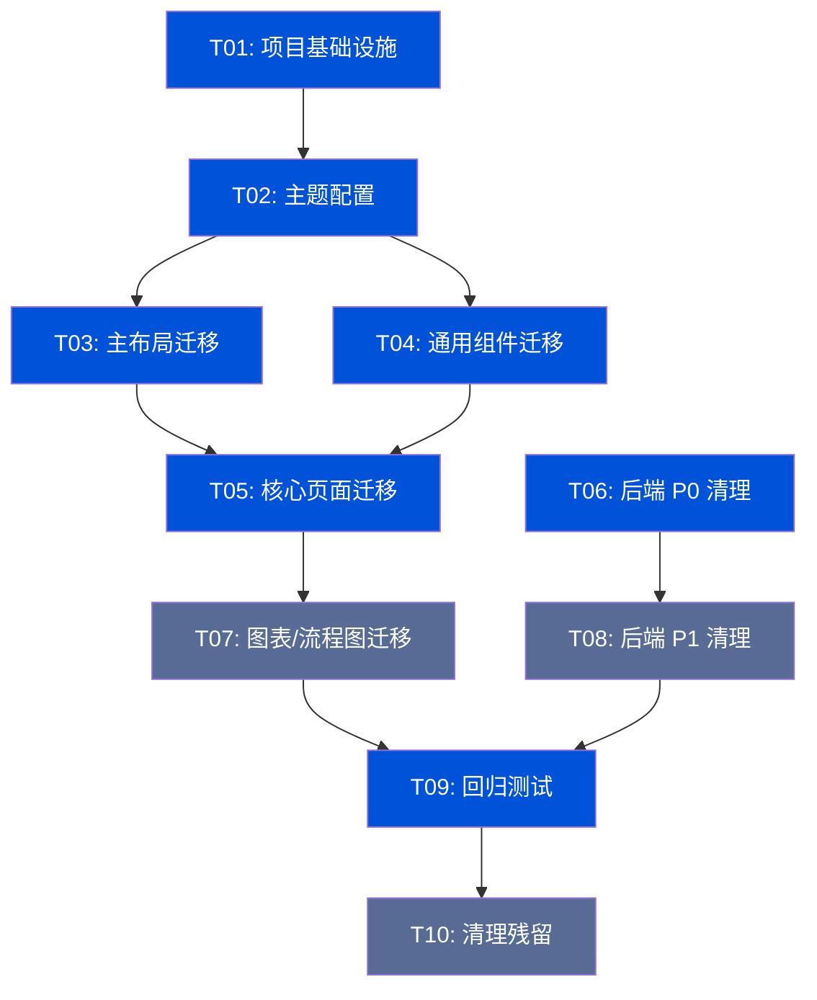

# 能源可信数据空间 — 前端重构系统架构设计

## 一、实现方案

### 1.1 迁移策略

采用**渐进式迁移**策略，允许 MUI 与 tdesign-react 短期共存，按 Phase 分批完成组件替换：

```
Phase 1: 基础搭建 + 共存期开始
    ↓
Phase 2: 核心页面迁移（MUI → tdesign-react 逐步替换）
    ↓
Phase 3: 复杂组件迁移（图表/流程图容器）
    ↓
Phase 4: 全量清理（移除 MUI 残留）→ 共存期结束
```

**共存期策略**：
- Phase 1-3 期间：新代码全部使用 tdesign-react，老代码逐步迁移
- Phase 4：全量清理，移除所有 MUI 依赖
- 样式隔离：通过 CSS Modules 或 BEM 命名隔离两套组件库的样式冲突

### 1.2 核心技术挑战

| 挑战 | 解决方案 |
|------|----------|
| MUI DataGrid 高级功能替代 | 使用 tdesign-react Table + 自定义插件（列配置、排序、筛选、分页内置支持） |
| MUI `sx` 样式系统替代 | 迁移至 Tailwind CSS class + CSS Modules |
| MUI 主题系统替代 | 使用 tdesign-react CSS Variables 主题定制 |
| ECharts/ReactFlow 容器迁移 | 仅替换外层容器（Card/Panel），图表/流程图逻辑不变 |
| 后端模拟数据清理 | 逐文件审查，将 random 生成替换为 SQLAlchemy 真实查询 |

---

## 二、框架选型

### 2.1 tdesign-react 版本选择

```json
{
  "tdesign-react": "^1.10.0",
  "tdesign-icons-react": "^0.5.0"
}
```

**选择理由**：
- 1.x 为稳定版，API 已固化
- 内置完整的 TypeScript 类型定义
- 支持 CSS Variables 主题定制
- 组件覆盖度高（60+ 组件）

### 2.2 按需加载方案

使用 Vite 原生 ESM 按需导入（无需 babel-plugin-import）：

```typescript
// 直接按需导入，Vite tree-shaking 自动移除未使用组件
import { Button, Table, Dialog } from 'tdesign-react';
import 'tdesign-react/es/style/index.css'; // 全局样式（含 CSS Variables）
```

### 2.3 Tailwind CSS 共存策略

```
tdesign-react 样式优先级：CSS Variables > 默认主题
Tailwind CSS 优先级：utility classes（通过 @layer 控制）

共存方案：
1. tdesign-react 提供组件级样式（内置）
2. Tailwind CSS 提供布局/间距/响应式工具类
3. 自定义样式使用 CSS Modules 隔离
4. 全局变量通过 :root CSS Variables 统一管理
```

**配置要点**：
- `tailwind.config.ts` 中避免与 tdesign-react 冲突的 prefix
- 全局重置样式在 `index.css` 中统一管理

---

## 三、文件列表

### 3.1 需新建的文件

```
frontend/
├── src/
│   ├── theme/
│   │   ├── tdesign-theme.ts          # TDesign 主题配置（CSS Variables）
│   │   └── global.css                # 全局样式（覆盖 TDesign 默认）
│   ├── layouts/
│   │   └── MainLayoutTDesign.tsx     # TDesign 版主布局（迁移自 MainLayout.tsx）
│   └── components/
│       ├── common/
│       │   ├── DataTable.tsx          # 通用数据表格（基于 TDesign Table）
│       │   ├── FormDialog.tsx         # 通用表单弹窗（基于 TDesign Dialog）
│       │   └── StatusTag.tsx          # 状态标签（基于 TDesign Tag）
│       └── layout/
│           ├── SidebarMenu.tsx        # 侧边栏菜单（TDesign Menu）
│           └── HeaderBar.tsx          # 顶部导航栏（TDesign Layout.Header）
```

### 3.2 需修改的文件（按优先级）

**P0 — 核心组件**
```
frontend/src/layouts/MainLayout.tsx          # 主布局（1118行，核心迁移目标）
frontend/src/components/PageHeader.tsx       # 页头组件
frontend/src/components/ConfirmDialog.tsx    # 确认弹窗
frontend/src/components/StatusTag.tsx        # 状态标签
frontend/src/components/LoadingOverlay.tsx   # 加载遮罩
frontend/src/stores/appStore.ts             # 主题状态适配
frontend/package.json                        # 依赖更新
frontend/vite.config.ts                      # Vite 配置更新
frontend/tailwind.config.ts                  # Tailwind 配置更新
frontend/index.html                          # 入口 HTML
frontend/src/main.tsx                        # 入口文件
frontend/src/App.tsx                         # 根组件
```

**P1 — 页面组件（89个 TSX 文件）**
```
frontend/src/pages/dashboard/              # 控制台页面
frontend/src/pages/data/                   # 数据中心页面（表格重）
frontend/src/pages/compute/                # 计算中心页面
frontend/src/pages/blockchain/             # 区块链中心页面
frontend/src/pages/ops/                    # 运营中心页面（表单重）
frontend/src/pages/security/               # 安全中心页面（弹窗重）
frontend/src/pages/portal/                 # 门户功能页面
frontend/src/pages/auth/                   # 认证页面
frontend/src/pages/monitor-screen/         # 监管大屏
```

**P2 — 后端模拟数据清理**
```
backend/app/services/quality_service.py    # P0: 移除 random，接入真实质量评估
backend/app/services/hsm_service.py        # P0: 移除模拟，接入真实密钥管理
backend/app/services/benchmark_service.py  # P1: 移除模拟基准数据
backend/app/services/compute_service.py    # P1: 移除增强计算模拟
backend/app/services/data_asset_service.py # P1: 移除增强数据模拟
backend/app/modules/sharing_center/        # P2: 隐私计算模块
```

---

## 四、数据结构和接口

### 4.1 后端清理所需数据库表

**已存在的表**（Alembic 迁移 0001-0010 已创建）：
- `data_assets` — 数据资产表
- `data_quality_reports` — 数据质量报告表
- `key_stores` — 密钥存储表
- `key_usage_logs` — 密钥使用日志表
- `compute_tasks` — 计算任务表
- `blockchain_evidence` — 区块链存证表

**需要新增的表**（如不存在）：

```sql
-- 计算基准测试结果表（如 benchmark_service 需要持久化）
CREATE TABLE IF NOT EXISTS compute_benchmarks (
    id UUID PRIMARY KEY DEFAULT gen_random_uuid(),
    algorithms JSONB NOT NULL,
    iterations INTEGER NOT NULL,
    data_size INTEGER NOT NULL,
    participants INTEGER NOT NULL,
    results JSONB NOT NULL,
    summary JSONB,
    created_at TIMESTAMPTZ DEFAULT NOW(),
    updated_at TIMESTAMPTZ DEFAULT NOW()
);

-- 数据质量评估维度详情表
CREATE TABLE IF NOT EXISTS quality_dimension_scores (
    id UUID PRIMARY KEY DEFAULT gen_random_uuid(),
    report_id UUID REFERENCES data_quality_reports(id),
    dimension VARCHAR(50) NOT NULL,
    score DECIMAL(5,4) NOT NULL,
    details JSONB,
    created_at TIMESTAMPTZ DEFAULT NOW()
);
```

### 4.2 前端 API 接口格式

所有 API 响应统一格式：
```typescript
interface ApiResponse<T> {
  code: number;       // 0=成功，非0=错误码
  data: T;
  message: string;
}

interface PaginatedResponse<T> {
  items: T[];
  total: number;
  page: number;
  page_size: number;
}
```

---

## 五、程序调用流程

### 5.1 主题配置流程

```
main.tsx
  ├── 导入 tdesign-react 样式
  ├── 导入全局 CSS Variables 主题
  ├── 渲染 <App />
  │   ├── ThemeProvider (TDesign 主题上下文)
  │   │   ├── 读取 appStore.themeMode
  │   │   ├── 应用 CSS Variables (light/dark)
  │   │   └── 渲染路由
  │   └── RouterProvider
  └── 挂载到 #root
```

### 5.2 组件迁移流程

```
原 MUI 组件调用：
  import { Button } from '@mui/material';
  <Button variant="contained" color="primary">提交</Button>

迁移后 TDesign 调用：
  import { Button } from 'tdesign-react';
  <Button theme="primary">提交</Button>

属性映射：
  MUI variant="contained" → TDesign theme="primary"
  MUI variant="outlined"  → TDesign theme="default" variant="outline"
  MUI color="error"       → TDesign theme="danger"
```

### 5.3 表格迁移流程

```
原 MUI DataGrid：
  <DataGrid rows={data} columns={columns} pagination />

迁移后 TDesign Table：
  <Table
    data={data}
    columns={tdColumns}
    pagination={{ pageSize: 20 }}
    sortable
    filterable
  />

列配置映射：
  MUI { field: 'name', headerName: '名称', width: 150 }
  → TDesign { colKey: 'name', title: '名称', width: 150 }
```

---

## 六、待确认事项

| # | 问题 | 影响范围 | 建议 |
|---|------|----------|------|
| Q1 | tdesign-react 与 Tailwind CSS 的 CSS 优先级冲突如何处理？ | 全局样式 | 建议在 tailwind.config 中设置 `important: true` 或使用 CSS Modules 隔离 |
| Q2 | MUI DataGrid 的列拖拽、行分组、导出功能在 TDesign Table 中如何实现？ | 数据密集型页面 | TDesign Table 内置排序/筛选/分页，列拖拽需自定义实现或使用 react-dnd |
| Q3 | 后端 benchmark_service.py 使用内存字典存储基准数据，是否需要持久化到数据库？ | 后端架构 | 建议创建 compute_benchmarks 表持久化 |
| Q4 | 后端 quality_service.py 的质量检查是实时计算还是基于预存报告？ | 数据质量模块 | 当前实现为实时计算 + 存储报告，建议保持 |
| Q5 | 是否需要支持 tdesign-react 暗色主题？ | 主题系统 | 建议 Phase 2 实现，利用 TDesign CSS Variables |
| Q6 | ECharts 和 ReactFlow 的容器组件迁移是否会影响图表渲染？ | 可视化页面 | 仅替换外层 Card/Panel，图表逻辑不变，需重点测试 |

---

## 七、共享知识

### 7.1 命名规范

- **组件文件**：PascalCase（如 `DataTable.tsx`）
- **工具文件**：camelCase（如 `useThemeMode.ts`）
- **常量**：UPPER_SNAKE_CASE（如 `DRAWER_WIDTH`）
- **CSS 类名**：kebab-case（如 `sidebar-menu`）

### 7.2 导入规范

```typescript
// 1. 第三方库
import { Button, Table } from 'tdesign-react';
import { useNavigate } from 'react-router-dom';

// 2. 内部组件
import { PageHeader } from '@/components';

// 3. 状态管理
import { useAppStore } from '@/stores/appStore';

// 4. API 服务
import { getDataAssets } from '@/api/data';

// 5. 类型定义
import type { DataAsset } from '@/types/data';
```

### 7.3 样式规范

- **优先使用 Tailwind CSS**：布局、间距、响应式
- **组件样式使用 TDesign 内置**：按钮、表格、表单等
- **自定义样式使用 CSS Modules**：避免全局污染
- **CSS Variables 统一管理**：主题色、间距、圆角等

### 7.4 API 调用规范

```typescript
// 统一使用 @tanstack/react-query 管理服务端状态
const { data, isLoading, error } = useQuery({
  queryKey: ['dataAssets', params],
  queryFn: () => getDataAssets(params),
});

// 错误处理统一格式
if (error) {
  message.error(error.message || '请求失败');
}
```

---

## 八、任务列表（按实现顺序）

### Phase 1：基础搭建（Week 1）

| 任务 ID | 任务名称 | 依赖 | 优先级 | 涉及文件 |
|---------|---------|------|--------|----------|
| T01 | 项目基础设施搭建 | 无 | P0 | `package.json`, `vite.config.ts`, `tailwind.config.ts`, `src/main.tsx`, `src/App.tsx` |
| T02 | TDesign 主题配置 + 全局样式 | T01 | P0 | `src/theme/tdesign-theme.ts`, `src/theme/global.css`, `index.html` |
| T03 | 主布局迁移 (MainLayout) | T02 | P0 | `src/layouts/MainLayout.tsx`, `src/components/layout/SidebarMenu.tsx`, `src/components/layout/HeaderBar.tsx` |

### Phase 2：核心页面迁移（Week 2-3）

| 任务 ID | 任务名称 | 依赖 | 优先级 | 涉及文件 |
|---------|---------|------|--------|----------|
| T04 | 通用组件迁移 | T02 | P0 | `src/components/PageHeader.tsx`, `src/components/ConfirmDialog.tsx`, `src/components/StatusTag.tsx`, `src/components/LoadingOverlay.tsx`, `src/components/common/DataTable.tsx`, `src/components/common/FormDialog.tsx` |
| T05 | 核心页面迁移（数据+运营+安全） | T03, T04 | P0 | `src/pages/data/*.tsx`, `src/pages/ops/*.tsx`, `src/pages/security/*.tsx` |
| T06 | 后端 P0 模拟数据清理 | 无 | P0 | `backend/app/services/quality_service.py`, `backend/app/services/hsm_service.py`, `backend/app/api/v1/data_asset.py` |

### Phase 3：复杂组件 + P1 清理（Week 4）

| 任务 ID | 任务名称 | 依赖 | 优先级 | 涉及文件 |
|---------|---------|------|--------|----------|
| T07 | 图表/流程图容器迁移 | T05 | P1 | `src/pages/compute/*.tsx`, `src/pages/blockchain/*.tsx`, `src/pages/monitor-screen/*.tsx` |
| T08 | 后端 P1 模拟数据清理 | T06 | P1 | `backend/app/services/benchmark_service.py`, `backend/app/services/compute_service.py`, `backend/app/services/data_asset_service.py` |

### Phase 4：收尾优化（Week 5）

| 任务 ID | 任务名称 | 依赖 | 优先级 | 涉及文件 |
|---------|---------|------|--------|----------|
| T09 | 全量回归测试 + 性能验证 | T07, T08 | P0 | 全部前端文件 |
| T10 | 清理 MUI 残留 + 更新文档 | T09 | P1 | `package.json`, 全部前端文件, `docs/` |

---

## 九、依赖包列表

### 需要安装

```json
{
  "dependencies": {
    "tdesign-react": "^1.10.0",
    "tdesign-icons-react": "^0.5.0"
  }
}
```

### 需要移除（Phase 4）

```json
{
  "dependencies": {
    "@emotion/react": "移除",
    "@emotion/styled": "移除",
    "@mui/icons-material": "移除",
    "@mui/material": "移除"
  }
}
```

### 保留不变

```json
{
  "dependencies": {
    "@tanstack/react-query": "^5.62.0",
    "axios": "^1.7.9",
    "echarts": "^5.5.1",
    "echarts-for-react": "^3.0.2",
    "react": "^18.3.1",
    "react-dom": "^18.3.1",
    "react-router-dom": "^6.28.0",
    "reactflow": "^11.11.4",
    "zustand": "^4.5.5"
  }
}
```

---

## 十、任务依赖图



---

## 十一、后端清理详细方案

### 11.1 data_asset.py 清理

**当前问题**：`_generate_preview_records()` 使用 `random.uniform` 生成模拟数据

**清理策略**：
```python
# 替换方案：从真实数据库查询预览数据
async def preview_asset_data(asset_id: str, limit: int, format: str, db: AsyncSession):
    # 1. 查询资产元数据
    asset = await db.execute(select(DataAsset).where(DataAsset.id == asset_id))
    
    # 2. 如果资产有关联的数据源，从数据源查询真实数据
    if asset.source_id:
        source = await get_data_source(db, asset.source_id)
        records = await query_data_source(source, limit)
    else:
        # 3. 无数据源时返回空数据 + 提示
        records = []
    
    # 4. 应用脱敏规则
    masked_records = [_mask_sensitive_fields(r) for r in records]
    return ApiResponse(data={"records": masked_records, "total": len(masked_records)})
```

### 11.2 quality_service.py 清理

**当前问题**：质量检查使用 `random.uniform` 生成模拟维度分数

**清理策略**：
```python
async def trigger_quality_check(db: AsyncSession, asset_id: str, check_dimensions: list[str]):
    # 1. 从数据库查询资产的真实元数据
    asset = await db.execute(select(DataAsset).where(DataAsset.id == asset_id))
    metadata = await db.execute(select(Metadata).where(Metadata.asset_id == asset_id))
    
    # 2. 基于真实数据计算质量维度
    completeness = calculate_completeness(metadata)  # 空值率、字段覆盖率
    timeliness = calculate_timeliness(asset)          # 数据延迟
    accuracy = calculate_accuracy(metadata)           # 数值范围、格式合规
    consistency = calculate_consistency(metadata)     # 跨表一致
    
    # 3. 生成质量报告并持久化
    report = DataQualityReport(
        asset_id=asset_id,
        completeness_score=completeness,
        timeliness_score=timeliness,
        accuracy_score=accuracy,
        consistency_score=consistency,
        overall_score=weighted_average(...)
    )
    db.add(report)
    await db.commit()
    return QualityReportResponse.model_validate(report)
```

### 11.3 benchmark_service.py 清理

**当前问题**：基准测试使用内存字典 `_benchmarks` 存储，结果为模拟数据

**清理策略**：
```python
# 1. 创建 compute_benchmarks 数据库表（如不存在）
# 2. 将 _benchmarks 内存存储替换为数据库查询
async def run_benchmark(db: AsyncSession, algorithms: list[str], iterations: int, ...):
    # 从数据库查询历史计算任务的真实性能数据
    tasks = await db.execute(
        select(ComputeTask)
        .where(ComputeTask.algorithm.in_(algorithms))
        .order_by(ComputeTask.created_at.desc())
        .limit(iterations)
    )
    
    # 基于真实任务数据计算基准指标
    results = calculate_benchmark_from_tasks(tasks)
    
    # 持久化基准结果
    benchmark = ComputeBenchmark(algorithms=algorithms, results=results, ...)
    db.add(benchmark)
    await db.commit()
    return BenchmarkResponse.model_validate(benchmark)
```

---

## 十二、风险评估

| 风险 | 影响 | 缓解措施 |
|------|------|----------|
| MUI DataGrid 高级功能无法完全替代 | 数据密集型页面功能降级 | 优先迁移基础功能，高级功能（列拖拽）后续迭代 |
| tdesign-react 样式与 Tailwind CSS 冲突 | UI 显示异常 | 使用 CSS Modules 隔离，设置明确的优先级规则 |
| 后端模拟数据清理后数据为空 | 前端页面显示空白 | 提供合理的空状态 UI，配合 seed data 填充测试数据 |
| 图表/流程图容器迁移影响渲染 | 可视化功能异常 | 仅替换外层容器，保持 ECharts/ReactFlow 内部逻辑不变 |
| 迁移过程中引入回归 Bug | 功能异常 | 每个 Phase 完成后进行回归测试，保持 Git 分支管理 |

---

## 十三、验收标准

1. **功能完整性**：所有现有页面功能正常，无回归 Bug
2. **组件覆盖率**：89 个 TSX 文件中 MUI 引用数为 0
3. **后端数据真实性**：33 个 API service 文件中 `random`/`mock` 引用数为 0
4. **视觉一致性**：TDesign 风格规范 100% 落地（主色 #0052D9、侧边栏 #18181D、圆角 8px）
5. **性能不退化**：页面首屏加载时间 ≤ 2 秒，API P99 ≤ 500ms
6. **TypeScript 类型安全**：无 `any` 类型，所有组件 Props 有完整类型定义
