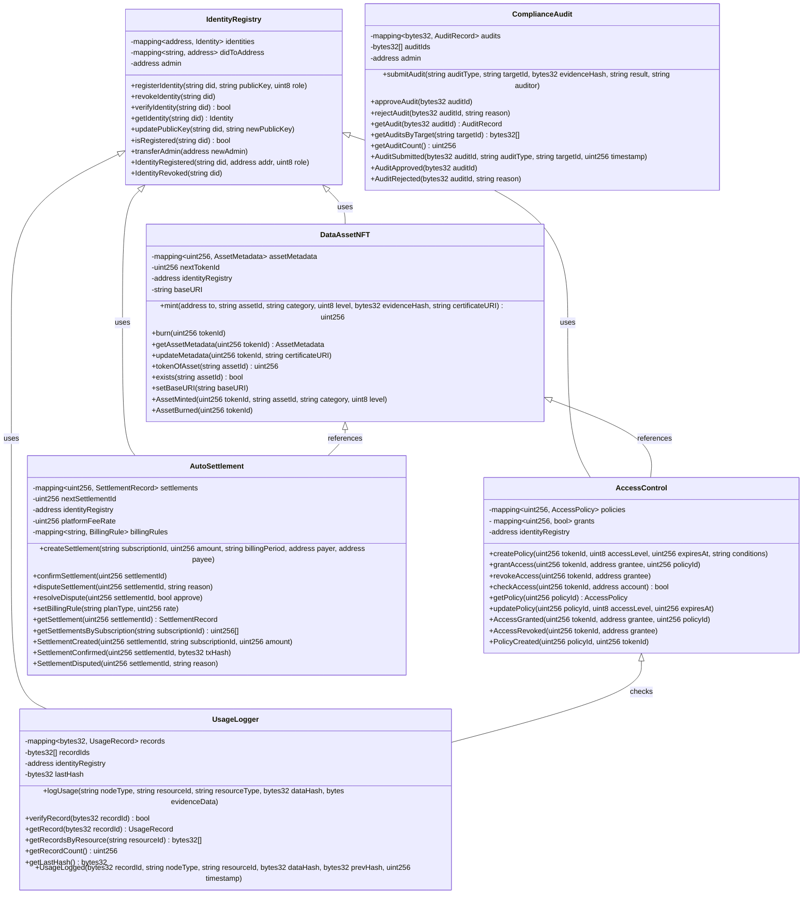
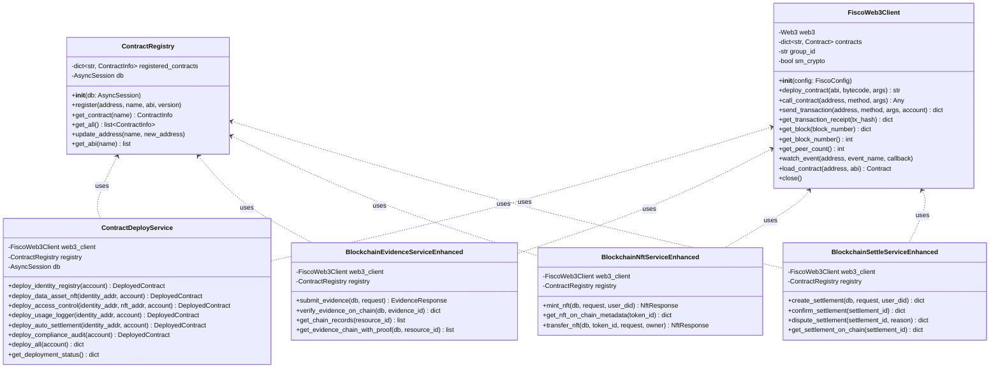
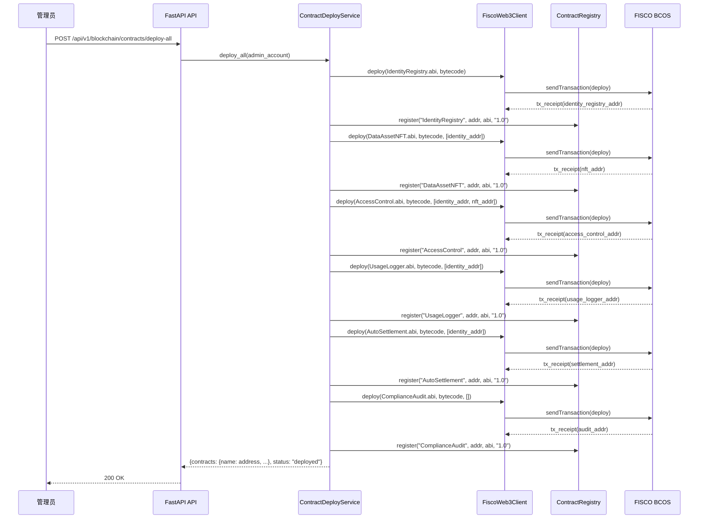
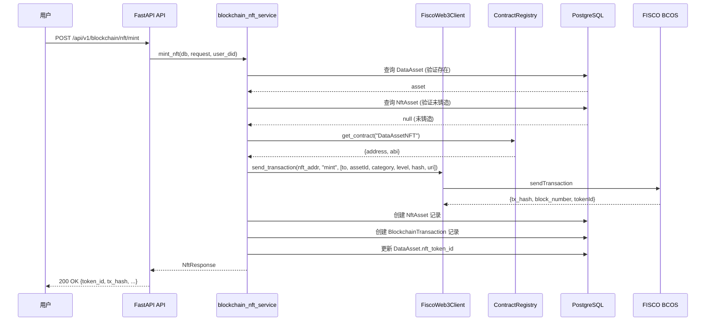
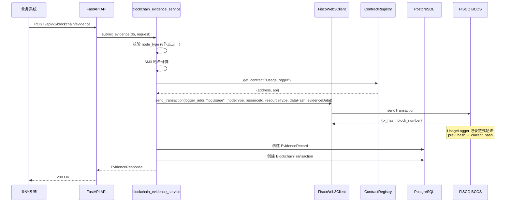
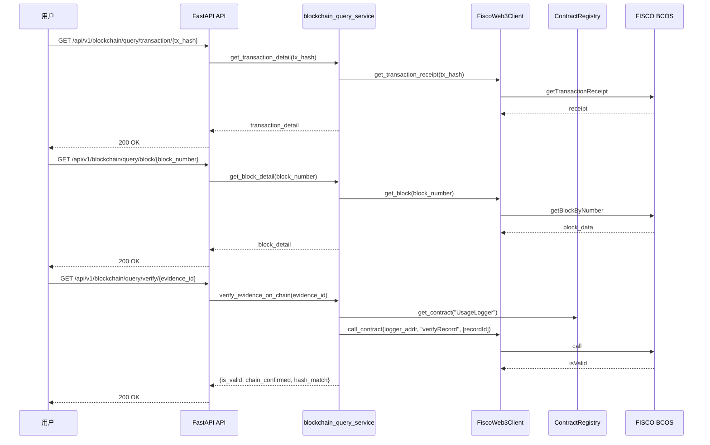
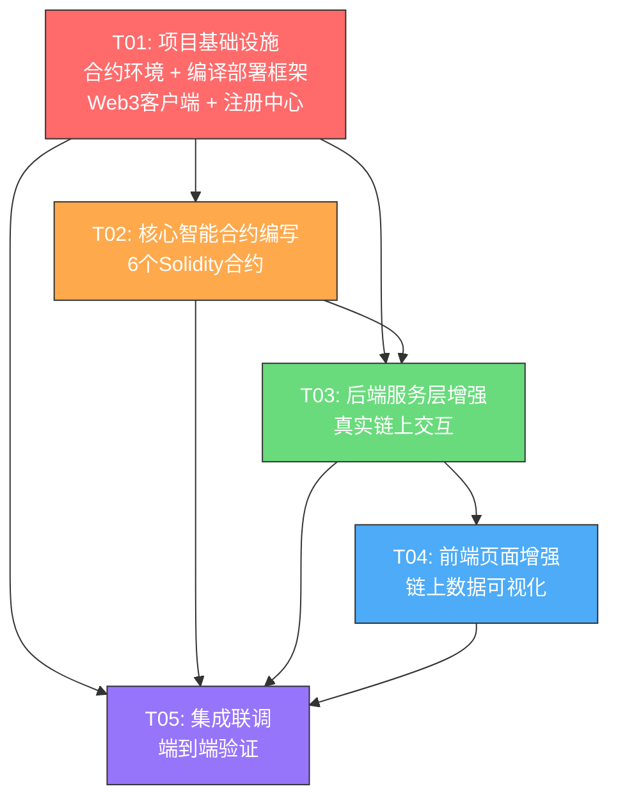

# 区块链存证中心 — 架构设计与任务分解

## 面向能源可信数据空间的区块链存证中心

| 字段 | 值 |
|------|-----|
| **项目名称** | energy_trusted_data_space — 区块链存证中心 |
| **文档版本** | v1.0 |
| **架构师** | 高见远（Gao） |
| **参考** | TASK-LIST.md 第五章（T-B-01 ~ T-B-24） |

---

## Part A: 系统设计

### 1. 实现方案（Implementation Approach）

#### 1.1 核心技术挑战

| 挑战 | 分析 |
|------|------|
| **FISCO BCOS 3.x 兼容性** | 需使用 FISCO BCOS 3.x 的 JSON-RPC 接口，合约使用 Solidity 0.8.x + 国密预编译合约 |
| **国密算法链上集成** | FISCO BCOS 3.x 原生支持国密（SM2/SM3/SM4），合约中使用 `smlink` 预编译进行 SM3 哈希验证 |
| **ERC-721 NFT 定制** | 基于 OpenZeppelin ERC721 扩展，添加能源数据资产特有属性（分类分级、确权哈希、证书URI） |
| **合约间依赖与升级** | 6个合约之间存在调用关系，需设计合理的接口隔离和事件通知机制 |
| **后端 Web3 交互** | 当前 `fisco_client.py` 使用 httpx 做 JSON-RPC，需升级为 `web3.py` + FISCO BCOS SDK 以支持 ABI 编解码 |
| **前端链上数据可视化** | BcQueryPage 当前使用 mock 数据，需对接真实链上查询 API |

#### 1.2 框架与库选型

| 层级 | 技术选型 | 理由 |
|------|---------|------|
| **智能合约** | Solidity 0.8.24 + OpenZeppelin 5.0 | FISCO BCOS 3.x 支持 Solidity 0.8.x，OpenZeppelin 提供成熟的 ERC-721/AccessControl 基础实现 |
| **合约编译** | solc 0.8.24 + FISCO BCOS console | FISCO BCOS 提供专属 console 工具链用于合约编译和部署 |
| **合约部署脚本** | Python + Web3.py + FISCO BCOS Python SDK | 与现有后端技术栈统一，Web3.py 支持 FISCO BCOS 的 ABI 编解码 |
| **后端框架** | FastAPI + 现有架构 | 沿用项目现有架构，新增合约交互服务层 |
| **前端框架** | React + MUI + ECharts | 沿用现有前端架构，增强 BcQueryPage 的真实链上查询能力 |
| **国密适配** | GmSSL（现有）+ FISCO BCOS 国密预编译 | 后端使用现有 gmssl_adapter，合约层面使用 FISCO BCOS 内置国密支持 |

#### 1.3 架构模式

采用 **分层架构 + 合约代理模式**：

```
┌───────────────────────────────────────────────────────────┐
│                    前端层 (React + MUI)                     │
│  BcContractsPage │ BcEvidencePage │ BcAssetsPage │ ...    │
└───────────────┬───────────────────────────────────────────┘
                │ REST API
┌───────────────▼───────────────────────────────────────────┐
│                   API 层 (FastAPI)                         │
│  blockchain_contract │ blockchain_evidence │ blockchain_*  │
└───────────────┬───────────────────────────────────────────┘
                │
┌───────────────▼───────────────────────────────────────────┐
│                 服务层 (Service Layer)                      │
│  contract_deployer │ blockchain_*_service (增强)           │
│  contract_registry (合约地址注册中心)                       │
└───────────────┬───────────────────────────────────────────┘
                │
┌───────────────▼───────────────────────────────────────────┐
│              区块链交互层 (Web3 Client)                     │
│  fisco_web3_client (Web3.py + FISCO BCOS SDK)             │
│  ABI 编解码 │ 交易签名 │ 事件监听 │ 状态查询               │
└───────────────┬───────────────────────────────────────────┘
                │ JSON-RPC / Channel
┌───────────────▼───────────────────────────────────────────┐
│              FISCO BCOS 联盟链 (4节点 PBFT)                │
│  IdentityRegistry │ DataAssetNFT │ AccessControl          │
│  UsageLogger      │ AutoSettlement │ ComplianceAudit      │
└───────────────────────────────────────────────────────────┘
```

---

### 2. 文件列表（File List）

#### 2.1 智能合约（新建）

```
contracts/
├── IdentityRegistry.sol          # DID 身份注册合约
├── DataAssetNFT.sol              # 数据资产 NFT（ERC-721）
├── AccessControl.sol             # 访问控制合约
├── UsageLogger.sol               # 使用日志存证合约
├── AutoSettlement.sol            # 自动结算合约
├── ComplianceAudit.sol           # 合规审计合约
└── interfaces/
    ├── IIdentityRegistry.sol     # IdentityRegistry 接口
    ├── IDataAssetNFT.sol         # DataAssetNFT 接口
    ├── IAccessControl.sol        # AccessControl 接口
    ├── IUsageLogger.sol          # UsageLogger 接口
    ├── IAutoSettlement.sol       # AutoSettlement 接口
    └── IComplianceAudit.sol      # ComplianceAudit 接口
```

#### 2.2 编译部署脚本（新建）

```
contracts/
├── compile.py                    # 合约编译脚本（ABI + Bytecode）
├── deploy.py                     # 合约部署脚本（按依赖顺序部署）
├── deploy_config.json            # 部署配置（链节点地址、账户等）
└── artifacts/                    # 编译输出目录
    ├── IdentityRegistry.json     # ABI + Bytecode
    ├── DataAssetNFT.json
    ├── AccessControl.json
    ├── UsageLogger.json
    ├── AutoSettlement.json
    └── ComplianceAudit.json
```

#### 2.3 后端增强（修改/新建）

```
backend/app/
├── core/
│   ├── fisco_web3_client.py      # 【新建】基于 Web3.py 的 FISCO BCOS 客户端
│   ├── contract_registry.py      # 【新建】合约地址注册中心（管理已部署合约的地址和 ABI）
│   └── fisco_client.py           # 【保留兼容】现有客户端，新增方法
├── services/
│   ├── contract_deploy_service.py # 【新建】合约部署服务
│   ├── blockchain_evidence_service.py # 【增强】对接 UsageLogger 合约
│   ├── blockchain_nft_service.py     # 【增强】对接 DataAssetNFT 合约
│   ├── blockchain_contract_service.py # 【增强】合约管理与 ABI 交互
│   └── blockchain_settle_service.py   # 【增强】对接 AutoSettlement 合约
├── api/v1/
│   ├── blockchain_contract.py    # 【增强】新增合约管理、部署状态、ABI 展示
│   └── blockchain_query.py       # 【新建】链上查询专用 API（交易/区块/合约状态）
├── schemas/
│   └── blockchain.py             # 【增强】新增合约管理相关 Schema
├── models/
│   └── blockchain.py             # 【增强】新增 DeployedContract 模型
└── config.py                     # 【增强】新增合约地址配置项
```

#### 2.4 前端增强（修改）

```
frontend/src/
├── pages/blockchain/
│   ├── BcContractsPage.tsx       # 【增强】合约管理：真实 ABI 展示、部署状态、事件日志
│   ├── BcQueryPage.tsx           # 【增强】对接真实链上查询 API（替换 mock）
│   ├── BcEvidencePage.tsx        # 【增强】存证详情增加链上验证状态
│   ├── BcAssetsPage.tsx          # 【增强】NFT 详情增加链上元数据展示
│   └── BcSettlementPage.tsx      # 【增强】结算详情增加链上交易回执
└── api/
    └── blockchain.ts             # 【增强】新增链上查询 API 函数
```

---

### 3. 数据结构与接口（Data Structures & Interfaces）

#### 3.1 智能合约类图



#### 3.2 后端服务类图



#### 3.3 合约数据结构

```solidity
// IdentityRegistry
struct Identity {
    string did;
    string publicKey;
    uint8 role;           // 0:普通用户, 1:数据提供方, 2:数据使用方, 3:监管方, 4:平台管理员
    bool isActive;
    uint256 registeredAt;
    uint256 updatedAt;
}

// DataAssetNFT
struct AssetMetadata {
    string assetId;
    string category;      // 发电/用电/调度/市场/设备/地理
    uint8 classificationLevel;  // 1:核心, 2:重要, 3:一般, 4:公开
    bytes32 evidenceHash;
    string certificateURI;
    uint256 mintedAt;
}

// AccessControl
struct AccessPolicy {
    uint256 tokenId;
    uint8 accessLevel;    // 1:只读, 2:计算, 3:导出, 4:管理
    uint256 expiresAt;
    string conditions;    // JSON 格式的附加条件
    bool isActive;
}

// UsageLogger
struct UsageRecord {
    bytes32 recordId;
    string nodeType;      // collect/preprocess/classify/publish/apply/compute/result/settle
    string resourceId;
    string resourceType;
    bytes32 dataHash;
    bytes evidenceData;
    bytes32 prevHash;     // 链式哈希，形成证据链
    address operator;
    uint256 timestamp;
    bool isValid;
}

// AutoSettlement
struct SettlementRecord {
    uint256 settlementId;
    string subscriptionId;
    uint256 amount;
    string billingPeriod;
    address payer;
    address payee;
    uint8 status;         // 0:待确认, 1:已确认, 2:争议中, 3:已解决, 4:已取消
    string disputeReason;
    bytes32 txHash;
    uint256 createdAt;
    uint256 confirmedAt;
}

// ComplianceAudit
struct AuditRecord {
    bytes32 auditId;
    string auditType;     // 数据安全/隐私合规/操作规范/链上验证
    string targetId;
    bytes32 evidenceHash;
    string result;        // pass/fail/pending
    string auditor;
    uint8 status;         // 0:待审, 1:通过, 2:驳回
    string rejectReason;
    uint256 timestamp;
}
```

---

### 4. 程序调用流程（Program Call Flow）

#### 4.1 合约部署流程



#### 4.2 数据资产 NFT 铸造流程



#### 4.3 全链路存证流程



#### 4.4 链上查询验证流程



---

### 5. 不明确事项（Anything UNCLEAR）

| 事项 | 假设/处理 |
|------|----------|
| FISCO BCOS 节点是否已部署 | 假设开发环境已有 4 节点 PBFT 联盟链运行中，部署脚本支持配置节点地址 |
| Web3.py 对 FISCO BCOS 3.x 的兼容性 | FISCO BCOS 3.x 提供标准 JSON-RPC，Web3.py 可通过自定义 Provider 对接。如遇兼容性问题，使用 FISCO BCOS Python SDK 的 `client` 模块作为备选 |
| 合约升级策略 | 当前版本采用不可升级合约（immutable）。如需升级，后续可引入 Proxy 模式 |
| 链上事件监听 | 当前方案以请求-响应模式为主，后续可引入 WebSocket 订阅链上事件 |
| gas 费用模型 | FISCO BCOS 联盟链无真实 gas 费用，但保留 gasUsed 统计用于性能监控 |
| 部署账户管理 | 假设使用 FISCO BCOS 控制台提供的管理员账户进行合约部署 |

---

## Part B: 任务分解

### 6. 所需依赖包（Required Packages）

#### 6.1 后端 Python 依赖

```
# 智能合约交互
web3>=6.15.0                    # Web3.py — 以太坊/FISCO BCOS JSON-RPC 客户端
py-solc-x>=2.0.0                # Solidity 编译器 Python 封装

# FISCO BCOS SDK（可选，作为 Web3.py 的备选）
# fisco-bcos-python-sdk          # FISCO BCOS 官方 Python SDK（如 Web3.py 不兼容则使用）

# 已有依赖（不需要新增）
# sqlalchemy, fastapi, httpx, pydantic 等
```

#### 6.2 合约开发依赖

```
# Solidity 编译器
solc-select>=1.0.0              # Solidity 版本管理工具

# OpenZeppelin 合约库（通过 remappings 或 npm 引入）
# @openzeppelin/contracts@5.0.0  # ERC721, AccessControl, Ownable 等基础实现
```

#### 6.3 前端依赖（无新增）

```
# 已有依赖，无需新增
# react, @mui/material, echarts, echarts-for-react, @tanstack/react-query
```

---

### 7. 任务列表（Task List — 按依赖排序）

> 严格遵守：不超过 5 个任务，每个任务至少 3 个相关文件，按功能模块分组

---

#### T01: 项目基础设施 — 合约开发环境 + 编译部署框架

**Task ID**: T01  
**Task Name**: 项目基础设施 — 合约开发环境与编译部署框架搭建  
**Source Files**:
- `contracts/compile.py` — 合约编译脚本
- `contracts/deploy.py` — 合约部署脚本
- `contracts/deploy_config.json` — 部署配置文件
- `contracts/interfaces/IIdentityRegistry.sol` — 接口定义
- `contracts/interfaces/IDataAssetNFT.sol`
- `contracts/interfaces/IAccessControl.sol`
- `contracts/interfaces/IUsageLogger.sol`
- `contracts/interfaces/IAutoSettlement.sol`
- `contracts/interfaces/IComplianceAudit.sol`
- `backend/app/core/fisco_web3_client.py` — Web3.py FISCO BCOS 客户端
- `backend/app/core/contract_registry.py` — 合约地址注册中心
- `backend/app/services/contract_deploy_service.py` — 合约部署服务
- `backend/app/config.py` — 新增合约配置项
- `requirements.txt` — 新增 web3, py-solc-x 依赖

**Dependencies**: 无  
**Priority**: P0

**详细说明**:
1. 创建 `contracts/` 目录结构和 6 个接口文件
2. 实现 `compile.py`：使用 solc 0.8.24 编译所有 .sol 文件，输出 ABI + Bytecode JSON
3. 实现 `deploy.py`：按依赖顺序（IdentityRegistry → DataAssetNFT → AccessControl → UsageLogger → AutoSettlement → ComplianceAudit）部署合约
4. 实现 `fisco_web3_client.py`：封装 Web3.py 对接 FISCO BCOS 3.x JSON-RPC，支持 ABI 编解码、交易发送、状态查询、事件过滤
5. 实现 `contract_registry.py`：内存 + 数据库双缓存管理已部署合约的地址和 ABI
6. 实现 `contract_deploy_service.py`：提供一键部署和单独部署接口
7. 更新 `config.py`：新增 `FISCO_WEB3_PROVIDER_URL`、`CONTRACT_ARTIFACTS_PATH` 等配置

---

#### T02: 核心智能合约编写

**Task ID**: T02  
**Task Name**: 编写 6 个 Solidity 智能合约  
**Source Files**:
- `contracts/IdentityRegistry.sol` — DID 身份注册
- `contracts/DataAssetNFT.sol` — 数据资产 NFT（ERC-721）
- `contracts/AccessControl.sol` — 访问控制
- `contracts/UsageLogger.sol` — 使用日志存证
- `contracts/AutoSettlement.sol` — 自动结算
- `contracts/ComplianceAudit.sol` — 合规审计

**Dependencies**: T01（需要接口定义和编译环境）  
**Priority**: P0

**详细说明**:
1. **IdentityRegistry.sol**：
   - DID 注册/注销/验证
   - 角色管理（数据提供方/使用方/监管方/管理员）
   - 公钥管理（支持密钥轮换）
   - 事件：`IdentityRegistered`、`IdentityRevoked`

2. **DataAssetNFT.sol**：
   - 继承 OpenZeppelin ERC721
   - 铸造时绑定 assetId、category、classificationLevel、evidenceHash
   - 支持按 assetId 查询 tokenId
   - 事件：`AssetMinted`、`AssetBurned`

3. **AccessControl.sol**：
   - 访问策略管理（创建/更新/删除）
   - 授权/撤销（tokenId + grantee 组合）
   - 访问检查（验证身份+策略+有效期）
   - 事件：`AccessGranted`、`AccessRevoked`、`PolicyCreated`

4. **UsageLogger.sol**：
   - 存证记录上链（8 节点类型支持）
   - **链式哈希结构**：每条记录的 prevHash 指向前一条，形成不可篡改的证据链
   - 按 resourceId 查询完整证据链
   - 记录验证（哈希比对）
   - 事件：`UsageLogged`

5. **AutoSettlement.sol**：
   - 结算记录创建/确认/争议/仲裁
   - 计费规则管理（按次/按量/订阅）
   - 平台手续费自动计算
   - 事件：`SettlementCreated`、`SettlementConfirmed`、`SettlementDisputed`

6. **ComplianceAudit.sol**：
   - 审计记录提交/通过/驳回
   - 按目标ID查询审计历史
   - 事件：`AuditSubmitted`、`AuditApproved`、`AuditRejected`

---

#### T03: 后端服务层增强 — 真实链上交互

**Task ID**: T03  
**Task Name**: 增强后端区块链服务层，实现真实链上交互  
**Source Files**:
- `backend/app/services/blockchain_evidence_service.py` — 对接 UsageLogger 合约
- `backend/app/services/blockchain_nft_service.py` — 对接 DataAssetNFT 合约
- `backend/app/services/blockchain_contract_service.py` — 合约管理增强
- `backend/app/services/blockchain_settle_service.py` — 对接 AutoSettlement 合约
- `backend/app/api/v1/blockchain_contract.py` — 新增合约管理 API
- `backend/app/api/v1/blockchain_query.py` — 新建链上查询 API
- `backend/app/schemas/blockchain.py` — 新增 Schema
- `backend/app/models/blockchain.py` — 新增 DeployedContract 模型

**Dependencies**: T01, T02（需要合约已编译、Web3 客户端可用）  
**Priority**: P0

**详细说明**:

1. **blockchain_evidence_service.py 增强**：
   - `submit_evidence`：通过 UsageLogger 合约的 `logUsage` 方法上链
   - `verify_evidence`：调用 UsageLogger 的 `verifyRecord` 验证链上记录
   - `get_evidence_chain`：从链上读取完整的链式哈希证据链
   - 保留数据库记录作为缓存层

2. **blockchain_nft_service.py 增强**：
   - `mint_nft`：通过 DataAssetNFT 合约的 `mint` 方法铸造
   - `get_nft_on_chain_metadata`：从链上读取 AssetMetadata
   - `transfer_nft`：通过合约的 `transferFrom` 转移
   - 保留数据库记录作为缓存层

3. **blockchain_settle_service.py 增强**：
   - `create_settlement`：通过 AutoSettlement 合约创建结算
   - `confirm_settlement`：调用合约确认结算
   - `dispute_settlement`：调用合约提交争议
   - 保留数据库记录作为缓存层

4. **blockchain_contract_service.py 增强**：
   - 从 ContractRegistry 读取已部署合约的真实 ABI
   - 支持按 ABI 定义的方法列表展示
   - 支持 ABI 编码的合约调用（替换当前简单的 JSON 参数）

5. **blockchain_query.py（新建）**：
   - `GET /query/transaction/{tx_hash}` — 查询交易详情
   - `GET /query/block/{block_number}` — 查询区块详情
   - `GET /query/block/latest` — 查询最新区块
   - `GET /query/chain/status` — 查询链状态（区块高度、节点数、TPS）
   - `GET /query/verify/{evidence_id}` — 链上存证验证

6. **数据模型增强**：
   - 新增 `DeployedContract` 模型（name, address, abi, version, deployed_at, deploy_tx_hash, status）
   - 更新 `BlockchainTransaction` 模型，增加 `event_logs` 字段

---

#### T04: 前端页面增强 — 链上数据可视化

**Task ID**: T04  
**Task Name**: 增强前端区块链页面，对接真实链上数据  
**Source Files**:
- `frontend/src/pages/blockchain/BcContractsPage.tsx` — 合约管理增强
- `frontend/src/pages/blockchain/BcQueryPage.tsx` — 链上查询增强（替换 mock）
- `frontend/src/pages/blockchain/BcEvidencePage.tsx` — 存证链上验证
- `frontend/src/pages/blockchain/BcAssetsPage.tsx` — NFT 链上元数据
- `frontend/src/pages/blockchain/BcSettlementPage.tsx` — 结算链上回执
- `frontend/src/api/blockchain.ts` — 新增 API 函数

**Dependencies**: T03（需要后端 API 已就绪）  
**Priority**: P1

**详细说明**:

1. **BcContractsPage.tsx 增强**：
   - 合约列表改为从 API 获取真实已部署合约
   - 合约详情弹窗展示真实 ABI（格式化 JSON）
   - 新增"部署合约"按钮（一键部署所有合约）
   - 合约状态展示：已部署/部署中/未部署
   - 交易记录弹窗展示真实链上交易

2. **BcQueryPage.tsx 增强（核心改动）**：
   - **替换所有 mock 数据**，对接真实链上查询 API
   - 交易查询：调用 `GET /query/transaction/{tx_hash}` 返回真实交易详情
   - 区块查询：调用 `GET /query/block/{block_number}` 返回真实区块信息
   - 合约查询：调用 `GET /query/contract/{address}` 返回真实合约状态
   - 新增"链状态"Tab：展示区块高度、节点数、最新区块时间
   - 新增查询结果的格式化展示（交易解码、事件日志等）

3. **BcEvidencePage.tsx 增强**：
   - 存证详情弹窗新增"链上验证"按钮
   - 调用 `GET /query/verify/{evidence_id}` 获取链上验证状态
   - 展示：链上确认状态、哈希匹配状态、链式哈希证据链可视化

4. **BcAssetsPage.tsx 增强**：
   - NFT 详情弹窗新增"链上元数据"区域
   - 从链上读取 AssetMetadata（分类、级别、确权哈希）
   - 展示铸造交易的链上回执

5. **BcSettlementPage.tsx 增强**：
   - 结算详情弹窗新增"链上交易"区域
   - 展示 AutoSettlement 合约的交易回执
   - 新增"确认结算"和"提交争议"按钮调用链上合约

6. **blockchain.ts API 增强**：
   - 新增 `queryTransaction(txHash)` / `queryBlock(blockNumber)` / `queryChainStatus()`
   - 新增 `verifyEvidenceOnChain(evidenceId)`
   - 新增 `deployAllContracts()`
   - 新增 `getContractABI(contractName)`

---

#### T05: 集成联调 — 合约部署验证 + 端到端测试

**Task ID**: T05  
**Task Name**: 集成联调 — 合约部署、端到端流程验证  
**Source Files**:
- `contracts/deploy.py` — 验证部署脚本
- `backend/app/core/fisco_web3_client.py` — 验证 Web3 客户端
- `backend/app/core/contract_registry.py` — 验证注册中心
- `backend/app/services/contract_deploy_service.py` — 验证部署服务
- `backend/app/api/v1/blockchain_query.py` — 验证查询 API
- `backend/app/api/v1/blockchain_contract.py` — 验证合约管理 API
- `frontend/src/pages/blockchain/BcQueryPage.tsx` — 验证前端展示
- `backend/app/models/blockchain.py` — 数据模型最终确认

**Dependencies**: T01, T02, T03, T04（所有前置任务完成）  
**Priority**: P1

**详细说明**:
1. 验证合约编译输出（ABI + Bytecode JSON 格式正确）
2. 验证合约部署流程（按依赖顺序部署成功）
3. 验证 Web3 客户端与 FISCO BCOS 节点通信
4. 验证后端 API 端到端流程：
   - 注册 DID → 铸造 NFT → 提交存证 → 触发结算 → 合规审计
5. 验证前端页面展示真实链上数据
6. 验证链上查询响应时间（单条 <200ms，范围 <2s/1000条）
7. 修复集成过程中发现的问题

---

### 8. 共享知识（Shared Knowledge）

```
# 跨切面关注点

## API 响应格式
- 所有 API 响应使用 {code, data, message} 格式（ApiResponse 模板）
- code=0 表示成功，其他为错误码

## 合约地址管理
- 合约地址存储在 contract_registry（内存 + 数据库双缓存）
- 首次部署后地址写入 deploy_config.json 和数据库 deployed_contracts 表
- 后续启动时从数据库加载，避免重复部署

## 链上交互模式
- 写操作：后端构造 ABI 编码的交易 → 发送到 FISCO BCOS → 获取 tx_hash → 记录到数据库
- 读操作：后端构造 ABI 编码的 call → 发送到 FISCO BCOS → 获取返回值 → 解码
- 事件查询：通过 Web3.py 的 event filter 获取历史事件

## 数据一致性
- 链上数据为权威来源（source of truth）
- 数据库记录作为缓存层，加速查询
- 存证验证时以链上数据为准

## 链式哈希结构（UsageLogger 核心设计）
- 每条存证记录包含 prevHash 字段，指向前一条记录的哈希
- 形成 A→B→C→... 的不可篡改证据链
- 验证时遍历链式哈希，确认完整性

## FISCO BCOS 特殊说明
- 使用 group_id 区分不同群组
- 合约调用需要指定 group_id
- 交易回执中的 status 为 "0x0" 表示成功
- 区块号和 gasUsed 为十六进制，需要转换

## 前端风格
- 统一使用 MUI v6 组件库
- 统计卡片使用渐变背景色
- 图表使用 ECharts（echarts-for-react）
- 表格使用 stickyHeader + 分页
- 弹窗使用 MUI Dialog
- 面包屑导航：首页 > 区块链中心 > 子页面
```

---

### 9. 任务依赖图（Task Dependency Graph）



**关键路径**: T01 → T02 → T03 → T04 → T05  
**可并行**: T01 完成后，T02 和 T03 的基础设施部分可并行开发

---

## 附录：TASK-LIST.md 第五章映射

| TASK-LIST 任务 | 对应本设计任务 | 说明 |
|---------------|--------------|------|
| T-B-01 FISCO BCOS 本地部署 | 运维任务（不在本设计范围） | 假设已有 4 节点 PBFT 联盟链 |
| T-B-02 链 ID 配置 + 节点管理 | T01 | deploy_config.json 中配置 |
| T-B-03 FISCO BCOS Python SDK 真实连接 | T01 | fisco_web3_client.py |
| T-B-04 IdentityRegistry.sol | T02 | DID 身份注册合约 |
| T-B-05 DataAssetNFT.sol | T02 | 数据资产 NFT 合约 |
| T-B-06 AccessControl.sol | T02 | 访问控制合约 |
| T-B-07 UsageLogger.sol | T02 | 使用日志合约 |
| T-B-08 AutoSettlement.sol | T02 | 自动结算合约 |
| T-B-09 ComplianceAudit.sol | T02 | 合规审计合约 |
| T-B-10 合约编译 + 部署脚本 | T01 | compile.py + deploy.py |
| T-B-11 数字身份与资产绑定 | T03 | IdentityRegistry + DataAssetNFT 联动 |
| T-B-12 NFT 铸造流程 | T03 | blockchain_nft_service.py 增强 |
| T-B-13 确权证书生成 | T03 | DataAssetNFT.certificateURI |
| T-B-14 原创性证明 | T03 | evidenceHash 上链 |
| T-B-15 存证数据格式 | T02 | UsageLogger.UsageRecord 结构 |
| T-B-16 全链路存证覆盖 | T03 | 8 节点全覆盖 |
| T-B-17 链式哈希结构 | T02 | UsageLogger.prevHash |
| T-B-18 计费规则上链 | T02 | AutoSettlement.setBillingRule |
| T-B-19 自动触发结算 | T03 | blockchain_settle_service.py 增强 |
| T-B-20 收益分配 | T02 | AutoSettlement.platformFeeRate |
| T-B-21 争议仲裁机制 | T02 | AutoSettlement.disputeSettlement |
| T-B-22 单条记录查询 <200ms | T03+T04 | blockchain_query.py + BcQueryPage |
| T-B-23 范围查询 <2s/1000条 | T03+T04 | 区块/交易范围查询 |
| T-B-24 全链路溯源 <5秒 | T03+T04 | 证据链查询 + 可视化 |
